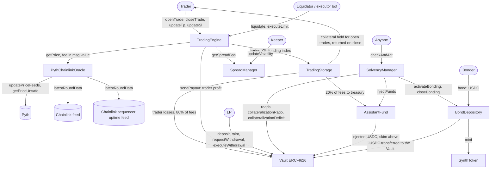

# Synthetic Trading Protocol

[](./LICENSE)
[](https://docs.soliditylang.org/)
[](https://getfoundry.sh/)

A leveraged synthetic trading protocol written in Solidity. Traders open long or short positions on
oracle-priced markets using USDC collateral. A single ERC-4626 vault, funded by liquidity providers
(LPs), is the counterparty to every trade: trader losses and 80% of trading fees go to the vault, and
trader profits are paid out of it. Execution prices come from Pyth pull updates, checked against a
Chainlink feed, with a spread that grows with open interest and a keeper-supplied volatility value.
The architecture follows gTrade by Gains Network (single vault as counterparty, oracle execution,
separate storage and trading contracts).

**Status:** Proof of concept. Not audited and not deployed. It is an educational project and must not be
used with real funds.

---

## Implementation status

Status legend: **Implemented** (code and tests exist), **Partial** (implemented with limits described in
the row), **Designed only** (described in the docs, no code), **Not found**. File references point to
`src/`; test names point to `test/`.

| Feature | Status | Evidence |
| :------ | :----- | :------- |
| ERC-4626 vault, sUSDC shares (18 decimals, `_decimalsOffset() = 12`) | Implemented | `Vault.sol` (Solady `ERC4626`); `test/unit/Vault.t.sol` |
| 3-epoch withdrawal lock (1 epoch = 1 day) with escrow and a 1-epoch execution window | Implemented | `Vault.requestWithdrawal` escrows the shares in the vault; `executeWithdrawal` works only in the epoch after unlock, then reverts `WithdrawalExpired`; `cancelWithdrawal` returns the shares. `test/regression/WithdrawalRegression.t.sol`, `Vault.t.sol` |
| ERC-4626 `max*` functions | Implemented | `maxWithdraw` and `maxRedeem` return 0 (the actions always revert); `maxDeposit` and `maxMint` return 0 while paused. Each is tested against its action in `Vault.t.sol` |
| Pyth pull integration: update data, caller-paid fee with refund, 5 s price age (owner-set up to 30 s), 2% confidence cap | Implemented | `PythChainlinkOracle.getPrice`; `test/unit/PythChainlinkOracle.t.sol` (MockPyth); fork suite on Arbitrum One at a pinned block, 19 tests |
| L2 sequencer uptime check (Chainlink feed, 1 hour grace period) | Implemented | `PythChainlinkOracle` constructor parameter, `address(0)` disables it; `test/regression/SequencerRegression.t.sol` and the fork suite |
| Chainlink deviation anchor (3%) and Chainlink heartbeat check | Implemented | `PythChainlinkOracle.getPrice`, `_getChainlinkPrice18`. On disagreement above 3% or a stale Chainlink answer the call reverts; there is no fallback price |
| Dynamic spread: base + OI term + volatility term, capped | Implemented | `SpreadManager.getSpreadBps`; volatility is set by a keeper (`updateVolatility`); `test/unit/SpreadManager.t.sol` |
| Funding between traders | Implemented | `FundingLib`, `TradingEngine._updateFundingIndex`: rate proportional to the relative skew, capped at 0.01% of the heavier side's notional per hour; the lighter side receives what the heavier side pays, through per-side indexes; the vault only carries the bad-debt residual described below |
| Liquidations: 90% loss threshold, reward `max(10% of remaining collateral, 0.5% of collateral)` | Implemented | `TradingEngine.liquidate`; loss includes funding and uses the trader-favourable edge of the Pyth confidence band; the reward is paid from the position's collateral, also past 100% loss; not blocked by pause |
| Automatic TP/SL (`executeLimit`) with executor reward (0.1% of notional, taken from the trader payout) | Implemented | `TradingEngine.executeLimit`; permissionless. Limit orders that open positions are not implemented |
| Open interest limit | Partial | Static per-pair cap on long + short OI (`TradingStorage.increaseOpenInterest`), set by the owner. No global cap |
| Open interest limits that adapt to volatility | Designed only | Described in `docs/02-mathematics.md` and `docs/07-vault-ssl.md`; no code |
| Profit cap | Implemented | `TradingEngine._calculatePayout`: collateral plus price PnL capped at 9x collateral (maximum price profit 8x); funding is settled after the cap in both directions |
| Max leverage | Implemented | Global `MAX_LEVERAGE = 100`, checked in `addPair`/`updatePair` and on open; per-pair limits below it |
| Opening guard | Implemented | `_validateNotPreLiquidatable` rejects a position `liquidate` would accept in the same block at an unchanged price (close spread at the post-open OI, collateral net of the open fee) |
| Asset classes (crypto, forex, commodities) | Partial | Any pair with a Pyth feed ID and a Chainlink feed can be configured. No per-class logic (no market hours, no weekend handling). Tests use BTC and ETH only |
| Fee split: 0.08% open and close fee on notional, 80% vault / 20% treasury | Implemented | `TradingEngine._distributeFees`; `script/Deploy.s.sol` sets the treasury to the `AssistantFund` |
| `SolvencyManager.checkAndAct`: inject reserve below 100% CR, open a bonding round below 95%, close it at 100% | Implemented | `SolvencyManager.sol`. CR is the vault share price relative to 1.0 USDC per share and does not include unrealised trader PnL |
| `AssistantFund.injectFunds` and permissionless `skim` | Implemented | `AssistantFund.sol`; `test/unit/AssistantFund.t.sol` |
| `BondDepository`: discounted $SYNTH sale with linear vesting | Implemented | `BondDepository.bond` / `claim`. A bond takes at most the current vault deficit and the round closes when CR is back at 100%. Price comes from an owner-set `referencePrice`, not from a market |
| `SynthToken` minter gating | Implemented | `SynthToken.mint` (`onlyMinter`); the owner can change the minter at any time |
| Surplus buyback of $SYNTH above 110% CR | Designed only | Described in `docs/02-mathematics.md`; no code |
| Circuit breakers, emergency withdrawal, role-based access control, timelock | Designed only | Earlier design documents only. Every contract uses a single `Ownable` owner |
| Liquidation lookbacks | Designed only | Listed as V2 in `docs/ROADMAP.md` |
| Custom oracle network (DON) | Not found | Dropped in the design phase; no code remains |

---

## How it works

- **Traders** deposit USDC collateral and open a long or short position with a chosen leverage. The
  collateral is held by `TradingStorage`, not by the vault.
- **LPs** deposit USDC into the vault and receive sUSDC shares. The vault is the counterparty to every
  trade: when a trader closes with a profit, the profit is paid from the vault and the share price
  falls; when a trader loses, the lost collateral is sent to the vault and the share price rises. LPs
  carry the open PnL of all traders. There is no impermanent loss in the AMM sense because the vault
  holds only USDC, but LPs can lose part of their deposit when traders are net profitable.
- **Keepers and bots** are needed for liveness: liquidations and TP/SL execution are permissionless and
  paid from trader collateral, `SolvencyManager.checkAndAct` and `AssistantFund.skim` are permissionless
  and unpaid, and the spread volatility input is set by a single keeper address.
- **Funding** moves value between the long and short traders of a pair, from the heavier side to the
  lighter side, at most 0.01% of the heavier side's notional per hour.

---

## Architecture



Notes on the diagram:

- The treasury address is a constructor argument of `TradingEngine`. `script/Deploy.s.sol` sets it to the
  `AssistantFund`; the unit tests use a plain address.
- `TradingStorage` pays the liquidator reward and the TP/SL executor reward out of the position's
  collateral. The vault never pays these rewards.
- `SolvencyManager` holds no funds. It reads the vault ratio and calls `AssistantFund.injectFunds` and
  `BondDepository.activateBonding`, which only accept calls from it.

### Oracle design

Each price-consuming call carries Pyth update data from the caller, who pays the Pyth update fee in
`msg.value`; the engine refunds `msg.value` minus the fee actually paid. The oracle rejects prices older
than `maxPriceAge` (5 seconds by default, owner-set up to a 30 second ceiling), published after the
current block, or with a confidence interval wider than 2% of the price, and reverts if the Pyth price
differs from the Chainlink answer by more than 3% or if the Chainlink answer is older than the configured
heartbeat. On L2s it also reverts while the Chainlink sequencer uptime feed reports the sequencer down and
for one hour after it comes back. Chainlink is never used as a fallback price.

Design note: a custom oracle network (a set of nodes publishing a median price) was considered early on
and dropped, because keeping it live requires running and monitoring backend services. Pyth pull
updates anchored to Chainlink are used instead.

### Solvency layers

- **Layer 1, preventive:** payout cap, static per-pair OI cap and dynamic spread; volatility-adaptive OI
  caps are designed only. The payout cap limits collateral plus price PnL to 9x the collateral.
- **Layer 2, reserve:** `AssistantFund` receives the 20% fee share (when it is set as the treasury) and
  `SolvencyManager.checkAndAct` injects it into the vault when the vault ratio is below 100%.
- **Layer 3, bonding:** below 95%, `checkAndAct` opens a round in which anyone can buy $SYNTH at a
  discount; the USDC goes to the vault and the $SYNTH vests linearly.

The vault ratio used by layers 2 and 3 is `totalAssets * 1e12 * 1e18 / totalSupply`, the share price
relative to its 1.0 starting value. It does not include the unrealised PnL of open trades.

---

## Trust assumptions and limitations

**Owner powers.** Each contract has one `Ownable` owner, with no timelock or multisig in code. The owner
can:

- Point `Vault.tradingEngine` and `TradingStorage.tradingEngine` at any address. That address can then
  move all vault USDC (`sendPayout`) and all trader collateral (`sendCollateral`).
- Pause `TradingEngine` (blocks `openTrade`, `closeTrade`, `executeLimit`, `updateTp`, `updateSl`) while
  `liquidate` keeps working, and pause the vault (blocks `deposit`, `mint`, `requestWithdrawal`;
  `executeWithdrawal` and `cancelWithdrawal` stay available).
- Add pairs with any `maxLeverage` up to `MAX_LEVERAGE` (100) and any `maxOI`, and change or deactivate
  them.
- Set oracle feeds (`setPairFeed`), the Pyth price age (`setMaxPriceAge`, 1 to 30 s), the funding factor
  (`setFundingFactor`, within 1e12 to 1e15; the 0.01% per hour ceiling is a constant), all `SpreadManager`
  parameters and its keeper, the treasury address, the `AssistantFund` target cap, the bond
  `referencePrice`, discount (up to 10%) and vesting period (up to 7 days), and the $SYNTH minter (which
  can mint without limit).

**Keepers and off-chain actors.** Liquidation and TP/SL execution rely on third-party bots. The
liquidator reward is `max(10% of the collateral left after the loss, 0.5% of the collateral)`: 1% at the
threshold, never below 0.5%, also past a 100% loss, always paid from the position's collateral. The
spread volatility input depends on one keeper address. `checkAndAct` and `skim` have no reward.

**Oracle assumptions.** Prices depend on Pyth publishers, Wormhole-signed updates and Chainlink. If the
Pyth price is too old, its confidence band is too wide, the Chainlink answer is stale, the two disagree
by more than 3%, or the sequencer check fails, every price-consuming call reverts, including
`closeTrade`, `executeLimit` and `liquidate`. Fetching Pyth updates from Hermes requires an API key since
the Pyth Core upgrade of 2026-08-26.

**LP risk.** LPs are the counterparty to trader PnL and can lose part of their deposit.

**Withdrawal lock.** Withdrawals go through `requestWithdrawal`, which escrows the shares, and
`executeWithdrawal` in the epoch that starts 3 epochs later, which pays at the share price of the
execution moment. After that epoch the request expires; `cancelWithdrawal` or a new request returns the
shares.

**Known limitations.**

- **Funding bad debt.** Funding receivers are credited as it accrues, while a payer settles at close or
  liquidation. If a payer ends with a loss above its collateral, the unpaid part of its funding is covered
  by the vault: `unpaid = max(0, fundingOwed - max(0, collateral + min(PnL, 8 x collateral) - reward))`.
  At a flat price, with the 0.01% per hour ceiling, 100x and liquidation at 90%, this needs the payer to
  stay unliquidated for more than 9.5 hours after crossing the threshold, and then grows by at most 1% of
  its collateral per hour ([Guide 2](./docs/02-mathematics.md#residual-funding-a-payer-cannot-pay)).
- **Oracle latency window.** Within `maxPriceAge` (5 s) the caller still chooses which Pyth update to
  submit, so a trader can open on a price up to 5 seconds old and close on the current one. The round trip
  costs about 26 BPS of notional with the deploy parameters.
- **Deposits have no lock.** A new LP can deposit just before a known trader loss or a reserve injection.
- **Share price and CR ignore unrealised PnL.** `totalAssets`, the share price and the collateralization
  ratio only move with realised PnL. Including open PnL is planned for a later round.
- **A winning close can revert.** `closeTrade` and `executeLimit` revert with `InsufficientVaultBalance`
  when the vault holds less USDC than the profit owed, until the vault is refilled.

---

## Testing

Measured on 2026-09-28 at commit `aaceb08` with forge 1.7.1 and solc 0.8.24 (fixed by the pragma in every
source file; `foundry.toml` does not pin `solc`), after `npm ci`. Later commits only change documentation
and add `script/analysis/pyth_update_age.py`. Details: [docs/tests/README.md](./docs/tests/README.md).

| Command | Result |
| :------ | :----- |
| `forge build` | Compiles. It fails before `npm ci` because the Pyth SDK is an npm dependency |
| `forge build --sizes` | Exits 0. `TradingEngine` runtime 24,563 bytes, 13 under the 24,576 byte limit |
| `forge test` (`FORK_RPC_URL` empty) | 632 tests: 613 passed, 0 failed, 19 skipped (the fork suite) |
| `forge test --list --json 2>/dev/null \| jq '[.[][][]] \| length'` | 632: unit 539, regression 33, integration 17 plus 8 invariant functions, invariant suites 16, fork 19 |
| `forge test --list --json 2>/dev/null \| jq '[.[][][] \| select(startswith("testFuzz_"))] \| length'` | 39 functions named `testFuzz_*` (256 fuzz runs each, Foundry default) |
| `forge test --list --json 2>/dev/null \| jq '[.[][][] \| select(startswith("invariant_"))] \| length'` | 24 stateful invariant functions (256 runs x 500 calls, Foundry default); call summaries are in `afterInvariant` hooks |
| `FORK_RPC_URL=<arbitrum-one-archive-rpc> forge test --match-path "test/fork/*"` | 19 passed at the pinned block 504,522,171 |
| `FOUNDRY_PROFILE=gas forge test` | 9 gas benchmarks passed, written to `snapshots/*.json`; not part of the 632 |
| `forge fmt --check` | Exits 0 |
| `forge coverage --report summary` | Per contract below |

| Contract | Lines | Statements | Branches | Functions |
| :------- | :---- | :--------- | :------- | :-------- |
| AssistantFund | 100% (33/33) | 100% (37/37) | 100% (6/6) | 100% (9/9) |
| BondDepository | 100% (93/93) | 94.92% (112/118) | 75.00% (18/24) | 100% (18/18) |
| PythChainlinkOracle | 100% (53/53) | 100% (85/85) | 100% (16/16) | 100% (7/7) |
| SolvencyManager | 100% (32/32) | 100% (45/45) | 100% (6/6) | 100% (4/4) |
| SpreadManager | 100% (54/54) | 100% (58/58) | 100% (13/13) | 100% (12/12) |
| SynthToken | 100% (23/23) | 100% (18/18) | 100% (4/4) | 100% (9/9) |
| TradingEngine | 100% (280/280) | 99.24% (392/395) | 95.65% (66/69) | 100% (41/41) |
| TradingStorage | 100% (132/132) | 100% (139/139) | 100% (33/33) | 100% (30/30) |
| Vault | 98.18% (108/110) | 98.39% (122/124) | 100% (17/17) | 100% (32/32) |
| FundingLib | 100% (16/16) | 100% (28/28) | 100% (4/4) | 100% (3/3) |

The protocol invariant suite runs the whole system (engine, vault, AssistantFund, SolvencyManager,
bonding) with `MockOracle`. It models every settlement and LP or solvency flow and checks the vault and
reserve balances against the model, that funding credits never exceed charges, that the vault's funding
exposure stays within the tracked bad debt, that storage holds exactly the open collateral, that escrowed
shares match pending requests, and that a rescue never lifts CR above 100%. The model does not include
unrealised PnL.

Gas of one call per entry point, from `FOUNDRY_PROFILE=gas forge test` (`snapshots/*.json`), with the real
`PythChainlinkOracle` on `MockPyth` (no Wormhole signature verification) and the real `SpreadManager`:

| Function | Gas |
| :------- | --: |
| `TradingEngine.openTrade` (with TP and SL) | 325,076 |
| `TradingEngine.closeTrade` (profit) | 166,923 |
| `TradingEngine.liquidate` | 160,049 |
| `TradingEngine.executeLimit` (TP) | 197,611 |
| `Vault.deposit` | 43,300 |
| `Vault.requestWithdrawal` | 63,014 |
| `Vault.executeWithdrawal` | 32,221 |
| `SolvencyManager.checkAndAct` (opens a bonding round) | 62,826 |
| `BondDepository.bond` | 141,854 |

**Fork tests.** `test/fork/PythChainlinkOracle.fork.t.sol` runs against Arbitrum One at
`FORK_BLOCK_NUMBER` (default 504,522,171), a block right after an on-chain Pyth update of BTC/USD and
ETH/USD, so the stored prices are fresh and no Hermes call or `ffi` is needed (`ffi = false`). It checks
that every address has code, that the Pyth proxy runs the implementation installed by the Pyth Core
upgrade, the update fee (0 wei), a recorded signed update, the sequencer uptime feed, and an open and
close through `TradingEngine`.

---

## Review notes

Findings from the round 1 review, fixed in round 2 on branch `fix/review-findings`. The tests named
`test_Regression_*` (and `testFuzz_Regression_*`) failed against the code before their fix; the other tests
in the same files pass before and after.

1. **Funding paid by the vault, not normalised (High).** Cause: the index moved by the absolute USD
   imbalance (a 1,000 USD imbalance gave 3.6% of notional per hour) and settled against the vault, so a
   10 USDC x100 short next to a 1,000 USDC x100 long closed with 57.82 USDC after 60 seconds at a flat
   price, and one account holding a long and 50 shorts drained 2,294.14 USDC in 160 seconds. Fix: rate
   proportional to the relative skew, capped at 0.01% per hour, per-side indexes, the lighter side
   receives what the heavier side pays, payers round up and receivers down, funding settled after the 9x
   cap. Tests: `test/regression/FundingRegression.t.sol`, `test/unit/FundingLib.t.sol`,
   `testFuzz_Funding_FundsConservation`. Commit `2dcf3ff`.
2. **Withdrawal requests without expiry or escrow; `max*` functions (Medium).** Cause: a request stayed
   executable forever after 3 epochs and its shares stayed transferable; `maxWithdraw`/`maxRedeem` and
   `maxDeposit`/`maxMint` did not match what the vault accepts. Fix: shares escrowed in the vault, a
   1-epoch execution window, `max*` aligned with the actions. Tests:
   `test/regression/WithdrawalRegression.t.sol`, `Vault.t.sol` max* and window tests. Commit `ad38b4f`.
3. **Oracle latency (Medium).** Cause: any update up to 30 seconds old was accepted, so a trade could open
   on a 25 second old price and close on the current one; a future `publishTime` underflowed. Fix:
   `maxPriceAge` (default 5 s, owner-set up to 30 s) and `PriceFromFuture`. Tests:
   `test/regression/OracleLatencyRegression.t.sol`. Commit `b62e786`.
4. **No L2 sequencer uptime check; fork suite not reproducible.** Cause: no sequencer check; the fork tests
   targeted HyperEVM at the latest block and called Hermes through `ffi`. Fix: Chainlink sequencer uptime
   feed with a 1 hour grace period (constructor parameter, `address(0)` disables it); fork suite on
   Arbitrum One at a pinned block without Hermes, `ffi = false`. Tests:
   `test/regression/SequencerRegression.t.sol`, `test/fork/PythChainlinkOracle.fork.t.sol`. Commits
   `b657eb9`, `2aa12c2`.
5. **No global leverage cap.** Fix: `MAX_LEVERAGE = 100` in pair configuration and on open. Tests:
   `test/regression/LeverageRegression.t.sol`. Commit `c7e702f`.
6. **Opening guard (Low).** Cause: the guard used the open spread and the gross collateral, so with a
   50 BPS spread a 100x position could be liquidated in the block it opened. Fix: close spread at the
   post-open OI and collateral net of the open fee. Tests: `test/regression/OpenGuardRegression.t.sol`,
   and `test_OpenTrade_RevertWhenPreLiquidatable`, which reverted on slippage instead of the guard. Commit
   `dc027f8`.
7. **Zero liquidator reward past 100% loss (Medium).** Fix: reward `max(10% of remaining, 0.5% of
   collateral)`, paid from the position's collateral. Tests:
   `test/regression/LiquidationRewardRegression.t.sol`. Commit `977ba1e`.
8. **Linear `deleteTrade` (Low).** Fix: swap and pop with the position stored in `Trade.userIndex`. Tests:
   `test/regression/DeleteTradeRegression.t.sol`. Commit `7475469`.
9. **Force-sent ETH paid to the next caller (Low).** Fix: refund `msg.value` minus the fee actually paid,
   with the entry balance kept in transient storage. Tests: `test/regression/EthRefundRegression.t.sol`.
   Commit `52aa4ee`.
10. **`updateTp`/`updateSl` without `nonReentrant` (Low).** Fix: guard added. Tests:
    `test/regression/ReentrancyRegression.t.sol`. Commit `a236103`.
11. **Bonding round not closed when CR recovers (Low).** Fix: a bond takes at most the current deficit and
    closes the round when it covers it; `checkAndAct` closes the round at CR >= 100%. Tests:
    `test/regression/BondingRoundRegression.t.sol`. Commit `6668365`.
12. **Stale NatSpec and unused error (Info).** `TradingEngine` header (fixed spread), `IOracle` (custom
    DON example), `BondDepository` header (keeper-maintained price); `ZeroFeeRecipient` removed. Commits
    `e42bd1b`, `6668365`, `8726c55`.
13. **A winning close reverts when the vault is short of USDC (Info).** No code change; documented under
    Known limitations.
14. **Test suite (Info).** Weak or tautological invariants replaced, call summaries moved to
    `afterInvariant`, tolerances tightened, `test_CloseTrade_UsesSpreadOnClose` given an assertion,
    compiler warnings removed. Commits `37119cf`, `7a51384`, `857580a`, `0577333`, `aaceb08`.

---

## Getting started

Requirements: [Foundry](https://getfoundry.sh/), Node.js with npm, Git. For the fork tests, an Arbitrum
One RPC URL that serves historical state (archive).

```bash
git clone --recursive https://github.com/GushALKDev/evm-synthetic-trading-protocol
cd evm-synthetic-trading-protocol
npm ci          # required: installs @pythnetwork/pyth-sdk-solidity, remapped from node_modules/
forge build
forge test      # mock mode: fork tests skip when FORK_RPC_URL is unset or empty
```

Forge loads a `.env` file from the project root automatically. Mock mode therefore needs
`FORK_RPC_URL` to be absent or empty in both the shell and `.env` (for example `FORK_RPC_URL= forge test`).

Other commands:

```bash
forge test --match-path "test/regression/*"    # round 2 regression tests
forge test --match-path "test/invariant/*"     # invariant suites
forge test --match-path "test/integration/*"   # full wired system
forge coverage --report summary
FOUNDRY_PROFILE=gas forge test                 # gas benchmarks, written to snapshots/
FORK_RPC_URL=<arbitrum-one-rpc> forge test --match-path "test/fork/*"
npx solhint 'src/**/*.sol'
```

| Variable | Used by | Required |
| :------- | :------ | :------- |
| `FORK_RPC_URL` | fork tests | Only for fork tests (Arbitrum One, archive) |
| `FORK_BLOCK_NUMBER` | fork tests | Optional, defaults to 504,522,171 |
| `PRIVATE_KEY`, `USDC_ADDRESS`, `PYTH_ADDRESS` | `script/Deploy.s.sol` | For deployment |
| `OWNER_ADDRESS`, `KEEPER_ADDRESS` | `script/Deploy.s.sol` | Optional, default to the deployer |
| `SEQUENCER_UPTIME_FEED` | `script/Deploy.s.sol` | Optional, defaults to `address(0)` (no check); on Arbitrum One `0xFdB631F5EE196F0ed6FAa767959853A9F217697D` |

`script/Deploy.s.sol` deploys the nine contracts and, when the owner is the deployer, grants the
cross-contract permissions. Pairs and oracle feeds are left to the owner (`addPair`, `setPairFeed`). The
deploy script was not run in this review.

---

## Documentation

| Document | Content |
| :------- | :------ |
| [docs/README.md](./docs/README.md) | Index |
| [docs/01-fundamentals.md](./docs/01-fundamentals.md) | Model and trade lifecycle |
| [docs/02-mathematics.md](./docs/02-mathematics.md) | Formulas as implemented, with rounding |
| [docs/03-architecture.md](./docs/03-architecture.md) | Contracts, oracle, execution flows |
| [docs/04-tradeoffs.md](./docs/04-tradeoffs.md) | Risks and what the code does about them |
| [docs/05-implementation.md](./docs/05-implementation.md) | Structs, interfaces, precision |
| [docs/06-improvements.md](./docs/06-improvements.md) | Ideas that are not implemented |
| [docs/07-vault-ssl.md](./docs/07-vault-ssl.md) | Vault and solvency layers |
| [docs/08-security.md](./docs/08-security.md) | Threat model, access control, invariants |
| [docs/ROADMAP.md](./docs/ROADMAP.md) | Build log by phase |
| [docs/tests/README.md](./docs/tests/README.md) | Test suite |

## Project structure

```
src/
  Vault.sol                 ERC-4626 LP vault with withdrawal requests
  TradingStorage.sol        Trades, pairs, open interest, funding index, trader collateral
  TradingEngine.sol         Open, close, liquidate, executeLimit, spread, fees, funding
  PythChainlinkOracle.sol   Pyth price with Chainlink deviation check
  SpreadManager.sol         Spread from OI and keeper-set volatility
  AssistantFund.sol         USDC reserve (solvency layer 2)
  SolvencyManager.sol       checkAndAct orchestration
  BondDepository.sol        Discounted $SYNTH sale with vesting (solvency layer 3)
  SynthToken.sol            $SYNTH ERC-20 with a single minter
  interfaces/               IOracle, ISolvency, ISynthToken, AggregatorV3Interface
  libraries/FundingLib.sol  Funding index math
test/
  unit/  regression/  integration/  invariant/  fork/  gas/  mocks/
script/
  Deploy.s.sol              Deploys and wires the contracts
  analysis/                 Pyth update age measurement (read-only RPC)
snapshots/                  Gas benchmark results
```

## License

MIT, see [LICENSE](./LICENSE).

## Author

[@GushALKDev](https://github.com/GushALKDev), Gustavo Martín ([LinkedIn](https://www.linkedin.com/in/gustavomaral/)).

## Acknowledgments

- [Foundry](https://getfoundry.sh/) and [Solady](https://github.com/Vectorized/solady), used to build the contracts.
- [Pyth](https://pyth.network/) and [Chainlink](https://chain.link/), the oracle sources.
- [gTrade by Gains Network](https://gains.trade/), the architectural reference: a single vault as the
  counterparty, oracle-priced execution, and trading logic separated from trade storage.
