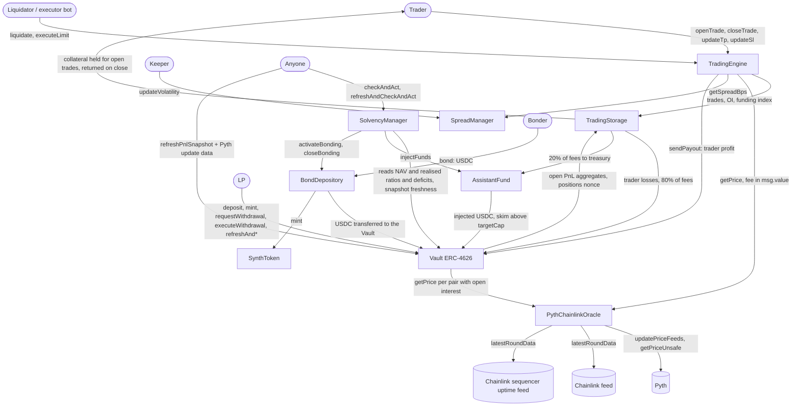

# Synthetic Trading Protocol

[](https://github.com/GushALKDev/evm-synthetic-trading-protocol/actions/workflows/test.yml)
[](./LICENSE)
[](https://docs.soliditylang.org/)
[](https://getfoundry.sh/)

A leveraged synthetic trading protocol written in Solidity. Traders open long or short positions on
oracle-priced markets using USDC collateral. A single ERC-4626 vault, funded by liquidity providers
(LPs), is the counterparty to every trade: trader losses and 80% of trading fees go to the vault, and
trader profits are paid out of it. The architecture follows gTrade by Gains Network (single vault as
counterparty, oracle execution, separate storage and trading contracts).

> **Proof of concept. Not audited and not deployed.** The findings of the internal review
> rounds are fixed or documented. It is an educational project and must not be used with real funds.

---

## Highlights

- **Oracle execution with layered checks.** Every price comes from a Pyth pull update paid by the caller,
  at most 5 seconds old by default, with a confidence band of at most 2%, and within 3% of Chainlink. On L2s a sequencer
  outage stops every price read, and the grace period after it blocks only new positions, never closes or
  liquidations.
- **LP share price at a conservative NAV.** `totalAssets` is the USDC balance minus the net unrealised trader
  profit, from a permissionless PnL snapshot built on per-pair and per-side aggregates, so its cost grows with
  the number of pairs, not of positions. An exiting LP is priced net of the open trader profit instead of
  leaving it to the LPs who stay.
- **Funding between traders, not against the vault.** The heavier side pays the lighter side at most 0.01%
  of its notional per hour; the vault only carries what a payer whose loss exceeds its collateral cannot pay.
- **Three solvency layers.** A payout cap, open interest caps and a dynamic spread; a reserve fund that
  injects USDC when the NAV falls below par; and a discounted $SYNTH bond sale with vesting when the
  realised ratio falls below 95%.
- **Incident controls.** Independent pause flags for opening, settling, depositing and withdrawing, and an
  incident playbook that says which flags each incident needs.
- **Tested in depth.** 818 tests, 32 invariant properties run as 51 campaigns (6,528,000 calls per
  run), a fork suite on Arbitrum One and 100% line, statement, branch and function coverage on every contract.

---

## How it works

- **Traders** deposit USDC collateral and open a long or short position with a chosen leverage (up to 100x).
  The collateral is held by `TradingStorage`, not by the vault.
- **LPs** deposit USDC into the vault and receive sUSDC shares. The vault holds only USDC, so there is no
  impermanent loss in the AMM sense, but LPs lose part of their deposit when traders are net profitable.
  Withdrawals are requested and executed three epochs (days) later.
- **Keepers and bots** keep the system live: liquidations and TP/SL execution are permissionless and paid
  from trader collateral; the solvency check and the reserve skim are permissionless and unpaid.



### Solvency layers

- **Layer 1, preventive:** collateral plus price PnL is capped at 9x the collateral, each pair has a static
  open interest cap, and the spread grows with open interest and a keeper-set volatility value.
- **Layer 2, reserve:** the `AssistantFund` receives the 20% fee share (the deploy script makes it the
  treasury) and `SolvencyManager.checkAndAct`
  injects it into the vault when the NAV ratio is below 100% and the PnL snapshot is fresh.
- **Layer 3, bonding:** below a 95% realised ratio, `checkAndAct` opens a round in which anyone can buy
  $SYNTH at a discount; the USDC goes to the vault and the $SYNTH vests linearly.

The NAV ratio is the share price relative to its 1.0 start; the realised ratio is the same formula on the USDC
balance alone, so bonding never sells discounted $SYNTH because of an unrealised move that can reverse.
Formulas: [Guide 2, section 8](./docs/02-mathematics.md#8-collateralization-ratio-and-solvency-actions).

---

## Implementation status

Most of the design is implemented and tested. Open interest caps are static per pair (no global cap) and any
pair with a Pyth and a Chainlink feed can be listed, with no per-asset-class logic such as market hours.
Limit orders that open a position are not implemented. Designed but not built: open interest caps that adapt
to volatility, a $SYNTH buyback above 110% coverage, liquidation lookbacks, and circuit breakers, an emergency
withdrawal, role-based access control or a timelock (every contract has a single `Ownable` owner). Every feature with its status and the code and tests behind it:
[Guide 9: Implementation Status](./docs/09-implementation-status.md).

---

## Trust assumptions

- **Owner.** Each contract has one owner with no timelock or multisig in code. The owner can point the vault
  and storage at a new engine, which could then move all vault USDC and trader collateral, and can set every
  risk parameter and pause flag.
- **Oracles.** If Pyth or Chainlink fail a check or disagree by more than 3%, every price-consuming call
  reverts, closes and liquidations included; Chainlink is never used as a fallback price.
- **LPs** are the counterparty to trader PnL and can lose part of their deposit.
- **Keepers.** Liquidations and TP/SL depend on third-party bots, and the spread's volatility input on one
  keeper address.

The owner's full powers, the known limitations (funding bad debt, the 5-second latency window, the biases of
the NAV, the deposit freeze while bonding is open) and what each pause flag stops:
[Guide 8: Security](./docs/08-security.md#8-trust-assumptions-and-known-limitations).

---

## Testing

Measured at commit `47d848f` with forge 1.7.1 and solc 0.8.24.

| Area | Result |
| :--- | :----- |
| Tests | 818: 659 unit, 70 regression, 17 integration, 51 invariant campaigns, 21 fork (Arbitrum One at a pinned block) |
| Fuzzing | 54 fuzz tests (13,824 cases per run); 32 invariant properties as 51 campaigns (6,528,000 calls per run), one set rerun with liquidations a day late |
| Coverage | 100% of lines, statements, branches and functions on every contract in `src/` |
| Static analysis | Slither 0.11.6 (199 results) and Aderyn 0.6.8 (64 instances): every result has a verdict and a reason; none is an open issue |
| Review | 28 findings from the review rounds, each fixed or documented; the `test_Regression_*` tests failed against the code before their fix |

| Gas (real oracle over `MockPyth`) | |
| :-------------------------------- | --: |
| `TradingEngine.openTrade` (with TP and SL) | 300,422 |
| `TradingEngine.closeTrade` (profit) | 129,992 |
| `TradingEngine.liquidate` | 127,387 |
| `Vault.refreshPnlSnapshot`, 20 pairs with a long and a short on each | 640,715 |

Commands, coverage per contract, what each invariant checks, fork scope, every gas benchmark and the static
analysis triage: [test suite documentation](./docs/tests/README.md). Every review finding with its cause, fix,
tests and commit: [Guide 10: Review Notes](./docs/10-review-notes.md).

---

## Getting started

Requirements: [Foundry](https://getfoundry.sh/) forge 1.7.1 (CI pins `v1.7.1`, the version every number in
this README was measured with; forge 1.8.x measures gas and counts invariant campaigns differently), Node.js
22.14 or later with npm (the Pyth SDK declares `engines: node >=22.14.0`; CI uses Node 22), Git. For the fork
tests, an Arbitrum One RPC URL that serves historical state (archive).

```bash
git clone --recursive https://github.com/GushALKDev/evm-synthetic-trading-protocol
cd evm-synthetic-trading-protocol
npm ci                  # required: installs @pythnetwork/pyth-sdk-solidity, remapped from node_modules/
forge build
FORK_RPC_URL= forge test   # mock mode: the fork tests skip
FORK_RPC_URL=<arbitrum-one-archive-rpc> forge test --match-path "test/fork/*"   # fork mode
```

Forge loads a `.env` file from the project root automatically. Mock mode therefore needs
`FORK_RPC_URL` to be absent or empty in both the shell and `.env` (for example `FORK_RPC_URL= forge test`).

```bash
forge test --match-path "test/regression/*"    # regression tests for the review findings
forge test --match-path "test/invariant/*"     # invariant suites
FORK_RPC_URL= FOUNDRY_PROFILE=coverage forge coverage --report summary   # coverage profile lifts the size limit
FOUNDRY_PROFILE=gas forge test                 # gas benchmarks, written to snapshots/
```

| Variable | Used by | Required |
| :------- | :------ | :------- |
| `FORK_RPC_URL` | fork tests | Only for fork tests (Arbitrum One, archive) |
| `FORK_BLOCK_NUMBER` | fork tests | Optional, defaults to 504,522,171 |
| `PRIVATE_KEY`, `USDC_ADDRESS`, `PYTH_ADDRESS` | `script/Deploy.s.sol` | For deployment |
| `OWNER_ADDRESS`, `KEEPER_ADDRESS` | `script/Deploy.s.sol` | Optional, default to the deployer |
| `SEQUENCER_UPTIME_FEED` | `script/Deploy.s.sol` | Optional, defaults to `address(0)` (no check); on Arbitrum One `0xFdB631F5EE196F0ed6FAa767959853A9F217697D` |

`script/Deploy.s.sol` deploys the nine contracts and, when the owner is the deployer, grants the
cross-contract permissions. Pairs and oracle feeds are left to the owner (`addPair`, `setPairFeed`). The
deploy script was not run in the review that produced these figures.

---

## Roadmap

All 89 items of phases 0 to 12 are done; phase 13 is a backlog of V2 ideas that is not implemented. Every item
with its scope: [docs/ROADMAP.md](./docs/ROADMAP.md).

- [x] Phase 0: Setup & Infrastructure (6/6)
- [x] Phase 1: Core: Vault (8/8)
- [x] Phase 2: Core: Trading Engine (12/12)
- [x] Phase 3: Oracle (Pyth + Chainlink) (12/12)
- [x] Phase 4: Fee System (5/5)
- [x] Phase 5: Funding Rates (4/4)
- [x] Phase 6: Dynamic Spread (6/6)
- [x] Phase 7: Liquidations (9/9)
- [x] Phase 8: Limit Orders (TP/SL) (5/5)
- [x] Phase 9: Solvency (Assistant Fund) (5/5)
- [x] Phase 10: Solvency (Bonding) (6/6)
- [x] Phase 11: Governance Token (4/4)
- [x] Phase 12: Testing & Review (7/7)
- [ ] Phase 13: V2 improvements, not implemented (0/9)

---

## Documentation

| Document | Content |
| :------- | :------ |
| [docs/README.md](./docs/README.md) | Index and reading order |
| [01 Fundamentals](./docs/01-fundamentals.md) | Model and trade lifecycle |
| [02 Mathematics](./docs/02-mathematics.md) | Formulas as implemented, with rounding |
| [03 Architecture](./docs/03-architecture.md) | Contracts, oracle, execution flows |
| [04 Trade-offs](./docs/04-tradeoffs.md) | Risks and what the code does about them |
| [05 Implementation](./docs/05-implementation.md) | Structs, interfaces, precision |
| [06 Improvements](./docs/06-improvements.md) | Ideas that are not implemented |
| [07 Vault and solvency](./docs/07-vault-ssl.md) | Vault and solvency layers |
| [08 Security](./docs/08-security.md) | Threat model, access control, pause flags, trust assumptions and limitations |
| [09 Implementation status](./docs/09-implementation-status.md) | Every feature with its status and evidence |
| [10 Review notes](./docs/10-review-notes.md) | Findings of the review rounds |
| [Test suite](./docs/tests/README.md) | Counts, invariants, fork tests, gas, coverage, static analysis |
| [ROADMAP](./docs/ROADMAP.md) | Build log by phase |

## Project structure

```
src/
  Vault.sol                 ERC-4626 LP vault at a conservative NAV, PnL snapshot, withdrawal requests
  TradingStorage.sol        Trades, pairs, open interest, open PnL aggregates, funding index, trader collateral
  TradingEngine.sol         Open, close, liquidate, executeLimit, spread, fees, funding
  PythChainlinkOracle.sol   Pyth price with Chainlink deviation check
  SpreadManager.sol         Spread from OI and keeper-set volatility
  AssistantFund.sol         USDC reserve (solvency layer 2)
  SolvencyManager.sol       checkAndAct orchestration
  BondDepository.sol        Discounted $SYNTH sale with vesting (solvency layer 3)
  SynthToken.sol            $SYNTH ERC-20 with a single minter
  interfaces/               IOracle, ISolvency, ISynthToken, AggregatorV3Interface
  libraries/FundingLib.sol  Funding index math
  libraries/OpenPnlLib.sol  Open PnL of a pair from the per-side aggregates
test/
  unit/  regression/  integration/  invariant/  fork/  gas/  mocks/
script/
  Deploy.s.sol              Deploys and wires the contracts
  analysis/                 Pyth update age measurement (read-only RPC)
snapshots/                  Gas benchmark results
```

## License

MIT, see [LICENSE](./LICENSE).

## Author

[@GushALKDev](https://github.com/GushALKDev), Gustavo Martín ([LinkedIn](https://www.linkedin.com/in/gustavomaral/)).

## Acknowledgments

- [Foundry](https://getfoundry.sh/) and [Solady](https://github.com/Vectorized/solady), used to build the contracts.
- [Pyth](https://pyth.network/) and [Chainlink](https://chain.link/), the oracle sources.
- [gTrade by Gains Network](https://gains.trade/), the architectural reference: a single vault as the
  counterparty, oracle-priced execution, and trading logic separated from trade storage.
