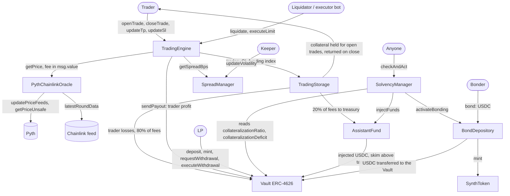

# Synthetic Trading Protocol

[](./LICENSE)
[](https://docs.soliditylang.org/)
[](https://getfoundry.sh/)

A leveraged synthetic trading protocol written in Solidity. Traders open long or short positions on
oracle-priced markets using USDC collateral. A single ERC-4626 vault, funded by liquidity providers
(LPs), is the counterparty to every trade: trader losses and 80% of trading fees go to the vault, and
trader profits are paid out of it. Execution prices come from Pyth pull updates, checked against a
Chainlink feed, with a spread that grows with open interest and a keeper-supplied volatility value.

**Status:** Proof of concept. Not audited and not deployed. It is an educational project and must not be
used with real funds.

---

## Implementation status

Status legend: **Implemented** (code and tests exist), **Partial** (implemented with limits described in
the row), **Designed only** (described in the docs, no code), **Not found**. File references point to
`src/`; test names point to `test/`.

| Feature | Status | Evidence |
| :------ | :----- | :------- |
| ERC-4626 vault, sUSDC shares (18 decimals, `_decimalsOffset() = 12`) | Implemented | `Vault.sol` (Solady `ERC4626`); `test/unit/Vault.t.sol` |
| 3-epoch withdrawal lock (1 epoch = 1 day) | Partial | `Vault.requestWithdrawal` / `executeWithdrawal`. A request never expires, so after the first 3 epochs the LP can exit at any later time without a new delay. `test_CannotWithdrawBeforeTime`, `test_CanWithdrawAfterTime` in `Vault.t.sol` |
| Pyth pull integration: update data, caller-paid fee with refund, 30 s staleness, 2% confidence cap | Implemented | `PythChainlinkOracle.getPrice`; `test/unit/PythChainlinkOracle.t.sol` (MockPyth). Fork suite not reproducible in this review |
| Chainlink deviation anchor (3%) and Chainlink heartbeat check | Implemented | `PythChainlinkOracle.getPrice`, `_getChainlinkPrice18`. On disagreement above 3% or a stale Chainlink answer the call reverts; there is no fallback price |
| Dynamic spread: base + OI term + volatility term, capped | Implemented | `SpreadManager.getSpreadBps`; volatility is set by a keeper (`updateVolatility`); `test/unit/SpreadManager.t.sol` |
| Funding rate cumulative index | Partial | `FundingLib`, `TradingEngine._updateFundingIndex`. The rate scales with the absolute USD imbalance and is not normalised by open interest: a 1,000 USD imbalance gives 3.6% of notional per hour. Funding settles against the vault, not between traders |
| Liquidations: 90% loss threshold, 10% of remaining collateral to the liquidator | Implemented | `TradingEngine.liquidate`; loss includes funding and uses the trader-favourable edge of the Pyth confidence band; not blocked by pause |
| Automatic TP/SL (`executeLimit`) with executor reward (0.1% of notional, taken from the trader payout) | Implemented | `TradingEngine.executeLimit`; permissionless. Limit orders that open positions are not implemented |
| Open interest limit | Partial | Static per-pair cap on long + short OI (`TradingStorage.increaseOpenInterest`), set by the owner. No global cap |
| Open interest limits that adapt to volatility | Designed only | Described in `docs/02-mathematics.md` and `docs/07-vault-ssl.md`; no code |
| Profit cap | Implemented | `TradingEngine._calculatePayout`: payout capped at 9x collateral (maximum profit 8x collateral) |
| Max leverage | Partial | Per pair, `Pair.maxLeverage` (`uint16`), set by the owner in `addPair`. No global cap in code; "100x" is only the value used in tests |
| Asset classes (crypto, forex, commodities) | Partial | Any pair with a Pyth feed ID and a Chainlink feed can be configured. No per-class logic (no market hours, no weekend handling). Tests use BTC and ETH only |
| Fee split: 0.08% open and close fee on notional, 80% vault / 20% treasury | Implemented | `TradingEngine._distributeFees`; `script/Deploy.s.sol` sets the treasury to the `AssistantFund` |
| `SolvencyManager.checkAndAct`: inject reserve below 100% CR, open a bonding round below 95% | Implemented | `SolvencyManager.sol`. CR is the vault share price relative to 1.0 USDC per share and does not include unrealised trader PnL |
| `AssistantFund.injectFunds` and permissionless `skim` | Implemented | `AssistantFund.sol`; `test/unit/AssistantFund.t.sol` |
| `BondDepository`: discounted $SYNTH sale with linear vesting | Implemented | `BondDepository.bond` / `claim`. Price comes from an owner-set `referencePrice`, not from a market |
| `SynthToken` minter gating | Implemented | `SynthToken.mint` (`onlyMinter`); the owner can change the minter at any time |
| Surplus buyback of $SYNTH above 110% CR | Designed only | Described in `docs/02-mathematics.md`; no code |
| Circuit breakers, emergency withdrawal, role-based access control, timelock | Designed only | Earlier design documents only. Every contract uses a single `Ownable` owner |
| Liquidation lookbacks | Designed only | Listed as V2 in `docs/ROADMAP.md` |
| Custom oracle network (DON) | Not found | Dropped in the design phase; no code remains |

---

## How it works

- **Traders** deposit USDC collateral and open a long or short position with a chosen leverage. The
  collateral is held by `TradingStorage`, not by the vault.
- **LPs** deposit USDC into the vault and receive sUSDC shares. The vault is the counterparty to every
  trade: when a trader closes with a profit, the profit is paid from the vault and the share price
  falls; when a trader loses, the lost collateral is sent to the vault and the share price rises. LPs
  carry the open PnL of all traders. There is no impermanent loss in the AMM sense because the vault
  holds only USDC, but LPs can lose part of their deposit when traders are net profitable.
- **Keepers and bots** are needed for liveness: liquidations and TP/SL execution are permissionless and
  paid from trader collateral, `SolvencyManager.checkAndAct` and `AssistantFund.skim` are permissionless
  and unpaid, and the spread volatility input is set by a single keeper address.

---

## Architecture



Notes on the diagram:

- The treasury address is a constructor argument of `TradingEngine`. `script/Deploy.s.sol` sets it to the
  `AssistantFund`; the unit tests use a plain address.
- `TradingStorage` pays the liquidator reward and the TP/SL executor reward out of the position's
  collateral. The vault never pays these rewards.
- `SolvencyManager` holds no funds. It reads the vault ratio and calls `AssistantFund.injectFunds` and
  `BondDepository.activateBonding`, which only accept calls from it.

### Oracle design

Each price-consuming call carries Pyth update data from the caller, who pays the Pyth update fee in
`msg.value`; the surplus is refunded. The oracle rejects prices older than 30 seconds or with a
confidence interval wider than 2% of the price, and reverts if the Pyth price differs from the Chainlink
answer by more than 3% or if the Chainlink answer is older than the configured heartbeat. Chainlink is
never used as a fallback price.

Design note: a custom oracle network (a set of nodes publishing a median price) was considered early on
and dropped, because keeping it live requires running and monitoring backend services. Pyth pull
updates anchored to Chainlink are used instead.

### Solvency layers

- **Layer 1, preventive (in code):** payout cap at 9x collateral, a static per-pair open interest cap set
  by the owner, and the dynamic spread. Open interest caps that adapt to volatility are designed only.
- **Layer 2, reserve:** `AssistantFund` receives the 20% fee share (when it is set as the treasury) and
  `SolvencyManager.checkAndAct` injects it into the vault when the vault ratio is below 100%.
- **Layer 3, bonding:** below 95%, `checkAndAct` opens a round in which anyone can buy $SYNTH at a
  discount; the USDC goes to the vault and the $SYNTH vests linearly.

The vault ratio used by layers 2 and 3 is `totalAssets * 1e12 * 1e18 / totalSupply`, the share price
relative to its 1.0 starting value. It does not include the unrealised PnL of open trades.

---

## Trust assumptions and limitations

**Owner powers.** Each contract has one `Ownable` owner, with no timelock or multisig in code. The owner
can:

- Point `Vault.tradingEngine` and `TradingStorage.tradingEngine` at any address. That address can then
  move all vault USDC (`sendPayout`) and all trader collateral (`sendCollateral`).
- Pause `TradingEngine` (blocks `openTrade`, `closeTrade`, `executeLimit`, `updateTp`, `updateSl`) while
  `liquidate` keeps working, and pause the vault (blocks `deposit`, `mint`, `requestWithdrawal`;
  `executeWithdrawal` and `cancelWithdrawal` stay available).
- Add pairs with any `maxLeverage` up to 65,535 and any `maxOI`, and change or deactivate them. Opens at
  1,250x or more revert because the 0.08% open fee on notional would reach the whole collateral.
- Set oracle feeds (`setPairFeed`), all `SpreadManager` parameters and its keeper, the treasury address,
  the `AssistantFund` target cap, the bond `referencePrice`, discount (up to 10%) and vesting period (up
  to 7 days), and the $SYNTH minter (which can mint without limit).

**Keepers and off-chain actors.** Liquidation and TP/SL execution rely on third-party bots. The
liquidator reward is 10% of the collateral left after the loss, so it is at most 1% of collateral and
drops to zero once the loss reaches the full collateral; nobody is paid to liquidate a position past
that point. The spread volatility input depends on one keeper address. `checkAndAct` and `skim` have no
reward.

**Oracle assumptions.** Prices depend on Pyth publishers, Wormhole-signed updates and Chainlink. If the
Pyth price is stale, its confidence band is too wide, the Chainlink answer is stale, or the two disagree
by more than 3%, every price-consuming call reverts, including `closeTrade`, `executeLimit` and
`liquidate`. The caller chooses which Pyth update to submit, within the 30 second window and as long as
it is newer than the price already stored on-chain. There is no L2 sequencer uptime check.

**LP risk.** LPs are the counterparty to trader PnL and can lose part of their deposit. The share price
only reflects realised PnL: unrealised trader profits and losses are not in `totalAssets`. A winning
`closeTrade` reverts if the vault holds less USDC than the profit owed.

**Withdrawal lock.** Withdrawals go through `requestWithdrawal` and, at least 3 epochs later,
`executeWithdrawal`, which pays at the share price of the execution moment. Deposits have no lock.
Requested shares are not escrowed and the request does not expire, so once an LP has waited 3 epochs the lock no longer delays later exits.

---

## Testing

Measured on 2026-09-28 from a clean `git clone --recursive` at commit `f89ca0c`, with forge 1.7.1 and solc
0.8.24 (fixed by the pragma in every source file; `foundry.toml` does not pin `solc`). Later documentation
commits do not change `src/`, `test/` or the build configuration.

| Command | Result |
| :------ | :----- |
| `forge build` | Compiles. It fails before `npm ci` because the Pyth SDK is an npm dependency |
| `forge test` (no `FORK_RPC_URL`) | 553 tests: 540 passed, 0 failed, 13 skipped (the fork suite skips without the variable) |
| `forge test --list --json 2>/dev/null \| jq '[.[][][]] \| length'` | 553 |
| `forge test --list --json 2>/dev/null \| jq '[.[][][] \| select(startswith("testFuzz_"))] \| length'` | 35 functions named `testFuzz_*` (256 fuzz runs each, Foundry default) |
| `forge test --list --json 2>/dev/null \| jq '[.[][][] \| select(startswith("invariant_"))] \| length'` | 17 stateful invariant functions (256 runs x 500 calls, Foundry default); 3 of them (`invariant_CallSummary`) only log and assert nothing |
| `forge coverage --report summary` | 100% line coverage on every file in `src/`. Branch coverage is 100% except `BondDepository.sol` 72.73% (16/22) and `TradingEngine.sol` 90.14% (64/71). The "Total" row is lower because it includes `node_modules/`, `script/` and `test/` |

Tests per file, from `forge test --summary`: unit 506 (`TradingEngine` 149, `TradingStorage` 111, `Vault`
62, `SpreadManager` 48, `BondDepository` 38, `PythChainlinkOracle` 31, `AssistantFund` 19, `SynthToken` 19,
`FundingLib` 16, `SolvencyManager` 13), integration 17 plus 6 invariant functions, invariant suites 11
(`Protocol` 6, `Bonding` 5), fork 13.

The unit and invariant suites for the trading engine use `MockOracle` and `MockSpreadManager`. The
invariants that exist are listed in [docs/08-security.md](./docs/08-security.md#3-invariants-in-the-test-suite).
None of them ties vault assets, open collateral, open PnL and fees together.

Gas, from `forge test --gas-report` (min / average / median / max). These numbers come from the
correctness suite, which uses `MockOracle` (no Pyth verification cost) and includes reverting calls; there
is no separate gas benchmark.

| Function | Min | Avg | Median | Max |
| :------- | --: | --: | -----: | --: |
| `TradingEngine.openTrade` | 48,817 | 274,130 | 261,645 | 360,759 |
| `TradingEngine.closeTrade` | 30,057 | 160,851 | 167,510 | 238,899 |
| `TradingEngine.liquidate` | 48,647 | 104,123 | 84,826 | 180,120 |
| `TradingEngine.executeLimit` | 29,364 | 117,685 | 117,626 | 171,004 |
| `Vault.deposit` | 46,663 | 56,458 | 55,202 | 135,978 |
| `Vault.mint` | 46,712 | 89,991 | 89,991 | 133,270 |
| `Vault.requestWithdrawal` | 29,091 | 55,824 | 56,004 | 75,892 |
| `Vault.executeWithdrawal` | 28,591 | 53,121 | 53,323 | 54,253 |
| `Vault.withdraw` / `Vault.redeem` (always revert) | 23,350 | 23,350 | 23,350 | 23,350 |
| `SolvencyManager.checkAndAct` | 27,944 | 55,287 | 49,088 | 134,403 |
| `BondDepository.bond` | 21,743 | 120,630 | 118,085 | 193,147 |
| `BondDepository.claim` | 24,100 | 52,149 | 50,308 | 68,884 |
| `BondDepository.activateBonding` | 24,071 | 49,535 | 49,544 | 49,544 |

**Fork tests.** `test/fork/PythChainlinkOracle.fork.t.sol` hardcodes Pyth and Chainlink addresses on
HyperEVM, forks the latest block of `FORK_RPC_URL` (the block is not pinned and there is no variable to
pin it) and fetches Pyth updates from the Hermes API through `ffi` (`curl` and `python3`). In this review
the Hermes endpoint returned HTTP 401 and no HyperEVM RPC was available, so the fork results could not
be reproduced.

---

## Review notes

This section will list findings from the ongoing review.

---

## Getting started

Requirements: [Foundry](https://getfoundry.sh/), Node.js with npm, Git. For the fork tests also `curl`,
`python3` and a HyperEVM RPC URL.

```bash
git clone --recursive https://github.com/GushALKDev/evm-synthetic-trading-protocol
cd evm-synthetic-trading-protocol
npm ci          # installs @pythnetwork/pyth-sdk-solidity, remapped from node_modules/
forge build
forge test      # mock mode: fork tests skip when FORK_RPC_URL is unset
```

Forge loads a `.env` file from the project root automatically. Mock mode therefore needs
`FORK_RPC_URL` to be absent from both the shell and `.env`.

Other commands:

```bash
forge test --match-path "test/invariant/*"     # invariant suites
forge test --match-path "test/integration/*"   # full wired system
forge coverage --report summary
forge test --gas-report
FORK_RPC_URL=<hyperevm-rpc> forge test --match-path "test/fork/*"
```

| Variable | Used by | Required |
| :------- | :------ | :------- |
| `FORK_RPC_URL` | fork tests | Only for fork tests (HyperEVM) |
| `PRIVATE_KEY`, `USDC_ADDRESS`, `PYTH_ADDRESS` | `script/Deploy.s.sol` | For deployment |
| `OWNER_ADDRESS`, `KEEPER_ADDRESS` | `script/Deploy.s.sol` | Optional, default to the deployer |

`script/Deploy.s.sol` deploys the nine contracts and, when the owner is the deployer, grants the
cross-contract permissions. Pairs and oracle feeds are left to the owner (`addPair`, `setPairFeed`). The
deploy script was not run in this review.

---

## Documentation

| Document | Content |
| :------- | :------ |
| [docs/README.md](./docs/README.md) | Index |
| [docs/01-fundamentals.md](./docs/01-fundamentals.md) | Model and trade lifecycle |
| [docs/02-mathematics.md](./docs/02-mathematics.md) | Formulas as implemented, with rounding |
| [docs/03-architecture.md](./docs/03-architecture.md) | Contracts, oracle, execution flows |
| [docs/04-tradeoffs.md](./docs/04-tradeoffs.md) | Risks and what the code does about them |
| [docs/05-implementation.md](./docs/05-implementation.md) | Structs, interfaces, precision |
| [docs/06-improvements.md](./docs/06-improvements.md) | Ideas that are not implemented |
| [docs/07-vault-ssl.md](./docs/07-vault-ssl.md) | Vault and solvency layers |
| [docs/08-security.md](./docs/08-security.md) | Threat model, access control, invariants |
| [docs/ROADMAP.md](./docs/ROADMAP.md) | Build log by phase |
| [docs/tests/README.md](./docs/tests/README.md) | Test suite |

## Project structure

```
src/
  Vault.sol                 ERC-4626 LP vault with withdrawal requests
  TradingStorage.sol        Trades, pairs, open interest, funding index, trader collateral
  TradingEngine.sol         Open, close, liquidate, executeLimit, spread, fees, funding
  PythChainlinkOracle.sol   Pyth price with Chainlink deviation check
  SpreadManager.sol         Spread from OI and keeper-set volatility
  AssistantFund.sol         USDC reserve (solvency layer 2)
  SolvencyManager.sol       checkAndAct orchestration
  BondDepository.sol        Discounted $SYNTH sale with vesting (solvency layer 3)
  SynthToken.sol            $SYNTH ERC-20 with a single minter
  interfaces/               IOracle, ISolvency, ISynthToken, AggregatorV3Interface
  libraries/FundingLib.sol  Funding index math
test/
  unit/  integration/  invariant/  fork/  mocks/
script/
  Deploy.s.sol              Deploys and wires the contracts
```

## License

MIT, see [LICENSE](./LICENSE).

## Author

[@GushALKDev](https://github.com/GushALKDev), Gustavo Martín ([LinkedIn](https://www.linkedin.com/in/gustavomaral/)).

## Acknowledgments

- [Foundry](https://getfoundry.sh/) and [Solady](https://github.com/Vectorized/solady), used to build the contracts.
- [Pyth](https://pyth.network/) and [Chainlink](https://chain.link/), the oracle sources.
- [Gains Network](https://gains.trade/), architectural inspiration.
