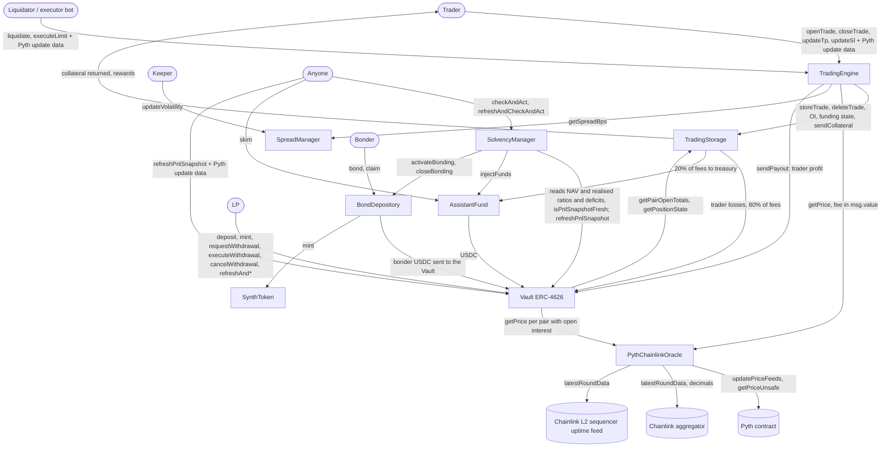
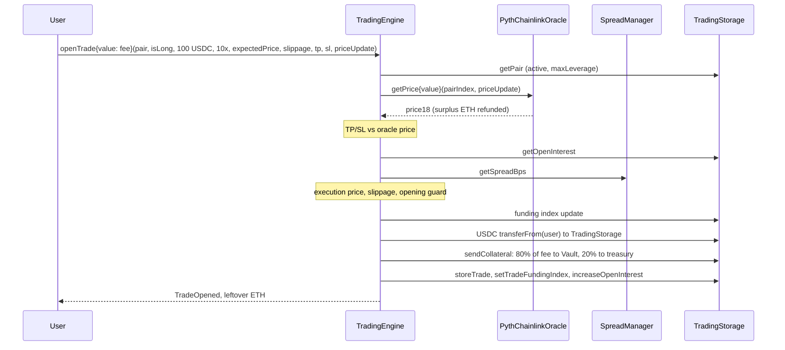
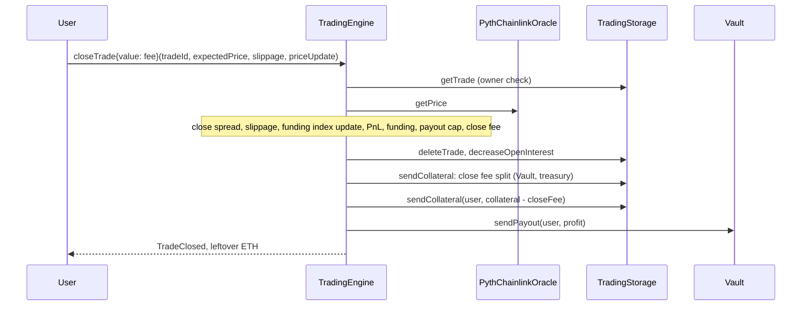
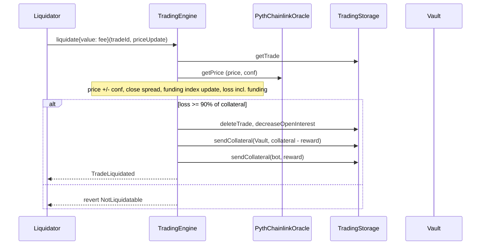

# Guide 3: Technical Architecture and Data Flow

**Prerequisites:** [Guide 2: Protocol Mathematics](./02-mathematics.md)
**Next:** [Guide 4: Trade-offs and Risks](./04-tradeoffs.md)

**Status:** Proof of concept. Not audited and not deployed.

---

## Table of Contents

1. [Component Diagram](#1-component-diagram)
2. [Oracle](#2-oracle)
3. [Oracle Design Note](#3-oracle-design-note)
4. [Contract Descriptions](#4-contract-descriptions)
5. [Execution Flows](#5-execution-flows)
6. [Design Patterns](#6-design-patterns)

---

## 1. Component Diagram


```mermaid
flowchart TD
    Trader([Trader]) -->|openTrade, closeTrade, updateTp, updateSl + Pyth update data| Engine
    Bot([Liquidator / executor bot]) -->|liquidate, executeLimit + Pyth update data| Engine
    Engine[TradingEngine] -->|storeTrade, deleteTrade, OI, funding state, sendCollateral| Storage[TradingStorage]
    Engine -->|getPrice, fee in msg.value| Oracle[PythChainlinkOracle]
    Oracle -->|updatePriceFeeds, getPriceUnsafe| Pyth[(Pyth contract)]
    Oracle -->|latestRoundData, decimals| Chainlink[(Chainlink aggregator)]
    Oracle -->|latestRoundData| Sequencer[(Chainlink L2 sequencer uptime feed)]
    Engine -->|getSpreadBps| Spread[SpreadManager]
    Keeper([Keeper]) -->|updateVolatility| Spread
    Storage -->|collateral returned, rewards| Trader
    Storage -->|trader losses, 80% of fees| Vault[Vault ERC-4626]
    Storage -->|20% of fees to treasury| AF[AssistantFund]
    Engine -->|sendPayout: trader profit| Vault
    LP([LP]) -->|deposit, mint, requestWithdrawal, executeWithdrawal, cancelWithdrawal, refreshAnd*| Vault
    Anyone([Anyone]) -->|checkAndAct, refreshAndCheckAndAct| SM[SolvencyManager]
    Anyone -->|skim| AF
    Anyone -->|refreshPnlSnapshot + Pyth update data| Vault
    Vault -->|getPairOpenTotals, getPositionState| Storage
    Vault -->|getPrice per pair with open interest| Oracle
    SM -->|reads NAV and realised ratios and deficits, isPnlSnapshotFresh; refreshPnlSnapshot| Vault
    SM -->|injectFunds| AF
    AF -->|USDC| Vault
    SM -->|activateBonding, closeBonding| BD[BondDepository]
    Bonder([Bonder]) -->|bond, claim| BD
    BD -->|bonder USDC sent to the Vault| Vault
    BD -->|mint| Synth[SynthToken]
```

Notes:

- The Pyth update data is fetched off-chain by the caller (for example from the Pyth Hermes API, which
  requires an API key since the Pyth Core upgrade of 2026-08-26) and passed as `bytes[]` calldata. The
  engine forwards `msg.value` to the oracle, which pays the Pyth fee and refunds the surplus to the engine.
  At the end of the call the engine returns what the call added to its balance (`msg.value` minus the fee
  paid; the `refundsEthSurplus` modifier keeps the balance at entry in transient storage), so ETH
  force-sent to the engine is not paid out.
- The treasury is a `TradingEngine` constructor argument, changeable by the owner. `script/Deploy.s.sol`
  sets it to the `AssistantFund`.
- All trader collateral sits in `TradingStorage`. Liquidator and TP/SL executor rewards are paid from it.

---

## 2. Oracle

`PythChainlinkOracle` implements `IOracle`:

```solidity
function getPrice(uint256 pairIndex, bytes[] calldata priceData) external payable returns (uint128 price18, uint128 conf18);
```

Pyth is the price source. Chainlink is only a deviation check: if Pyth fails a check the call reverts; it
never falls back to the Chainlink answer.

### Validation pipeline (`PythChainlinkOracle.getPrice`)

| Step | Check | Error |
| :--- | :---- | :---- |
| 1 | Pair feed configured (`active`) | `PairFeedNotSet` |
| 2 | Sequencer uptime feed (if set): `answer == 0`, `startedAt != 0`, and more than `SEQUENCER_GRACE_PERIOD` (3600 s) since `startedAt` | `SequencerDown`, `SequencerGracePeriodNotOver` |
| 3 | `msg.value >= PYTH.getUpdateFee(priceData)`, then `PYTH.updatePriceFeeds{value: fee}(priceData)` | `InsufficientFee` |
| 3b | `PYTH.getPriceUnsafe(feedId)`: `publishTime <= block.timestamp` and `block.timestamp - publishTime <= maxPriceAge` (5 s by default, owner-set up to `MAX_STALENESS` = 30 s) | `PriceFromFuture`, `StalePrice` |
| 4 | `price > 0` | `ZeroPrice` |
| 5 | `conf * 10000 <= price * 200` (confidence at most 2% of price) | `ConfidenceTooWide` |
| 6 | Normalise price and conf to 18 decimals (`PythUtils.convertToUint`) | |
| 7 | Chainlink `latestRoundData`: `block.timestamp - updatedAt <= heartbeat`, `answer > 0`, normalise by `decimals()` | `ChainlinkStalePrice`, `ZeroPrice` |
| 8 | `abs(pyth - chainlink) * 10000 <= chainlink * 300` (at most 3% apart) | `PriceDeviationTooHigh` |
| 9 | Refund `msg.value - fee` to the caller | |

Behaviour to be aware of:

- `updatePriceFeeds` only stores an update newer than the one already on-chain, and `getPriceUnsafe`
  returns the newest stored price. A caller can therefore pick any signed update from the last
  `maxPriceAge` seconds that is newer than the stored one, or pass no update and use the stored price if
  it is fresh enough. This is the remaining latency window ([Guide 4](./04-tradeoffs.md#1-latency-arbitrage)).
- The same age limit applies to every `getPrice` call: open, close, TP/SL execution, liquidation, and the
  TP/SL validation in `updateTp`/`updateSl`.
- A `publishTime` after `block.timestamp` reverts with `PriceFromFuture` instead of an arithmetic
  underflow. No such update was seen on Arbitrum One: in 787 Pyth `PriceFeedUpdate` events (265
  transactions, 60 windows of 10,000 blocks, 86,400 blocks apart, ending at block 509,770,836), the age at
  inclusion was 0 s (345 events), 1 s (426) or 2 s (16), and never negative
  (`python3 script/analysis/pyth_update_age.py --rpc https://arb1.arbitrum.io/rpc --head 509770836 --window 10000 --step 86400 --count 60`).
  These are updates pushed by bots, not wallet transactions.
- The sequencer uptime feed is a constructor parameter (`address(0)` disables the check, for chains
  without one). While the sequencer is down, and for one hour after it comes back, every price read
  reverts, including liquidations, so positions are not settled before traders could react.
- Any failed check reverts the whole call. `closeTrade`, `executeLimit`, `liquidate`, `openTrade`, and
  `updateTp`/`updateSl` with a non-zero value all revert while Pyth is stale, its confidence is wide,
  Chainlink is stale, the two disagree by more than 3%, or the sequencer check fails.
- Arbitrum One charged no Pyth update fee at the pinned fork block (`test_Fork_UpdateFee_IsZero`), so the
  refund path is only exercised with a non-zero fee by the MockPyth tests.

### How the confidence band is used

- `openTrade`, `closeTrade`, `executeLimit`, `updateTp`, `updateSl` use `price18` and ignore `conf18`.
- `liquidate` uses the trader-favourable edge of the band: `price + conf` for longs and
  `max(price - conf, 0)` for shorts, then applies the close spread. A wide band makes liquidation harder;
  since the oracle rejects `conf` above 2% of the price, the effect is bounded.

---

## 3. Oracle Design Note

A custom oracle network (a set of nodes publishing a median price) was considered early on and dropped,
because keeping it live requires running and monitoring backend services. Pyth pull updates anchored to
Chainlink are used instead. No code from the earlier design remains; `IOracle` keeps the engine
independent of the oracle implementation, so another backend would be a new `IOracle` contract and a
redeploy of `TradingEngine` (the oracle address is immutable there).

Consequences of the chosen design:

- Price-consuming `TradingEngine` functions are `payable` and forward `msg.value` to fund the Pyth fee.
- Frontends and bots must fetch Pyth update data off-chain and attach it to each call.
- The caller chooses the update within the staleness window (see section 2), which matters for latency
  arbitrage ([Guide 4](./04-tradeoffs.md#1-latency-arbitrage)).

---

## 4. Contract Descriptions

Every contract uses Solady `Ownable` with a single owner. There is no role system and no timelock.

### 4.1 `Vault.sol` (ERC-4626)

Holds LP USDC, issues sUSDC at a conservative NAV, keeps the PnL snapshot, pays trader profits.

| Function | Access | Description |
| :------- | :----- | :---------- |
| `deposit(assets, receiver)` / `mint(shares, receiver)` | Anyone, when not paused | ERC-4626 entry at the NAV; reverts with `StalePnlSnapshot` or `CoverageBelowPar` |
| `refreshAndDeposit` / `refreshAndMint(..., priceUpdate)` | Anyone, when not paused, payable | Refresh the snapshot, then deposit or mint; refund the ETH surplus |
| `refreshPnlSnapshot(priceUpdate)` | Anyone, payable | Value every pair with open interest and store `(netPnl, timestamp, nonce)` |
| `totalAssets()` | View | USDC balance minus the positive net trader PnL of the latest snapshot; never reverts |
| `withdraw(...)` / `redeem(...)` | Anyone | Always revert with `UseRequestWithdrawalFlow` |
| `requestWithdrawal(shares)` | Share holder, when not paused | Moves `shares` into escrow in the vault and records the current epoch; a new request returns the previous escrow first |
| `executeWithdrawal()` | Requester | During the epoch after the 3-epoch delay, burns the escrowed shares at the current NAV and sends USDC; needs a fresh snapshot; later it reverts with `WithdrawalExpired` |
| `refreshAndExecuteWithdrawal(priceUpdate)` | Requester, payable | Refresh the snapshot, then execute the request |
| `cancelWithdrawal()` | Requester | Deletes the request and returns the escrowed shares (also after expiry) |
| `sendPayout(receiver, amount)` | `tradingEngine` only | Sends USDC; reverts if `amount` is above the USDC balance |
| `collateralizationRatio()` / `collateralizationDeficit()` | View | NAV ratio and deficit (LP principal coverage); injection trigger in `SolvencyManager` |
| `realisedCollateralizationRatio()` / `realisedCollateralizationDeficit()` | View | Balance-only ratio and deficit; bonding trigger and `bond` clamp |
| `isPnlSnapshotFresh()` | View | No open trade, or snapshot within `maxPnlSnapshotAge` with no open or close since |
| `setTradingEngine`, `setMaxPnlSnapshotAge`, `pause`, `unpause` | Owner | |

`maxWithdraw` and `maxRedeem` return 0 because `withdraw` and `redeem` always revert; `maxDeposit` and
`maxMint` return 0 while the vault is paused, with a stale snapshot or below 100% coverage
([Guide 7](./07-vault-ssl.md#erc-4626-max-functions)).

### 4.2 `TradingEngine.sol`

| Function | Access | Description |
| :------- | :----- | :---------- |
| `openTrade(pairIndex, isLong, collateral, leverage, expectedPrice, slippageBps, tp, sl, priceUpdate)` | Anyone, when not paused | Opens a position |
| `closeTrade(tradeId, expectedPrice, slippageBps, priceUpdate)` | Trade owner, when not paused | Closes and settles |
| `updateTp(tradeId, newTp, priceUpdate)` / `updateSl(...)` | Trade owner, when not paused | Changes TP or SL; 0 clears it |
| `liquidate(tradeId, priceUpdate)` | Anyone, also while paused | Liquidates when the loss reaches 90% |
| `executeLimit(tradeId, priceUpdate)` | Anyone, when not paused | Closes when TP or SL is crossed |
| `setTreasury`, `setFundingFactor`, `pause`, `unpause` | Owner | |

Checks in `openTrade`: collateral at least 10 USDC, leverage non-zero, at most `MAX_LEVERAGE` (100) and at
most the pair's `maxLeverage`, pair active, TP/SL not already crossed at the oracle price, execution price
within the caller's slippage tolerance, the opening guard (the position must not be liquidatable at an
unchanged price in the same block, [Guide 2](./02-mathematics.md#opening-guard-_validatenotpreliquidatable)),
open fee below the collateral (unreachable while `MAX_LEVERAGE` is 100), and pair OI cap (in
`TradingStorage`).

TP/SL rules, checked against the oracle price in the engine and against the open price in storage:

| Direction | TP | SL |
| :-------- | :- | :- |
| Long | `tp > price` | `sl < price` |
| Short | `tp < price` | `sl > price` |

**`liquidate` design:**

- Not gated by `whenNotPaused`, so liquidations continue while trading is paused. Closing and TP/SL
  execution are paused, so traders cannot exit while liquidations run.
- The loss includes funding, like `closeTrade`.
- The caller funds the Pyth fee through `msg.value`.
- If the oracle reverts (stale, wide confidence, deviation), `liquidate` reverts too.
- The reward is `max(10% of the collateral left after the loss, 0.5% of the collateral)`: 1% of the
  collateral at the threshold, never below 0.5%, also past a 100% loss, and never more than the collateral,
  so the vault never funds it.
- The vault is paid before the liquidator, so a liquidator blocked by the token can only block its own
  reward.
- PnL rounding favours the vault (longs floor, shorts ceil `exitValue`).

**`executeLimit` design:**

- Anyone can call it once the oracle price crosses TP (long `price >= tp`, short `price <= tp`) or SL (long
  `price <= sl`, short `price >= sl`). TP is checked first.
- Settlement uses the close-direction spread, funding, the close fee and the same payout branches as
  `closeTrade`. The payout goes to the trade owner.
- The caller receives 0.1% of notional, taken from the trader's payout and capped at it.
- Gated by `whenNotPaused`.

### 4.3 `TradingStorage.sol`

Stores trades, pairs, OI and funding state, and holds trader collateral. Only `tradingEngine` can change
state or move funds.

```solidity
mapping(uint256 => Trade) private _trades;
mapping(address => uint256[]) private _userTrades;
mapping(uint256 => uint256) private _openInterestLong;   // pairIndex => OI (18 decimals)
mapping(uint256 => uint256) private _openInterestShort;
mapping(uint256 => int256) private _cumulativeFundingIndexLong;  // per pair, long side
mapping(uint256 => int256) private _cumulativeFundingIndexShort; // per pair, short side
mapping(uint256 => uint256) private _fundingLastUpdated;         // per pair
mapping(uint256 => int256) private _tradeFundingIndex;           // per trade, entry index of its side
Pair[] private _pairs;
```

`increaseOpenInterest` enforces `long + short <= maxOI` per pair. `addPair` and `updatePair` reject a
`maxLeverage` above `MAX_LEVERAGE`. `deleteTrade` removes the ID from the user's array in constant time:
`Trade.userIndex` holds the trade's position in the array and the last entry is swapped into it.

### 4.4 `PythChainlinkOracle.sol`

See section 2. Owner functions: `setPairFeed(pairIndex, pythFeedId, chainlinkFeed, heartbeat)` and
`setMaxPriceAge(seconds)`. `setPairFeed` always marks the feed active; there is no function to deactivate a
feed. The sequencer uptime feed is immutable.

### 4.5 `SpreadManager.sol`

`getSpreadBps(pairIndex, currentOI)` (formula in [Guide 2](./02-mathematics.md#4-execution-price-with-dynamic-spread)).
The keeper calls `updateVolatility`; the owner sets base spread, factors, cap, volatility change bound and
keeper.

### 4.6 `SolvencyManager.sol`

| Function | Access | Action |
| :------- | :----- | :----- |
| `checkAndAct()` | Anyone | At or above 100% CR, closes an open bonding round. Below 100% CR, injects `min(reserve, deficit)` from the AssistantFund; below 95%, also opens a bonding round for the remaining shortfall if none is active |
| `deficitToTarget()` | View | `Vault.collateralizationDeficit()` |

It holds no funds. There is no buyback function.

### 4.7 `AssistantFund.sol`

| Function | Access | Description |
| :------- | :----- | :---------- |
| `injectFunds(amount)` | SolvencyManager | Sends reserve USDC to the vault |
| `skim()` | Anyone | Sends `balance - targetCap` to the vault |
| `balance()` / `isFunded()` | View | |
| `setSolvencyManager`, `setTargetCap` | Owner | |

It receives fees as plain USDC transfers when it is set as the engine treasury.

### 4.8 `BondDepository.sol` and `SynthToken.sol`

| Function | Access | Description |
| :------- | :----- | :---------- |
| `activateBonding(neededUsdc)` | SolvencyManager | Opens a round with a USDC cap |
| `closeBonding()` | SolvencyManager | Closes the open round (called by `checkAndAct` at CR >= 100%) |
| `bond(usdcAmount)` | Anyone, during a round | Takes `min(usdcAmount, remainingCap, vault deficit)` from the caller into the vault, mints $SYNTH into the depository and records a linear vesting position; reverts `NoActiveRound` when nothing is available |
| `claim(bondId)` | Bonder | Transfers vested $SYNTH |
| `setReferencePrice`, `setDiscountBps` (max 10%), `setVestingPeriod` (max 7 days), `setSolvencyManager` | Owner | |
| `SynthToken.mint` | Minter (set by owner) | |
| `SynthToken.burn` / `burnFrom` | Holder / approved spender | |

A round closes when its cap is used, when a bond restores the vault to 100% CR, or when `checkAndAct`
finds CR back at 100%.

---

## 5. Execution Flows

All price-consuming functions take `bytes[] calldata priceUpdate` and are `payable`.

### 5.1 Open trade


```mermaid
sequenceDiagram
    participant User
    participant Engine as TradingEngine
    participant Oracle as PythChainlinkOracle
    participant Spread as SpreadManager
    participant Storage as TradingStorage

    User->>Engine: openTrade{value: fee}(pair, isLong, 100 USDC, 10x, expectedPrice, slippage, tp, sl, priceUpdate)
    Engine->>Storage: getPair (active, maxLeverage)
    Engine->>Oracle: getPrice{value}(pairIndex, priceUpdate)
    Oracle-->>Engine: price18 (surplus ETH refunded)
    Note over Engine: TP/SL vs oracle price
    Engine->>Storage: getOpenInterest
    Engine->>Spread: getSpreadBps
    Note over Engine: execution price, slippage, opening guard
    Engine->>Storage: funding index update
    Engine->>Storage: USDC transferFrom(user) to TradingStorage
    Engine->>Storage: sendCollateral: 80% of fee to Vault, 20% to treasury
    Engine->>Storage: storeTrade, setTradeFundingIndex, increaseOpenInterest
    Engine-->>User: TradeOpened, leftover ETH
```

### 5.2 Close with profit

Example: long 10x, 100 USDC deposited, oracle 50,000 at open and 52,000 at close, 5 BPS spread, no
funding accrued.

| Item | Value |
| :--- | :---- |
| Open fee | 0.80 USDC (0.64 to vault, 0.16 to treasury) |
| Stored collateral | 99.20 USDC |
| Open price / exit price | 50,025 / 51,974 |
| PnL | 38.648835 USDC |
| Close fee | 0.7936 USDC |
| Payout | 137.055235 USDC: 98.4064 from TradingStorage, 38.648835 from the Vault |


```mermaid
sequenceDiagram
    participant User
    participant Engine as TradingEngine
    participant Oracle as PythChainlinkOracle
    participant Storage as TradingStorage
    participant Vault

    User->>Engine: closeTrade{value: fee}(tradeId, expectedPrice, slippage, priceUpdate)
    Engine->>Storage: getTrade (owner check)
    Engine->>Oracle: getPrice
    Note over Engine: close spread, slippage, funding index update, PnL, funding, payout cap, close fee
    Engine->>Storage: deleteTrade, decreaseOpenInterest
    Engine->>Storage: sendCollateral: close fee split (Vault, treasury)
    Engine->>Storage: sendCollateral(user, collateral - closeFee)
    Engine->>Vault: sendPayout(user, profit)
    Engine-->>User: TradeClosed, leftover ETH
```

On a partial loss, `TradingStorage` pays the trader the payout and sends the rest of the collateral to the
vault. On a full loss, all collateral goes to the vault.

### 5.3 Liquidation


```mermaid
sequenceDiagram
    participant Bot as Liquidator
    participant Engine as TradingEngine
    participant Oracle as PythChainlinkOracle
    participant Storage as TradingStorage
    participant Vault

    Bot->>Engine: liquidate{value: fee}(tradeId, priceUpdate)
    Engine->>Storage: getTrade
    Engine->>Oracle: getPrice (price, conf)
    Note over Engine: price +/- conf, close spread, funding index update, loss incl. funding
    alt loss >= 90% of collateral
        Engine->>Storage: deleteTrade, decreaseOpenInterest
        Engine->>Storage: sendCollateral(Vault, collateral - reward)
        Engine->>Storage: sendCollateral(bot, reward)
        Engine-->>Bot: TradeLiquidated
    else
        Engine-->>Bot: revert NotLiquidatable
    end
```

---

## 6. Design Patterns

### 6.1 Checks, effects, interactions

`openTrade`, `closeTrade`, `liquidate`, `executeLimit`, `updateTp` and `updateSl` are `nonReentrant`.
They call the oracle (an external, owner-configured contract) and update the funding state in
`TradingStorage` before the trade is deleted; the trade deletion and OI change happen before any USDC
transfer, and the ETH refund to the caller is the last interaction.

### 6.2 Access-control helpers

Each access check is a modifier that calls an internal `_require*` function (for example `onlyTradingEngine`
calls `_requireTradingEngine`), which keeps the check in one place in the bytecode.

### 6.3 Push payouts

Payouts are pushed to the trader in the same call. If the token blocks a trader's address, that trader's
close reverts. A pull ("claim") pattern is not used.

### 6.4 Contract size

`TradingEngine` runtime size is 24,563 bytes, 13 bytes under the 24,576 byte limit
(`forge build --sizes`, optimizer off). The round 2 fixes added 1,652 bytes (from 22,911). Any further
logic in the engine needs the optimizer or an extraction (a settlement library or a satellite contract)
first. No proxy or diamond pattern is used; contracts are not upgradeable.

---

**See also:**

- [Guide 4: Trade-offs and Risks](./04-tradeoffs.md)
- [Guide 5: Implementation](./05-implementation.md)
