# 🏗️ Guide 3: Technical Architecture and Data Flow

**Version:** 1.0
**Prerequisites:** [Guide 2: Protocol Mathematics](./02-mathematics.md)
**Next:** [Guide 4: Trade-offs and Problems](./04-tradeoffs.md)

---

## 📋 Table of Contents

1. [Component Diagram](#1-component-diagram)
2. [Oracle System (DON)](#2-oracle-system-don)
3. [Contract Descriptions](#3-contract-descriptions)
4. [Detailed Execution Flows](#4-detailed-execution-flows)
5. [Design Patterns](#5-design-patterns)

---

## 1. Component Diagram

### High-Level View


### Detailed View (ASCII)

```
┌─────────────────────────────────────────────────────────────────────┐
│                           USER LAYER                                 │
│  (Frontend, Arbitrage Bots, LPs, Keepers)                           │
└────────────┬────────────────────────────────────────┬───────────────┘
             │                                        │
             │ Execute Trades                         │ Deposit Liquidity
             ▼                                        ▼
┌─────────────────────────────────────────────────────────────────────┐
│                        EVM CONTRACT LAYER                            │
│                                                                      │
│  ┌───────────────────────┐           ┌───────────────────────┐      │
│  │  TRADING ENGINE              │──────────►│  VAULT (ERC-4626)     │      │
│  │  (Business Logic)     │           │  (The Treasury)       │      │
│  │                       │           │                       │      │
│  │  • openTrade          │◄──────────│  • Custodies USDC     │      │
│  │  • closeTrade         │           │  • Issues sToken      │      │
│  │  • liquidate          │           │  • Pays Winners       │      │
│  │  • updateTP/SL        │           │  • Tracks Assets      │      │
│  └──────────┬────────────┘           └───────────────────────┘      │
│             │                                     ▲                  │
│             ▼                                     │                  │
│  ┌───────────────────────┐           ┌────────────┴──────────┐      │
│  │  TRADING STORAGE      │           │  SOLVENCY MANAGER     │      │
│  │  (State Layer)        │           │  (Defense Orchestrator)│      │
│  │                       │           │                       │      │
│  │  • trades[id]         │           │  • Check CR           │      │
│  │  • openInterest[pair] │           │  • Trigger Injection  │      │
│  │  • userTrades[addr]   │           │  • Trigger Bonding    │      │
│  └───────────────────────┘           └───────────────────────┘      │
│             ▲                                 │       │              │
│             │                                 ▼       ▼              │
│             │                        ┌────────────┐ ┌────────────┐  │
│             │                        │ ASSISTANT  │ │ BOND       │  │
│             │                        │ FUND       │ │ DEPOSITORY │  │
│             │                        └────────────┘ └────────────┘  │
│             │                                                        │
│  ┌──────────┴────────────┐                                          │
│  │  ORACLE AGGREGATOR    │◄──── Decentralized Oracle Network (DON)  │
│  │  (Price Source)       │                                          │
│  │                       │      ┌────────────────────────────────┐  │
│  │  • 6-8 DON Nodes      │◄─────│  CHAINLINK FEED (Validation)   │  │
│  │  • Median of 3 best   │      └────────────────────────────────┘  │
│  │  • Slippage check     │                                          │
│  └───────────────────────┘                                          │
└─────────────────────────────────────────────────────────────────────┘
```

---

## 2. Oracle System (DON)

The oracle is the most critical component. Manipulation or failure can drain the Vault.

### DON Architecture


### Aggregation Process

1. **Request:** Contract requests price from 6-8 DON nodes.
2. **Response:** Responses are received (some may fail or be slow).
3. **Validation:** Prices with excessive slippage vs Chainlink are discarded.
4. **Selection:** The 3 fastest prices that passed validation are taken.
5. **Aggregation:** The **median** of those 3 prices is calculated.
6. **Execution:** Trade executes with final price (+ dynamic spread).

### Why Median?

- **Resists manipulation:** 1 corrupt node cannot move the price.
- **Resists outliers:** An extreme price (wick) is discarded.
- **Example:** Prices [50,005, 50,010, 60,000] → Median = **50,010** (ignores 60k).

---

## 3. Contract Descriptions

### 3.1 `Vault.sol` (ERC-4626)

**Role:** Financial heart. Custodies USDC, issues shares, pays traders.

| Function | Access | Description |
|:---|:---|:---|
| `deposit(assets, receiver)` | Public | LP deposits USDC, receives sToken |
| `withdraw(assets, receiver, owner)` | Public | LP withdraws USDC (subject to timelock) |
| `redeem(shares, receiver, owner)` | Public | LP burns sToken for USDC |
| `sendPayout(user, amount)` | onlyTrading | Pays profits to traders |
| `receiveLoss(amount)` | onlyTrading | Records trader losses |
| `totalAssets()` | View | Total USDC in Vault |

**Security:**
- `onlyTrading`: Only TradingEngine can request payouts.
- **Withdrawal Request System:** 3-epoch timelock for withdrawals (anti front-running).

### 3.2 `TradingEngine.sol` (Business Logic)

**Role:** Main controller for trading logic.

| Function | Access | Description |
|:---|:---|:---|
| `openTrade(pair, size, leverage, isLong)` | Public | Opens new position |
| `closeTrade(tradeId)` | Owner | Closes position (manual) |
| `updateTP(tradeId, newTP)` | Owner | Updates Take Profit |
| `updateSL(tradeId, newSL)` | Owner | Updates Stop Loss |
| `liquidate(tradeId)` | Public | Liquidates at-risk position |
| `executeLimit(tradeId)` | Keeper | Executes reached TP/SL |

**Validations in `openTrade`:**
- ✅ User has sufficient collateral
- ✅ Pair is not paused
- ✅ Global/pair `MaxOpenInterest` not exceeded
- ✅ Oracle price is valid and recent
- ✅ Leverage is within limits

### 3.3 `TradingStorage.sol` (State Layer)

**Role:** Stores all persistent data. Allows logic upgrades without data migration.

```solidity
// Main mappings
mapping(uint256 => Trade) public trades;
mapping(uint256 => uint256) public openInterest; // pairIndex => OI
mapping(address => uint256[]) public userTrades;

// Global indices
uint256 public cumulativeFundingIndex;
uint256 public lastFundingTime;
```

### 3.4 `OracleAggregator.sol`

**Role:** Unifies DON prices with security validations.

| Function | Description |
|:---|:---|
| `getPrice(pairIndex)` | Returns aggregated price (median of 3) |
| `validateAgainstChainlink(price)` | Verifies maximum slippage |
| `checkStaleness(timestamp)` | Rejects prices > 2 minutes old |

**Anti-Wick Logic:**
```solidity
// Only accept prices within ±X% of Chainlink
require(
    price >= chainlinkPrice * (1 - MAX_SLIPPAGE) &&
    price <= chainlinkPrice * (1 + MAX_SLIPPAGE),
    "Price deviation too high"
);
```

### 3.5 `SolvencyManager.sol`

**Role:** Orchestrates Vault defense layers.

| Function | Trigger | Action |
|:---|:---|:---|
| `checkAndInject()` | CR < 100% | Inject from AssistantFund |
| `activateBonding()` | AssistantFund insufficient | Start bond sales |
| `executeBuyback()` | CR > 110% | Buy and burn $SYNTH |

### 3.6 `AssistantFund.sol`

**Role:** Emergency reserve in USDC.

- **Input:** 20% of all trading fees.
- **Output:** Only callable by `SolvencyManager` under deficit.

### 3.7 `BondDepository.sol`

**Role:** Last resort mechanism. Sells $SYNTH at discount.

| Parameter | Value | Description |
|:---|:---|:---|
| `DISCOUNT` | 5-10% | Discount vs TWAP |
| `VESTING_PERIOD` | 0-7 days | Vesting period (based on urgency) |
| `BOND_CAP` | Variable | Maximum USDC to raise |

---

## 4. Detailed Execution Flows

### 4.1 Open Trade Flow

```mermaid
sequenceDiagram
    participant User
    participant Trading as TradingEngine
    participant Oracle as OracleAggregator
    participant Storage as TradingStorage
    participant Vault

    User->>Trading: openTrade(pair, 100 USDC, 10x, Long)
    
    Trading->>Trading: Validations:<br/>- OI check<br/>- Leverage check<br/>- Pair active
    
    Trading->>Oracle: getPrice(pair)
    Oracle-->>Trading: price = 50,000 USD
    
    Trading->>Trading: Calculate:<br/>- Entry price with spread<br/>- Fees (0.08%)
    
    Trading->>Vault: transferFrom(user, 100 USDC)
    Vault-->>Trading: ✓
    
    Trading->>Storage: storeTrade(trade struct)
    Trading->>Storage: updateOI(pair, +1000 USD)
    
    Trading-->>User: Emit TradeOpened(tradeId)
```



### 4.2 Close Trade with Profit Flow


### 4.3 Liquidation Flow


---

## 5. Design Patterns

### 5.1 Checks-Effects-Interactions (CEI)

**CRITICAL** to avoid reentrancy:

```solidity
function closeTrade(uint256 tradeId) external nonReentrant {
    Trade storage t = trades[tradeId];
    
    // 1. CHECKS
    if (msg.sender != t.user) revert NotTradeOwner();
    
    // 2. EFFECTS (update state BEFORE external calls)
    uint256 payout = _calculatePnL(t);
    delete trades[tradeId];
    openInterest[t.pairIndex] -= t.size;
    
    // 3. INTERACTIONS (external calls LAST)
    if (payout > 0) {
        vault.sendPayout(msg.sender, payout);
    }
}
```

### 5.2 Diamond Pattern (EIP-2535)

Recommended if system exceeds 24kb per contract limit:

```
┌─────────────────────────────┐
│      Diamond Proxy          │
│  (Single entry point)       │
├─────────────────────────────┤
│ Facet: TradingFacet         │
│ Facet: VaultFacet           │
│ Facet: OracleFacet          │
│ Facet: SolvencyFacet        │
└─────────────────────────────┘
```

### 5.3 Pull over Push

For profit withdrawals, consider "claim" pattern:

```solidity
// Instead of:
vault.sendPayout(user, amount); // Push (can fail)

// Use:
pendingPayouts[user] += amount;
// User claims later
```

---

**See also:**
- [Guide 4: Trade-offs and Problems](./04-tradeoffs.md) - Risks and mitigations
- [Guide 5: Solidity Implementation](./05-implementation.md) - Detailed code
