# 🏗️ Guide 3: Technical Architecture and Data Flow

**Version:** 2.0
**Prerequisites:** [Guide 2: Protocol Mathematics](./02-mathematics.md)
**Next:** [Guide 4: Trade-offs and Problems](./04-tradeoffs.md)

---

## 📋 Table of Contents

1. [Component Diagram](#1-component-diagram)
2. [Oracle System (Pyth + Chainlink)](#2-oracle-system-pyth--chainlink)
3. [Oracle Architecture Decision Record](#3-oracle-architecture-decision-record)
4. [Contract Descriptions](#4-contract-descriptions)
5. [Detailed Execution Flows](#5-detailed-execution-flows)
6. [Design Patterns](#6-design-patterns)

---

## 1. Component Diagram

### High-Level View


### Detailed View (ASCII)

```
┌─────────────────────────────────────────────────────────────────────┐
│                           USER LAYER                                │
│            (Frontend, Arbitrage Bots, LPs, Keepers)                 │
│                                                                     │
│  Frontend fetches price data from Pyth Hermes API and includes      │
│  it as calldata in the user's transaction (pull oracle model).      │
└────────────┬────────────────────────────────────────┬───────────────┘
             │                                        │
             │ Execute Trades (+ priceUpdate bytes)   │ Deposit Liquidity
             ▼                                        ▼
┌─────────────────────────────────────────────────────────────────────┐
│                        EVM CONTRACT LAYER                           │
│                                                                     │
│  ┌───────────────────────┐           ┌───────────────────────┐      │
│  │  TRADING ENGINE       │──────────►│  VAULT (ERC-4626)     │      │
│  │  (Business Logic)     │           │  (The Treasury)       │      │
│  │                       │           │                       │      │
│  │  • openTrade          │◄──────────│  • Custodies USDC     │      │
│  │  • closeTrade         │           │  • Issues sToken      │      │
│  │  • liquidate          │           │  • Pays Winners       │      │
│  │  • updateTP/SL        │           │  • Tracks Assets      │      │
│  └──────────┬────────────┘           └───────────────────────┘      │
│             │                                     ▲                 │
│             ▼                                     │                 │
│  ┌───────────────────────┐           ┌────────────┴──────────┐      │
│  │  TRADING STORAGE      │           │  SOLVENCY MANAGER     │      │
│  │  (State Layer)        │           │ (Defense Orchestrator)│      │
│  │                       │           │                       │      │
│  │  • trades[id]         │           │  • Check CR           │      │
│  │  • openInterest[pair] │           │  • Trigger Injection  │      │
│  │  • userTrades[addr]   │           │  • Trigger Bonding    │      │
│  └───────────────────────┘           └───────────────────────┘      │
│             ▲                                 │       │             │
│             │                                 ▼       ▼             │
│             │                        ┌────────────┐ ┌────────────┐  │
│             │                        │ ASSISTANT  │ │ BOND       │  │
│             │                        │ FUND       │ │ DEPOSITORY │  │
│             │                        └────────────┘ └────────────┘  │
│             │                                                       │
│  ┌──────────┴────────────┐                                          │
│  │  PYTH+CHAINLINK ORACLE│◄──── Pyth Network (Primary, Pull Model)  │
│  │  (Price Validation)   │                                          │
│  │                       │      ┌────────────────────────────────┐  │
│  │  • Pyth price + conf  │◄─────│  CHAINLINK FEED (Deviation     │  │
│  │  • Staleness check    │      │  Anchor — revert if too far)   │  │
│  │  • Confidence check   │      └────────────────────────────────┘  │
│  │  • Chainlink anchor   │                                          │
│  └───────────────────────┘                                          │
└─────────────────────────────────────────────────────────────────────┘
```

---

## 2. Oracle System (Pyth + Chainlink)

The oracle is the most critical component. Manipulation or failure can drain the Vault.

### Architecture: Pull Oracle (Pyth) + Deviation Anchor (Chainlink)

The protocol uses **Pyth Network** as the primary price source with a **pull-based model**, and **Chainlink Price Feeds** exclusively as a deviation anchor to protect against extraordinary Pyth price anomalies.

**Key design principle:** Chainlink is NOT a fallback. If Pyth price is stale, the transaction reverts. Chainlink only validates that Pyth's price is within acceptable deviation — this is critical for high-leverage protocols where a Chainlink fallback (with its higher latency) could expose traders and LPs to unfair execution.

### Pull Oracle Flow

```mermaid
sequenceDiagram
    participant Frontend
    participant Hermes as Pyth Hermes (Off-chain)
    participant User
    participant Engine as TradingEngine
    participant Oracle as PythChainlinkOracle
    participant Pyth as Pyth Contract
    participant CL as Chainlink Feed

    Frontend->>Hermes: GET /v2/updates/price/latest?ids[]=feedId
    Hermes-->>Frontend: priceUpdate (signed bytes)
    Frontend->>User: Include priceUpdate in tx calldata

    User->>Engine: openTrade(pair, collateral, ..., priceUpdate)
    Engine->>Oracle: getPrice(pairIndex, priceUpdate)

    Oracle->>Pyth: updatePriceFeeds{value: fee}(priceUpdate)
    Pyth-->>Oracle: Price verified (Wormhole signature valid)

    Oracle->>Pyth: getPriceNoOlderThan(feedId, MAX_STALENESS)
    Pyth-->>Oracle: PythPrice(price, conf, expo, publishTime)

    Note over Oracle: Check 1: Staleness ≤ MAX_STALENESS<br/>Check 2: Confidence ≤ MAX_CONFIDENCE_BPS<br/>Check 3: Price > 0

    Oracle->>CL: latestRoundData()
    CL-->>Oracle: chainlinkPrice

    Note over Oracle: Check 4: |pythPrice - chainlinkPrice| ≤ MAX_DEVIATION<br/>If deviation too high → revert (circuit breaker)

    Oracle-->>Engine: validatedPrice (uint128, 18 decimals)
    Engine->>Engine: Execute trade with validated price
```



### Validation Pipeline

Every price goes through 4 checks before being accepted. Failure at any stage reverts the transaction:

| Check                | Condition                                                         | Error                   | Rationale                                        |
| :------------------- | :---------------------------------------------------------------- | :---------------------- | :----------------------------------------------- |
| **Staleness**        | `publishTime ≥ block.timestamp - MAX_STALENESS`                   | `StalePrice`            | Stale prices at high leverage = unfair execution |
| **Confidence**       | `conf * BPS_DENOMINATOR / abs(price) ≤ MAX_CONFIDENCE_BPS`        | `ConfidenceTooWide`     | Wide confidence = market stress or illiquidity   |
| **Non-zero**         | `price > 0`                                                       | `ZeroPrice`             | Sanity check                                     |
| **Deviation anchor** | `\|pythPrice - chainlinkPrice\| / chainlinkPrice ≤ MAX_DEVIATION` | `PriceDeviationTooHigh` | Protects against Pyth anomalies or manipulation  |

### Suggested Parameter Values

| Parameter            | Value                | Rationale                                                                            |
| :------------------- | :------------------- | :----------------------------------------------------------------------------------- |
| `MAX_STALENESS`      | 10-30 seconds        | For 100x leverage, fresher = safer. Tight bound prevents adversarial price selection |
| `MAX_CONFIDENCE_BPS` | 100-200 bps (1-2%)   | Rejects trades during extreme uncertainty                                            |
| `MAX_DEVIATION`      | 150-300 bps (1.5-3%) | Allows normal Pyth/Chainlink drift, catches anomalies                                |

### Confidence Interval Usage

Pyth provides a confidence interval (`conf`) with every price, representing publisher disagreement. This is a unique advantage over other oracles:

- **Normal conditions:** `conf/price < 0.1%` — proceed normally
- **Moderate uncertainty:** `conf/price ~ 0.5%` — protocol could widen spreads (Phase 4)
- **High uncertainty:** `conf/price > 1%` — revert, do not execute trades
- **Liquidations:** Use conservative price (`price - conf` for longs, `price + conf` for shorts) to prevent unfair liquidations during volatility

---

## 3. Oracle Architecture Decision Record

> **Date:** 2026-02-25
> **Status:** Accepted
> **Decision:** Pyth Network (primary) + Chainlink (deviation anchor only) — replacing the originally planned custom DON.

### Context

The original architecture (v1.0) specified a custom Decentralized Oracle Network (DON) with 6-8 nodes pulling prices from CEX APIs, validated against a Chainlink reference feed. This was inspired by Gains Network (gTrade) v6 architecture.

### Options Evaluated

#### Option A: Custom DON (6-8 nodes) — Original Design

**How it works:** 6-8 independent nodes connect to CEX WebSocket APIs (Binance, Coinbase, Kraken, etc.), compute median prices, sign and submit them on-chain. An oracle aggregator contract receives these prices, validates each against Chainlink (reject if >1.5% deviation), waits for minimum 3 valid answers, and returns the median.

**Pros:**

- Full control over aggregation logic and update frequency
- No external dependencies beyond CEX APIs and Chainlink reference
- Can add any trading pair by connecting a new CEX API

**Cons:**

- **~6-12 months engineering effort** (node software, key management, monitoring, aggregator contract)
- **$7k-$23k/month operational cost** (servers, gas, maintenance)
- **0.5-1 FTE permanent dedication** to oracle operations
- With only 6-8 nodes, compromise of 4 is sufficient for price manipulation
- CEX APIs change frequently, requiring constant maintenance
- **gTrade itself is migrating away from this pattern** to Chainlink Data Streams

#### Option B: Pyth Network (pull model) + Chainlink (anchor) — Chosen

**How it works:** Pyth's 128+ data publishers (exchanges, market makers like Jump, Jane Street, Wintermute) submit prices every 400ms to Pythnet. Users fetch the latest signed price from Pyth's off-chain Hermes API and include it as calldata. The on-chain Pyth contract verifies the Wormhole signature and stores the price. Chainlink serves as a deviation anchor.

**Pros:**

- **~2-3 weeks integration effort** (install SDK, implement IOracle, add checks)
- **Near-zero operational cost** (users pay ~$0.01 per price update on L2)
- 128+ first-party publishers with Oracle Integrity Staking (slashing)
- Confidence intervals enable dynamic risk management
- 400ms update frequency (free tier), 1ms with Pyth Pro
- 500+ price feeds (crypto, forex, commodities)
- Battle-tested: Synthetix v3, Jupiter Perps ($50B+ volume)

**Cons:**

- Wormhole dependency for cross-chain price attestation
- Pull model requires frontend to fetch and include price data
- Users could attempt adversarial price selection within staleness window
- Less popular feeds may have fewer publishers

### Industry Precedent

| Protocol           | Oracle Approach                                                | Trend                         |
| :----------------- | :------------------------------------------------------------- | :---------------------------- |
| **gTrade (Gains)** | Custom DON (8 nodes) → **migrating to Chainlink Data Streams** | Moving AWAY from custom DON   |
| **GMX v2**         | Chainlink Data Streams (pull)                                  | Never built custom infra      |
| **Synthetix v3**   | Pyth Network (pull)                                            | Standard for modern perps     |
| **Jupiter Perps**  | Pyth Network (pull)                                            | Standard for modern perps     |
| **dYdX v4**        | Validator consensus (own L1)                                   | Only viable with own appchain |

**Key observation:** No perpetual DEX launched after 2023 has chosen to build a custom DON. gTrade, the pioneer of the pattern, is actively migrating away from it.

### Decision

**Adopt Option B: Pyth (primary) + Chainlink (deviation anchor only).**

Chainlink is specifically NOT a fallback for stale Pyth prices. In a protocol supporting up to 100x leverage, executing a trade with a high-latency fallback price (Chainlink heartbeat can be 1-60 seconds) would expose traders and LPs to unfair execution. If Pyth is stale, the trade simply reverts — the user retries with a fresh price.

The `IOracle` interface abstraction allows adding new oracle backends (e.g., Chainlink Data Streams, a custom DON) in the future — just deploy a new `IOracle` implementation and update the address. TradingEngine never changes.

### Consequences

- Phase 3 reduced from ~3 months to ~3 weeks
- Engineering effort focused on core protocol features (Phases 4-8)
- TradingEngine functions that need prices must accept `bytes[] calldata priceUpdate` (not payable — oracle self-funds fees)
- Frontend must integrate with Pyth Hermes API
- Keeper bots (liquidations, TP/SL execution) must also fetch and submit Pyth price updates

---

## 4. Contract Descriptions

### 4.1 `Vault.sol` (ERC-4626)

**Role:** Financial heart. Custodies USDC, issues shares, pays traders.

| Function                            | Access      | Description                             |
| :---------------------------------- | :---------- | :-------------------------------------- |
| `deposit(assets, receiver)`         | Public      | LP deposits USDC, receives sToken       |
| `withdraw(assets, receiver, owner)` | Public      | LP withdraws USDC (subject to timelock) |
| `redeem(shares, receiver, owner)`   | Public      | LP burns sToken for USDC                |
| `sendPayout(user, amount)`          | onlyTrading | Pays profits to traders                 |
| `receiveLoss(amount)`               | onlyTrading | Records trader losses                   |
| `totalAssets()`                     | View        | Total USDC in Vault                     |

**Security:**

- `onlyTrading`: Only TradingEngine can request payouts.
- **Withdrawal Request System:** 3-epoch timelock for withdrawals (anti front-running).

### 4.2 `TradingEngine.sol` (Business Logic)

**Role:** Main controller for trading logic.

| Function                                  | Access | Description                 |
| :---------------------------------------- | :----- | :-------------------------- |
| `openTrade(pair, size, leverage, isLong)` | Public | Opens new position          |
| `closeTrade(tradeId)`                     | Owner  | Closes position (manual)    |
| `updateTP(tradeId, newTP)`                | Owner  | Updates Take Profit         |
| `updateSL(tradeId, newSL)`                | Owner  | Updates Stop Loss           |
| `liquidate(tradeId)`                      | Public | Liquidates at-risk position |
| `executeLimit(tradeId)`                   | Keeper | Executes reached TP/SL      |

**Validations in `openTrade`:**

- ✅ User has sufficient collateral
- ✅ Pair is not paused
- ✅ Global/pair `MaxOpenInterest` not exceeded
- ✅ Oracle price is valid and recent
- ✅ Leverage is within limits
- ✅ TP/SL not already triggered at oracle price (see below)

**TP/SL price-dependent validations (Phase 3):**

Both `openTrade` (when setting initial TP/SL) and `updateTP`/`updateSL` must validate that the TP/SL is not already triggered at the current oracle price. This is done in TradingEngine (not TradingStorage) because it requires access to the oracle.

| Direction | TP rule              | SL rule              |
| :-------- | :------------------- | :------------------- |
| LONG      | `tp > oraclePrice`   | `sl < oraclePrice`   |
| SHORT     | `tp < oraclePrice`   | `sl > oraclePrice`   |

If violated, the transaction reverts. Rationale:

- **SL already triggered:** The keeper would execute immediately at current market price, which is worse than the SL the user intended. The user loses more than expected while thinking they are protected.
- **TP already triggered:** The keeper would execute immediately at current market price, which is better than the TP — but the user likely doesn't know the price already surpassed their target. Reverting lets them set a higher TP or close at market price explicitly.

TradingStorage retains its own structural validations (Long: `tp > openPrice`, `sl < openPrice`; Short: inverse) as a defense-in-depth layer that doesn't depend on the oracle.

### 4.3 `TradingStorage.sol` (State Layer)

**Role:** Stores all persistent data. Allows logic upgrades without data migration.

```solidity
// Main mappings
mapping(uint256 => Trade) public trades;
mapping(uint256 => uint256) public openInterest; // pairIndex => OI
mapping(address => uint256[]) public userTrades;

// Global indices
uint256 public cumulativeFundingIndex;
uint256 public lastFundingTime;
```

### 4.4 `PythChainlinkOracle.sol` (implements `IOracle`)

**Role:** Validates Pyth prices with staleness, confidence, and Chainlink deviation checks. Self-funds Pyth fees from its own ETH balance.

| Function                                | Description                                                                    |
| :-------------------------------------- | :----------------------------------------------------------------------------- |
| `getPrice(pairIndex, priceData)`        | Updates Pyth price on-chain, validates, returns normalized price (18 decimals) |
| `getPairFeed(pairIndex)`                | Returns PairFeed config for a pair                                             |

**Interface:** `IOracle { getPrice(uint256 pairIndex, bytes[] calldata priceData) → uint128 price18 }` — technology-agnostic. TradingEngine only depends on this interface, not the implementation.

**Validation pipeline (all checks must pass or transaction reverts):**

```solidity
// 0. Compute fee and pay from own ETH balance
uint256 fee = PYTH.getUpdateFee(priceData);
if (address(this).balance < fee) revert InsufficientEthForFee();

// 1. Update Pyth price on-chain (user-submitted signed data)
PYTH.updatePriceFeeds{value: fee}(priceData);

// 2. Read price with staleness check (reverts if stale)
PythStructs.Price memory price = PYTH.getPriceUnsafe(feed.pythFeedId);
if (block.timestamp - price.publishTime > MAX_STALENESS) revert StalePrice();

// 3. Reject if confidence interval too wide
if (price.conf * BPS_DENOMINATOR / uint64(abs(price.price)) > MAX_CONFIDENCE_BPS)
    revert ConfidenceTooWide();

// 4. Chainlink deviation anchor (NOT a fallback — circuit breaker only)
uint256 chainlinkPrice = _getChainlinkPrice18(feed.chainlinkFeed, feed.chainlinkHeartbeat);
uint256 deviation = _calculateDeviation(pythPrice, chainlinkPrice);
if (deviation > MAX_DEVIATION) revert PriceDeviationTooHigh();
```

### 4.5 `SolvencyManager.sol`

**Role:** Orchestrates Vault defense layers.

| Function            | Trigger                    | Action                    |
| :------------------ | :------------------------- | :------------------------ |
| `checkAndInject()`  | CR < 100%                  | Inject from AssistantFund |
| `activateBonding()` | AssistantFund insufficient | Start bond sales          |
| `executeBuyback()`  | CR > 110%                  | Buy and burn $SYNTH       |

### 4.6 `AssistantFund.sol`

**Role:** Emergency reserve in USDC.

- **Input:** 20% of all trading fees.
- **Output:** Only callable by `SolvencyManager` under deficit.

### 4.7 `BondDepository.sol`

**Role:** Last resort mechanism. Sells $SYNTH at discount.

| Parameter        | Value    | Description                       |
| :--------------- | :------- | :-------------------------------- |
| `DISCOUNT`       | 5-10%    | Discount vs TWAP                  |
| `VESTING_PERIOD` | 0-7 days | Vesting period (based on urgency) |
| `BOND_CAP`       | Variable | Maximum USDC to raise             |

---

## 5. Detailed Execution Flows

> **Note:** All trading functions that require a price accept `bytes[] calldata priceUpdate` as a parameter. The frontend fetches signed price data from Pyth Hermes API and includes it in the transaction calldata (pull oracle model). TradingEngine is NOT payable — the oracle implementation (PythChainlinkOracle) self-funds Pyth fees from its own ETH balance.

### 5.1 Open Trade Flow


### 5.2 Close Trade with Profit Flow


### 5.3 Liquidation Flow


---

## 6. Design Patterns

### 6.1 Checks-Effects-Interactions (CEI)

**CRITICAL** to avoid reentrancy:

```solidity
function closeTrade(uint256 tradeId) external nonReentrant {
    Trade storage t = trades[tradeId];

    // 1. CHECKS
    if (msg.sender != t.user) revert NotTradeOwner();

    // 2. EFFECTS (update state BEFORE external calls)
    uint256 payout = _calculatePnL(t);
    delete trades[tradeId];
    openInterest[t.pairIndex] -= t.size;

    // 3. INTERACTIONS (external calls LAST)
    if (payout > 0) {
        vault.sendPayout(msg.sender, payout);
    }
}
```

### 6.2 Diamond Pattern (EIP-2535)

Recommended if system exceeds 24kb per contract limit:

```
┌─────────────────────────────┐
│      Diamond Proxy          │
│  (Single entry point)       │
├─────────────────────────────┤
│ Facet: TradingFacet         │
│ Facet: VaultFacet           │
│ Facet: OracleFacet          │
│ Facet: SolvencyFacet        │
└─────────────────────────────┘
```

### 6.3 Pull over Push

For profit withdrawals, consider "claim" pattern:

```solidity
// Instead of:
vault.sendPayout(user, amount); // Push (can fail)

// Use:
pendingPayouts[user] += amount;
// User claims later
```

---

**See also:**

- [Guide 4: Trade-offs and Problems](./04-tradeoffs.md) - Risks and mitigations
- [Guide 5: Solidity Implementation](./05-implementation.md) - Detailed code
