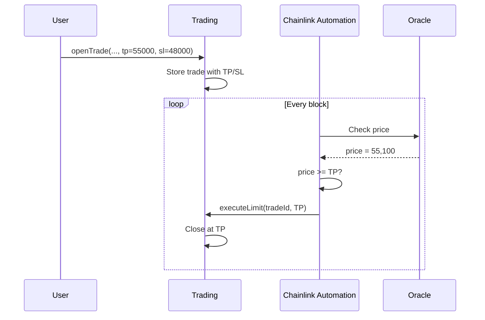

# 🚀 Guide 6: Suggested Improvements and Roadmap

**Version:** 1.0
**Prerequisites:** [Guide 5: Solidity Implementation](./05-implementation.md)
**Next:** [Guide 7: Vault SSL Architecture](./07-vault-ssl.md)

---

## 📋 Table of Contents

1. [Advanced Orders](#1-advanced-orders)
2. [Multi-Collateral Vault](#2-multi-collateral-vault)
3. [Tiered Fees (Volume Discounts)](#3-tiered-fees-volume-discounts)
4. [Referral System](#4-referral-system)
5. [NFT Boost for LPs](#5-nft-boost-for-lps)
6. [On-Chain Copy Trading](#6-on-chain-copy-trading)
7. [Account Abstraction (ERC-4337)](#7-account-abstraction-erc-4337)
8. [Implementation Roadmap](#8-implementation-roadmap)

---

Once the core is implemented, these improvements will bring the Synthetic Trading Protocol to the level of competitors like GMX v2 or Gains Network.

---

## 1. Advanced Orders

### Current State
The basic design only supports "Market Orders" (immediate execution at oracle price).

### Improvement: Limit Orders + Automatic TP/SL



### Implementation

```solidity
struct LimitOrder {
    uint256 tradeId;
    uint256 targetPrice;
    OrderType orderType; // TP, SL, LIMIT_OPEN
    bool executed;
}

function executeLimit(uint256 orderId) external onlyKeeper {
    LimitOrder storage order = limitOrders[orderId];
    Trade storage trade = trades[order.tradeId];
    
    (uint256 price,) = oracle.getPrice(trade.pairIndex);
    
    bool shouldExecute;
    if (order.orderType == OrderType.TP) {
        shouldExecute = trade.isLong 
            ? price >= order.targetPrice 
            : price <= order.targetPrice;
    } else if (order.orderType == OrderType.SL) {
        shouldExecute = trade.isLong 
            ? price <= order.targetPrice 
            : price >= order.targetPrice;
    }
    
    if (!shouldExecute) revert ConditionNotMet();
    
    _closeTrade(order.tradeId, CloseReason.TakeProfit);
}
```

### Costs
- **Keeper Gas:** Include small extra in `openingFee` to cover automatic execution.
- **Alternative:** Keeper takes 0.01% of payout as reward.

---

## 2. Multi-Collateral Vault

### Current State
Only USDC as collateral.

### Improvement: Accept ETH, wBTC, DAI

#### Option A: Virtual Funds (Recommended)

```
┌─────────────────────────────────────────────────────────────┐
│                    MULTI-COLLATERAL VAULT                    │
├─────────────────────────────────────────────────────────────┤
│  ETH Pool      ──►  Valued in USD  ──►  Virtual Vault       │
│  wBTC Pool     ──►  (via Chainlink) ──►  (Single Pool)      │
│  USDC Pool     ──►                  ──►                     │
├─────────────────────────────────────────────────────────────┤
│  Withdrawal: User receives SAME asset they deposited        │
│  Risk: Liquidity may be insufficient per asset              │
└─────────────────────────────────────────────────────────────┘
```

#### Option B: Auto-Swap to USDC

- User deposits ETH → Automatically swapped to USDC.
- On withdrawal, USDC → ETH swapped back.
- **Pro:** Simplicity. **Con:** Slippage on swaps.

### Considerations

| Collateral | Risk | Mitigation |
|:---|:---|:---|
| ETH | Volatility | More conservative LTV ratio (80%) |
| wBTC | Volatility + Bridge risk | LTV 75%, native wBTC only |
| DAI | Minor depeg, oracle | Similar to USDC |

---

## 3. Tiered Fees (Volume Discounts)

### Tier Structure

| Tier | Cumulative Volume | Opening Fee | Discount |
|:---|:---|:---|:---|
| Bronze | $0 - $10K | 0.08% | 0% |
| Silver | $10K - $100K | 0.06% | 25% |
| Gold | $100K - $1M | 0.05% | 37.5% |
| Platinum | $1M - $10M | 0.04% | 50% |
| Diamond | > $10M | 0.03% | 62.5% |

### Alternative: Discount by $SYNTH Holdings

```solidity
function getDiscount(address user) public view returns (uint256 discountBps) {
    uint256 synthBalance = synthToken.balanceOf(user);
    
    if (synthBalance >= 100_000e18) return 5000; // 50% off
    if (synthBalance >= 50_000e18) return 3000;  // 30% off
    if (synthBalance >= 10_000e18) return 1500;  // 15% off
    if (synthBalance >= 1_000e18) return 500;    // 5% off
    return 0;
}
```

**Dual benefit:** Incentivizes $SYNTH holding + Rewards frequent traders.

---

## 4. Referral System

### Mechanics

```
┌───────────────────────────────────────────────────────────────┐
│  Alice (Referrer)                     Bob (Referee)           │
│       │                                    │                  │
│       │────── Refers ──────────────────────►│                  │
│       │                                    │                  │
│       │                              Opens Trade              │
│       │                              Fee: 8 USDC              │
│       │                                    │                  │
│       │◄── 10% (0.8 USDC) ────────────────│                  │
│       │                              Gets 5% discount         │
│       │                              (pays 7.6 USDC)          │
└───────────────────────────────────────────────────────────────┘
```

### Implementation

```solidity
mapping(address => address) public referrers;
mapping(address => uint256) public referralEarnings;

uint256 constant REFERRAL_DISCOUNT_BPS = 500;  // 5% discount for referee
uint256 constant REFERRER_REWARD_BPS = 1000;   // 10% of fees to referrer

function setReferrer(address referrer) external {
    if (referrers[msg.sender] != address(0)) revert AlreadyReferred();
    if (referrer == msg.sender) revert SelfReferral();
    referrers[msg.sender] = referrer;
    emit ReferralSet(msg.sender, referrer);
}

function _distributeFees(address user, uint256 feeAmount) internal {
    address referrer = referrers[user];
    
    if (referrer != address(0)) {
        uint256 referrerReward = feeAmount * REFERRER_REWARD_BPS / 10000;
        referralEarnings[referrer] += referrerReward;
        feeAmount -= referrerReward;
    }
    
    // Rest to vault + treasury...
}
```

---

## 5. NFT Boost for LPs

### Concept
Give early LPs (bootstrap) an NFT that increases their APY in the Vault.

### NFT Tiers

| NFT Tier | Requirement | APY Boost | Supply |
|:---|:---|:---|:---|
| 🥉 Pioneer | Deposit in first 2 weeks | +10% | Unlimited |
| 🥈 Founder | Deposit > $10K in month 1 | +25% | 500 |
| 🥇 Genesis | Deposit > $100K in week 1 | +50% | 50 |

### Implementation

```solidity
interface IBoostNFT {
    function getBoost(address user) external view returns (uint256 boostBps);
}

// In Vault.sol
function _calculateYield(address user, uint256 baseYield) internal view returns (uint256) {
    uint256 boost = boostNFT.getBoost(user);
    return baseYield + baseYield * boost / 10000;
}
```

---

## 6. On-Chain Copy Trading

### Concept
"Copy Trading" vaults where users deposit and a contract automatically replicates a "Master Trader's" trades.

```
┌─────────────────────────────────────────────────────────────────┐
│                      COPY TRADING VAULT                          │
├─────────────────────────────────────────────────────────────────┤
│  Master Trader: 0xABC...                                        │
│  Strategy: High-leverage BTC scalping                           │
│  Track Record: +45% last 30d                                    │
├─────────────────────────────────────────────────────────────────┤
│  Followers:                                                      │
│  • User1: $1,000 deposited → Auto-copies at 10% scale           │
│  • User2: $5,000 deposited → Auto-copies at 50% scale           │
│  • User3: $10,000 deposited → Auto-copies at 100% scale         │
├─────────────────────────────────────────────────────────────────┤
│  Fee: 20% of profits to Master Trader                           │
└─────────────────────────────────────────────────────────────────┘
```

### Considerations
- **Latency:** Copy must execute in same or next block.
- **Liquidity:** Copy trading vault could run out of funds if many copy.
- **Performance Fee:** 15-30% of profits to master trader.

---

## 7. Account Abstraction (ERC-4337)

### Benefits

| Feature | Description | UX Improvement |
|:---|:---|:---|
| **Gasless Trading** | Protocol pays gas | No ETH needed |
| **Session Keys** | Sign once, trade 24h | No constant popups |
| **Batch Transactions** | Approve + Open in 1 tx | Fewer clicks |
| **Social Recovery** | Recover wallet via guardians | No seed phrases |

### Implementation with Session Keys

```solidity
// User creates temporary session key
struct SessionKey {
    address key;
    uint256 validUntil;
    uint256 maxSpend;
    bool canOpen;
    bool canClose;
}

// Trading can verify session keys
function openTrade(...) external {
    if (msg.sender != tx.origin) {
        // Call from Account Abstraction wallet
        _verifySessionKey(msg.sender, SessionAction.OPEN);
    }
    // ...
}
```

---

## 8. Implementation Roadmap

### Phase 1: Core (MVP)
- [x] ERC-4626 Vault
- [x] Basic TradingProxy
- [x] Oracle integration
- [x] Liquidations
- [ ] Basic Frontend

### Phase 2: Essential Features (Q2)
- [ ] Automatic TP/SL with Keepers
- [ ] Referral System
- [ ] Tiered Fees
- [ ] Mobile-responsive UI

### Phase 3: Growth (Q3)
- [ ] Multi-collateral (ETH, wBTC)
- [ ] NFT Boost for LPs
- [ ] Analytics Dashboard
- [ ] Leaderboard

### Phase 4: Advanced (Q4)
- [ ] Copy Trading Vaults
- [ ] Account Abstraction
- [ ] Cross-chain (via LayerZero?)
- [ ] DAO Governance

---

**See also:**
- [Guide 7: Vault SSL Architecture](./07-vault-ssl.md) - Vault details
- [Guide 8: Security](./08-security.md) - Security considerations for improvements
