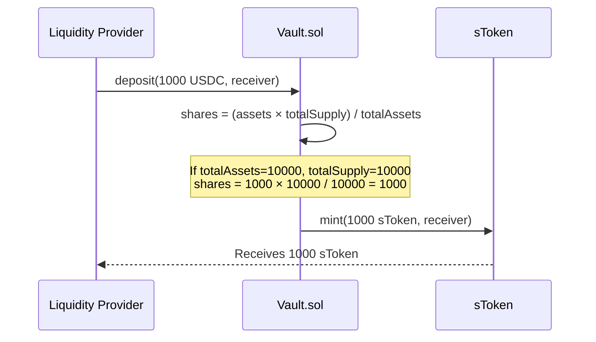
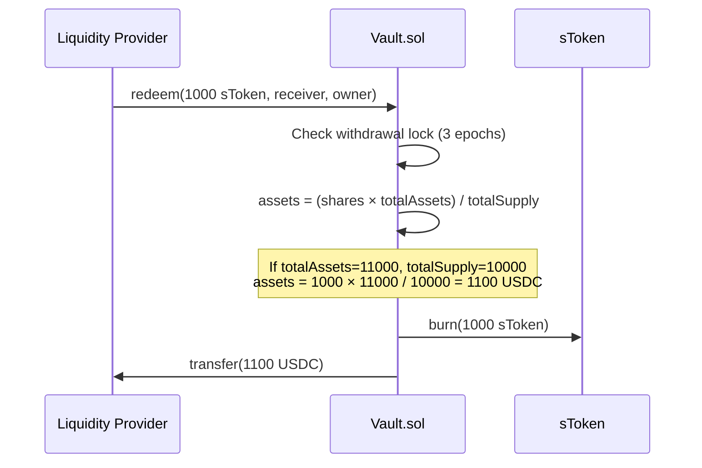
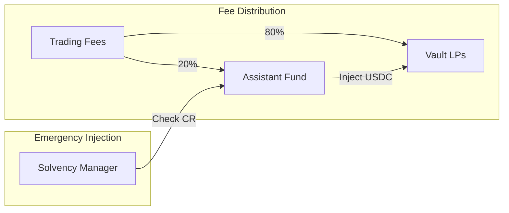
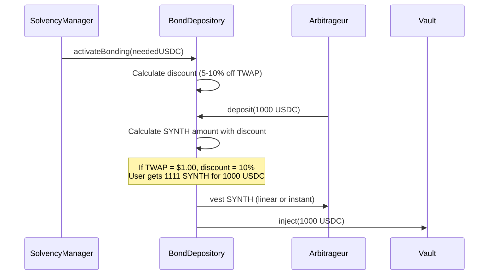
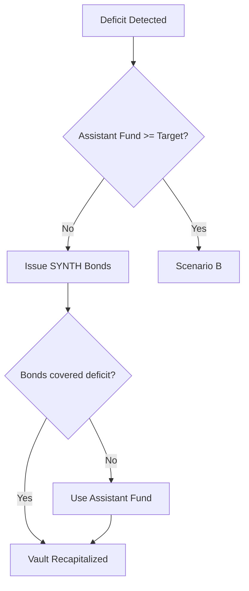
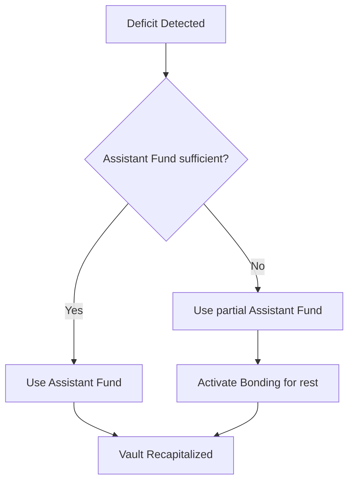

# 📘 Guide 7: Single-Sided Liquidity (SSL) Technical Architecture

**Version:** 1.0
**Prerequisites:** [Guide 1: Fundamental Concepts](./01-fundamentals.md)
**Next:** [Guide 8: Security](./08-security.md)

---

## 📋 Table of Contents

1. [Core Component: The ERC-4626 Vault](#1-core-component-the-erc-4626-vault)
2. [PnL and Accounting Mechanics](#2-pnl-and-accounting-mechanics)
3. [Risk Management and Solvency System](#3-risk-management-and-solvency-system)
4. [Dynamic Defense Logic](#4-dynamic-defense-logic)
5. [Initial Risk Mitigation](#5-initial-risk-mitigation)
6. [Component Summary](#6-component-summary)

---

## 1. Core Component: The ERC-4626 Vault

The architecture is based on a standardized Vault that acts as the **single counterparty** for all trades.

### Configuration

| Parameter | Value | Description |
|:---|:---|:---|
| **Standard** | ERC-4626 | Tokenized Vault Standard |
| **Asset** | USDC | Base stablecoin |
| **Share Token** | sToken | Synthetic Vault Token |
| **Decimals** | 18 | For sToken |

### Deposit Mechanics


```mermaid
sequenceDiagram
    participant LP as Liquidity Provider
    participant Vault as Vault.sol
    participant sToken as sToken

    LP->>Vault: deposit(1000 USDC, receiver)
    Vault->>Vault: shares = (assets × totalSupply) / totalAssets
    Note over Vault: If totalAssets=10000, totalSupply=10000<br/>shares = 1000 × 10000 / 10000 = 1000
    Vault->>sToken: mint(1000 sToken, receiver)
    sToken-->>LP: Receives 1000 sToken
```

### Withdrawal Mechanics


```mermaid
sequenceDiagram
    participant LP as Liquidity Provider
    participant Vault as Vault.sol
    participant sToken as sToken

    LP->>Vault: redeem(1000 sToken, receiver, owner)
    Vault->>Vault: Check withdrawal lock (3 epochs)
    Vault->>Vault: assets = (shares × totalAssets) / totalSupply
    Note over Vault: If totalAssets=11000, totalSupply=10000<br/>assets = 1000 × 11000 / 10000 = 1100 USDC
    Vault->>sToken: burn(1000 sToken)
    Vault->>LP: transfer(1100 USDC)
```

### Withdrawal Lock (Anti Front-Running)

To prevent LPs from withdrawing liquidity just before a large payout to traders:

```solidity
struct WithdrawalRequest {
    uint256 shares;
    uint256 requestEpoch;
    address receiver;
}

uint256 constant WITHDRAWAL_DELAY_EPOCHS = 3;

function requestWithdrawal(uint256 shares) external {
    withdrawalRequests[msg.sender] = WithdrawalRequest({
        shares: shares,
        requestEpoch: currentEpoch(),
        receiver: msg.sender
    });
    emit WithdrawalRequested(msg.sender, shares, currentEpoch());
}

function executeWithdrawal() external {
    WithdrawalRequest storage req = withdrawalRequests[msg.sender];
    if (currentEpoch() < req.requestEpoch + WITHDRAWAL_DELAY_EPOCHS) {
        revert WithdrawalLocked(req.requestEpoch + WITHDRAWAL_DELAY_EPOCHS);
    }
    
    uint256 assets = previewRedeem(req.shares);
    _burn(msg.sender, req.shares);
    IERC20(usdc).safeTransfer(req.receiver, assets);
    
    delete withdrawalRequests[msg.sender];
}
```

---

## 2. PnL and Accounting Mechanics

The Vault acts as "The House". LP performance depends **inversely** on Trader performance.

### Share Price Formula

$$SharePrice = \\frac{totalAssets()}{totalSupply()}$$

### PnL Flow

```
┌─────────────────────────────────────────────────────────────────────┐
│ WINNING TRADE (User wins)                                           │
│                                                                      │
│   User wins 100 USDC                                                │
│        │                                                             │
│        ▼                                                             │
│   Vault.sendPayout(user, 100 USDC)                                  │
│        │                                                             │
│        ▼                                                             │
│   totalAssets() -= 100                                              │
│   totalSupply() = (unchanged)                                       │
│        │                                                             │
│        ▼                                                             │
│   SharePrice ↓ DECREASES                                            │
│   LPs suffer impermanent loss                                       │
└─────────────────────────────────────────────────────────────────────┘

┌─────────────────────────────────────────────────────────────────────┐
│ LOSING TRADE (User loses)                                           │
│                                                                      │
│   User loses 100 USDC (+ 8 USDC fees)                               │
│        │                                                             │
│        ▼                                                             │
│   Collateral stays in Vault                                         │
│   Fees distributed (80% vault, 20% treasury)                        │
│        │                                                             │
│        ▼                                                             │
│   totalAssets() += 100 + 6.4 (80% of fees)                          │
│   totalSupply() = (unchanged)                                       │
│        │                                                             │
│        ▼                                                             │
│   SharePrice ↑ INCREASES                                            │
│   LPs earn yield                                                    │
└─────────────────────────────────────────────────────────────────────┘
```

### Numerical Example

| State | totalAssets | totalSupply | SharePrice | Event |
|:---|:---|:---|:---|:---|
| Initial | 1,000,000 USDC | 1,000,000 sToken | 1.00 | - |
| Trade 1 | 1,000,500 USDC | 1,000,000 sToken | 1.0005 | Trader loses 500 |
| Trade 2 | 999,500 USDC | 1,000,000 sToken | 0.9995 | Trader wins 1,000 |
| Trade 3 | 1,010,000 USDC | 1,000,000 sToken | 1.01 | Trader loses 10,500 |

---

## 3. Risk Management and Solvency System

To protect the Vault's `totalAssets` from catastrophic drops, **three security layers** are implemented.

### Layer 1: Preventive (Profit Caps and Spreads)

#### Profit Caps (Hard Limit)

```solidity
uint256 constant MAX_PROFIT_MULTIPLIER = 9e18; // 9x = 900%

function _calculatePayout(
    uint256 collateral,
    int256 pnl
) internal pure returns (uint256 payout) {
    if (pnl <= 0) {
        // Loss: return remaining collateral (if any)
        payout = pnl < -int256(collateral) ? 0 : collateral - uint256(-pnl);
    } else {
        // Profit: cap at MAX_PROFIT_MULTIPLIER
        uint256 maxPayout = collateral.mulWad(MAX_PROFIT_MULTIPLIER);
        uint256 theoreticalPayout = collateral + uint256(pnl);
        payout = theoreticalPayout > maxPayout ? maxPayout : theoreticalPayout;
    }
}
```

#### Dynamic Spreads

The standalone `SpreadManager` contract computes dynamic spread based on **OI** and **per-pair volatility**:

```solidity
/// @notice Calculate total spread in BPS for a pair given its current OI
function getSpreadBps(uint256 _pairIndex, uint256 _currentOI) external view returns (uint256 spreadBps) {
    uint256 oiImpact = (_currentOI * impactFactor) / OI_PRECISION;    // OI_PRECISION = 1e30
    uint256 volImpact = (_pairVolatility[_pairIndex] * volFactor) / VOL_PRECISION; // VOL_PRECISION = 1e18
    spreadBps = baseSpreadBps + oiImpact + volImpact;
    if (spreadBps > maxSpreadBps) spreadBps = maxSpreadBps;
}
```

TradingEngine reads OI from TradingStorage and delegates to `SPREAD_MANAGER.getSpreadBps()` in `_applySpread`.

### Layer 2: Reactive (Assistant Fund)

A separate contract (`AssistantFund.sol`) that accumulates reserve capital.


```mermaid
graph LR
    subgraph Fee Distribution
        Fee[Trading Fees] -->|80%| Vault[Vault LPs]
        Fee -->|20%| AF[Assistant Fund]
    end
    
    subgraph Emergency Injection
        SM[Solvency Manager] -->|Check CR| AF
        AF -->|Inject USDC| Vault
    end
```

#### Funding (Filling)

```solidity
function distributeFees(uint256 totalFees) internal {
    uint256 assistantShare = totalFees.mulWad(ASSISTANT_FEE_SPLIT); // 20%
    uint256 vaultShare = totalFees - assistantShare;
    
    IERC20(usdc).safeTransfer(address(assistantFund), assistantShare);
    // vaultShare stays in Vault (increases totalAssets)
}
```

#### Usage (Injection)

```solidity
// Only callable by SolvencyManager
function injectFunds(uint256 amount) external onlySolvencyManager {
    if (amount > balance()) revert InsufficientFunds();
    
    IERC20(usdc).safeTransfer(address(vault), amount);
    emit FundsInjected(amount);
}
```

### Layer 3: Last Resort (Token Minting & Bonding)

If the Assistant Fund is insufficient, the **BondDepository** is activated.

#### Bonding Mechanism


```mermaid
sequenceDiagram
    participant SM as SolvencyManager
    participant BD as BondDepository
    participant User as Arbitrageur
    participant Vault

    SM->>BD: activateBonding(neededUSDC)
    BD->>BD: Calculate discount (5-10% off TWAP)
    
    User->>BD: deposit(1000 USDC)
    BD->>BD: Calculate SYNTH amount with discount
    Note over BD: If TWAP = $1.00, discount = 10%<br/>User gets 1111 SYNTH for 1000 USDC
    BD->>User: vest SYNTH (linear or instant)
    BD->>Vault: inject(1000 USDC)
```

#### Bonding Parameters

| Parameter | Value | Description |
|:---|:---|:---|
| `DISCOUNT_BPS` | 500-1000 | 5-10% discount vs TWAP |
| `VESTING_PERIOD` | 0-7 days | Vesting period (based on urgency) |
| `MAX_BOND_CAP` | Variable | Maximum USDC to raise in one round |

---

## 4. Dynamic Defense Logic

The system prioritizes which capital source to use based on **protocol maturity**.

### Scenario A: Growth Phase

**Objective:** Preserve USDC in Assistant Fund to build reserve.


```mermaid
flowchart TD
    A[Deficit Detected] --> B{Assistant Fund >= Target?}
    B -->|No| C[Issue SYNTH Bonds]
    C --> D{Bonds covered deficit?}
    D -->|No| E[Use Assistant Fund]
    D -->|Yes| F[Vault Recapitalized]
    E --> F
    B -->|Yes| G[Scenario B]
```

### Scenario B: Mature Phase

**Objective:** Protect $SYNTH holders from unnecessary dilution.


```mermaid
flowchart TD
    A[Deficit Detected] --> B{Assistant Fund sufficient?}
    B -->|Yes| C[Use Assistant Fund]
    C --> D[Vault Recapitalized]
    B -->|No| E[Use partial Assistant Fund]
    E --> F[Activate Bonding for rest]
    F --> D
```

### Activation Thresholds

```solidity
uint256 constant SAFE_CR = 110e16;      // 110%
uint256 constant DEFICIT_CR = 100e16;   // 100%
uint256 constant CRITICAL_CR = 95e16;   // 95%

function checkAndAct() external {
    uint256 cr = vault.collateralizationRatio();
    
    if (cr >= SAFE_CR) {
        // Healthy - consider buyback
        _executeBuyback();
    } else if (cr >= DEFICIT_CR) {
        // Warning - no action, just monitor
        emit Warning(cr);
    } else if (cr >= CRITICAL_CR) {
        // Deficit - inject from Assistant Fund
        _injectFromAssistant();
    } else {
        // Critical - activate bonding
        _activateBonding();
    }
}
```

---

## 5. Initial Risk Mitigation: Dynamic Spread via SpreadManager

The protocol uses a standalone `SpreadManager` contract to dynamically adjust execution spreads based on **OI** and **per-pair volatility**. Higher risk conditions automatically widen spreads, making new positions more expensive and protecting the Vault.

### Why dynamic spreads?

- **High OI = Greater protocol exposure** → wider spread discourages additional positions
- **High volatility = Greater risk of extreme movements** → wider spread compensates for risk
- **Automatic protection:** Spread adjusts algorithmically via keeper-updated volatility
- **No position blocking:** Unlike dynamic OI caps, spread-based protection allows all trades but at a worse price

### SpreadManager Architecture

```solidity
/// @notice Computes dynamic spread BPS based on OI impact and per-pair volatility
contract SpreadManager is Ownable {
    uint256 public constant OI_PRECISION = 1e30;
    uint256 public constant VOL_PRECISION = 1e18;

    uint256 public baseSpreadBps;        // Fixed floor (default: 5 = 0.05%)
    uint256 public impactFactor;         // OI impact multiplier (default: 3e5)
    uint256 public volFactor;            // Volatility multiplier (default: 100)
    uint256 public maxSpreadBps;         // Ceiling (default: 100 = 1%)
    uint256 public maxVolatilityChangeBps; // Max per-update vol change (default: 200 = 2%)
    address public keeper;
    mapping(uint256 => uint256) private _pairVolatility; // 18 decimals

    function getSpreadBps(uint256 _pairIndex, uint256 _currentOI) external view returns (uint256 spreadBps) {
        uint256 oiImpact = (_currentOI * impactFactor) / OI_PRECISION;
        uint256 volImpact = (_pairVolatility[_pairIndex] * volFactor) / VOL_PRECISION;
        spreadBps = baseSpreadBps + oiImpact + volImpact;
        if (spreadBps > maxSpreadBps) spreadBps = maxSpreadBps;
    }
}
```

### BPS Calibration

| Parameter | Default | Example Effect |
|:---|:---|:---|
| `baseSpreadBps` | 5 (0.05%) | Fixed floor for all conditions |
| `impactFactor` | 3e5 | 3 BPS at 10M OI (`1e25 * 3e5 / 1e30 = 3`) |
| `volFactor` | 100 | 3 BPS at 3% vol (`3e16 * 100 / 1e18 = 3`) |
| `maxSpreadBps` | 100 (1%) | Hard ceiling |

### Volatility Update

The keeper updates per-pair volatility on-chain. Changes are bounded by `±maxVolatilityChangeBps` (default: 200 = 2%) to prevent manipulation. First update for a pair skips bounds check.

### Behavior During High Volatility Events

```
┌─────────────────────────────────────────────────────────────────────┐
│ EVENT: BTC Flash Crash (-15% in 1 hour)                             │
├─────────────────────────────────────────────────────────────────────┤
│                                                                      │
│  1. Keeper detects σ 24h = 12% (normally 3%)                        │
│  2. Keeper calls updateVolatility(BTC_INDEX, 12%)                   │
│     (bounded by ±2% per update, so multiple updates needed)         │
│  3. System recalculates spread:                                     │
│     • Spread: 0.05% + 0.03%(OI) + 0.36%(Vol) = 0.44%               │
│                                                                      │
│  4. New positions: Allowed but at wider spread (more expensive)     │
│     • Existing positions: Unaffected (entered at their spread)      │
│     • Closes: Allowed (spread on close also wider)                  │
│                                                                      │
│  5. When volatility returns to normal:                              │
│     • Spread decreases gradually                                    │
│     • New positions: Back to normal pricing                         │
│                                                                      │
└─────────────────────────────────────────────────────────────────────┘
```

**Guarantee:** The protocol automatically protects itself during periods of high uncertainty without requiring manual intervention.

---

## 6. Component Summary

| Contract | Function | Standard/Logic |
|:---|:---|:---|
| **LiquidityVault.sol** | Custodies LP funds, central counterparty | ERC-4626 |
| **TradingEngine.sol** | Executes trades, calculates PnL | Business Logic |
| **TradingStorage.sol** | Stores trades and OI | State Layer |
| **PythChainlinkOracle.sol** | Validates Pyth prices with Chainlink anchor (implements IOracle) | Pyth + Chainlink |
| **OIManager.sol** | Calculates max OI based on volatility | Adaptive OI |
| **AssistantFund.sol** | Emergency reserve in USDC | Treasury |
| **BondDepository.sol** | Sells $SYNTH at discount | Bonding Mechanism |
| **SolvencyManager.sol** | Orchestrates rescues (Fund vs Bond) | State Machine |
| **PricingLib.sol** | Calculates dynamic spreads (OI + Vol) | Library |
| **FundingLib.sol** | Calculates funding rates | Library |

---

**See also:**
- [Guide 2: Mathematics](./02-mathematics.md) - Adaptive OI and Spread formulas
- [Guide 8: Security](./08-security.md) - Threat model and access control
- [Guide 3: Technical Architecture](./03-architecture.md) - Detailed flows
