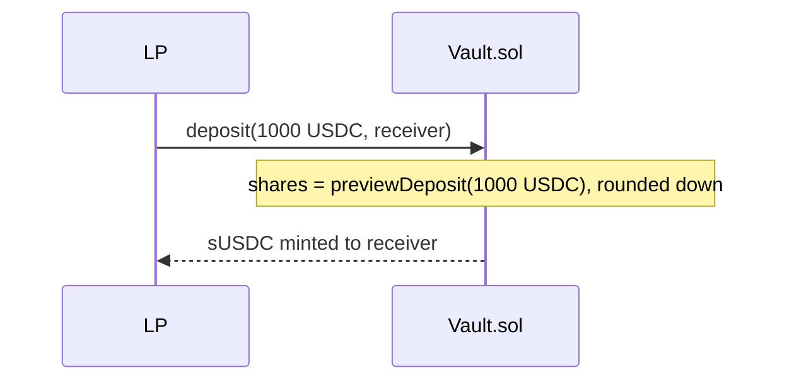
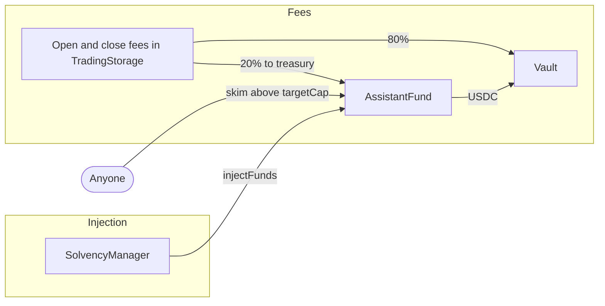
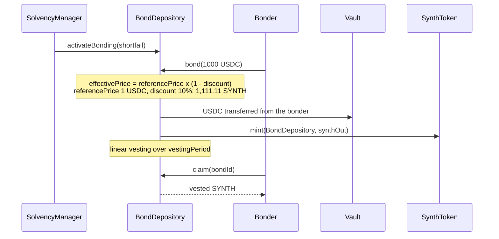
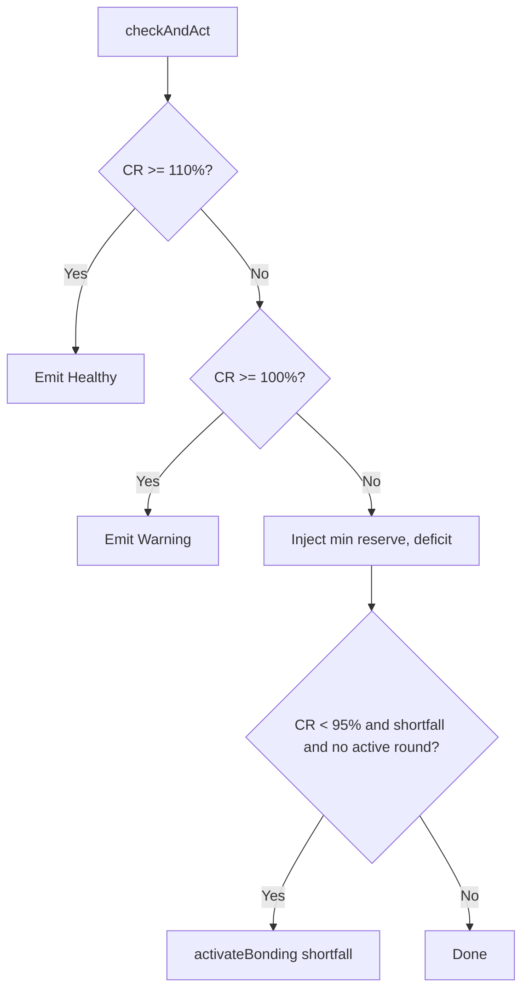

# Guide 7: Vault and Solvency Architecture

**Prerequisites:** [Guide 1: Fundamentals](./01-fundamentals.md)
**Next:** [Guide 8: Security](./08-security.md)

**Status:** Proof of concept. Not audited and not deployed.

---

## Table of Contents

1. [The ERC-4626 Vault](#1-the-erc-4626-vault)
2. [PnL and Accounting](#2-pnl-and-accounting)
3. [Solvency Layers](#3-solvency-layers)
4. [SolvencyManager Logic](#4-solvencymanager-logic)
5. [Dynamic Spread](#5-dynamic-spread)
6. [Component Summary](#6-component-summary)

---

## 1. The ERC-4626 Vault

`Vault.sol` is the single counterparty for all trades.

| Parameter | Value |
|:---|:---|
| Standard | ERC-4626 (Solady) |
| Asset | USDC (6 decimals) |
| Share token | sUSDC, "Synthetic Liquidity Token", 18 decimals |
| Decimals offset | 12 (virtual shares, so the first deposit mints 1e12 share units per USDC unit) |

### Deposit

`deposit(assets, receiver)` and `mint(shares, receiver)` follow ERC-4626 and are blocked while the vault is
paused. There is no lock on deposits.


```mermaid
sequenceDiagram
    participant LP
    participant Vault as Vault.sol
    LP->>Vault: deposit(1000 USDC, receiver)
    Note over Vault: shares = previewDeposit(1000 USDC), rounded down
    Vault-->>LP: sUSDC minted to receiver
```

### Withdrawal

`withdraw` and `redeem` always revert with `UseRequestWithdrawalFlow`. LPs use a two-step flow:

```solidity
function requestWithdrawal(uint256 shares) external nonReentrant whenNotPaused {
    uint256 balance = balanceOf(msg.sender);
    if (balance < shares) revert InsufficientShares(shares, balance);
    uint256 epoch = currentEpoch();
    uint256 unlockEpoch = epoch + WITHDRAWAL_DELAY_EPOCHS;
    // Overwrites any existing request (no need to cancel first)
    withdrawalRequests[msg.sender] = WithdrawalRequest({shares: shares, requestEpoch: epoch});
    emit WithdrawalRequested(msg.sender, shares, epoch, unlockEpoch);
}

function executeWithdrawal() external nonReentrant {
    WithdrawalRequest storage req = withdrawalRequests[msg.sender];
    if (req.shares == 0) revert NoWithdrawalRequest();
    uint256 unlockEpoch = req.requestEpoch + WITHDRAWAL_DELAY_EPOCHS;
    if (currentEpoch() < unlockEpoch) revert WithdrawalLocked(unlockEpoch);
    uint256 sharesToBurn = req.shares;
    // Assets calculated at execution time (price per share may have changed since request)
    uint256 assets = previewRedeem(sharesToBurn);
    delete withdrawalRequests[msg.sender];
    _burn(msg.sender, sharesToBurn);
    emit WithdrawalExecuted(msg.sender, sharesToBurn, assets);
    ASSET.safeTransfer(msg.sender, assets);
}
```

- `EPOCH_LENGTH = 1 days`, `WITHDRAWAL_DELAY_EPOCHS = 3`. Epoch 0 starts at deployment.
- The payout uses the share price at execution, not at request.
- `executeWithdrawal` and `cancelWithdrawal` are not blocked by the pause.

### What the lock does and does not do

The lock is meant to stop LPs from exiting just before a known trader payout. As implemented:

- The requested shares are not escrowed; they remain transferable.
- A request does not expire. After the first 3 epochs an LP can keep a request open and execute it at any
  later moment, so the delay applies once rather than to each exit.
- Deposits are not delayed, so a new LP can enter just before a known trader loss is realised.
- `maxWithdraw`, `maxRedeem`, `maxDeposit` and `maxMint` return Solady's defaults: they do not reflect
  that `withdraw`/`redeem` always revert or that deposits are paused.

These are current behaviour and are flagged for review.

---

## 2. PnL and Accounting

LP results are the opposite of trader results, plus fees.

$$SharePrice = \frac{totalAssets()}{totalSupply()} \times 10^{12}$$

`totalAssets()` is the vault's USDC balance. It moves only when PnL is realised:

```
┌─────────────────────────────────────────────────────────────────────┐
│ TRADER CLOSES WITH PROFIT                                           │
│   TradingStorage returns the collateral (minus close fee)           │
│   TradingEngine calls Vault.sendPayout(trader, profit)              │
│   totalAssets decreases, share price falls: LPs lose                │
│   Reverts if the vault holds less USDC than the profit              │
└─────────────────────────────────────────────────────────────────────┘

┌─────────────────────────────────────────────────────────────────────┐
│ TRADER CLOSES WITH LOSS, OR IS LIQUIDATED                           │
│   TradingStorage sends the lost collateral to the vault             │
│   80% of the close fee to the vault, 20% to the treasury            │
│   totalAssets increases, share price rises: LPs gain                │
└─────────────────────────────────────────────────────────────────────┘
```

Unrealised PnL of open trades is not reflected in the share price, the vault ratio or any preview
function.

### Example

| State | totalAssets | totalSupply (sUSDC) | Share price | Event |
|:---|:---|:---|:---|:---|
| Initial | 1,000,000 USDC | 1,000,000 | 1.0000 | |
| Trade 1 | 1,000,500 USDC | 1,000,000 | 1.0005 | A trader loses 500 |
| Trade 2 | 999,500 USDC | 1,000,000 | 0.9995 | A trader wins 1,000 |
| Trade 3 | 1,010,000 USDC | 1,000,000 | 1.0100 | A trader loses 10,500 |

---

## 3. Solvency Layers

### Layer 1: preventive controls

What exists in code:

- **Payout cap.** `TradingEngine._calculatePayout` caps the payout at 9x collateral:

  ```solidity
  uint256 public constant MAX_PROFIT_MULTIPLIER = 9;

  function _calculatePayout(uint64 _collateral, int256 _pnlUsdc) internal pure returns (uint256 payoutUsdc) {
      if (_pnlUsdc >= 0) {
          payoutUsdc = uint256(_pnlUsdc) + uint256(_collateral);
          uint256 maxPayout = uint256(_collateral) * MAX_PROFIT_MULTIPLIER;
          if (payoutUsdc > maxPayout) payoutUsdc = maxPayout;
      } else {
          uint256 loss = uint256(-_pnlUsdc);
          if (loss >= uint256(_collateral)) {
              payoutUsdc = 0;
          } else {
              payoutUsdc = uint256(_collateral) - loss;
          }
      }
  }
  ```

  The cap applies to collateral plus profit, so the largest profit is 8x collateral (800%).
- **Static open interest cap.** `TradingStorage.increaseOpenInterest` reverts when long + short OI on a
  pair exceeds `maxOI`, a value the owner sets per pair.
- **Dynamic spread.** Section 5.

Designed but not implemented: open interest caps that shrink when volatility rises (for example
`MaxOI = BaseOI x (TargetVol / CurrentVol)`), a global OI cap, and a separate `OIManager` contract.

### Layer 2: AssistantFund


```mermaid
graph LR
    subgraph Fees
        Fee[Open and close fees in TradingStorage] -->|80%| Vault[Vault]
        Fee -->|20% to treasury| AF[AssistantFund]
    end
    subgraph Injection
        SM[SolvencyManager] -->|injectFunds| AF
        AF -->|USDC| Vault
    end
    Anyone([Anyone]) -->|skim above targetCap| AF
```

- The fee split is in `TradingEngine._distributeFees`; the 20% share goes to `treasury`, which
  `script/Deploy.s.sol` sets to the `AssistantFund`.
- `injectFunds(amount)` is restricted to the `SolvencyManager` and sends reserve USDC to the vault.
- `skim()` is permissionless and sends the balance above `targetCap` to the vault.

```solidity
function injectFunds(uint256 _amount) external onlySolvencyManager {
    uint256 available = balance();
    if (_amount > available) revert InsufficientFunds(_amount, available);
    ASSET.safeTransfer(VAULT, _amount);
    emit FundsInjected(_amount);
}
```

An injection raises the share price for everyone holding shares at that moment, including LPs who
deposited just before it.

### Layer 3: BondDepository and $SYNTH


```mermaid
sequenceDiagram
    participant SM as SolvencyManager
    participant BD as BondDepository
    participant User as Bonder
    participant Vault
    participant Synth as SynthToken

    SM->>BD: activateBonding(shortfall)
    User->>BD: bond(1000 USDC)
    Note over BD: effectivePrice = referencePrice x (1 - discount)<br/>referencePrice 1 USDC, discount 10%: 1,111.11 SYNTH
    BD->>Vault: USDC transferred from the bonder
    BD->>Synth: mint(BondDepository, synthOut)
    Note over BD: linear vesting over vestingPeriod
    User->>BD: claim(bondId)
    BD-->>User: vested SYNTH
```

| Parameter | Value |
|:---|:---|
| `discountBps` | owner-set, at most 1000 (10%); 500 in `script/Deploy.s.sol` |
| `vestingPeriod` | owner-set, at most 7 days; 48 h by default |
| Round cap | the shortfall passed by `SolvencyManager` |
| `referencePrice` | owner-set USDC per SYNTH, 2 USDC by default; no market price feed |

A round stays open until its cap is used, even if the vault recovers. `SynthToken` supply comes only from
the minter, which the owner sets and can change.

---

## 4. SolvencyManager Logic

Implemented order: reserve first, then bonding.


```mermaid
flowchart TD
    A[checkAndAct] --> B{CR >= 110%?}
    B -->|Yes| H[Emit Healthy]
    B -->|No| C{CR >= 100%?}
    C -->|Yes| W[Emit Warning]
    C -->|No| D[Inject min reserve, deficit]
    D --> E{CR < 95% and shortfall and no active round?}
    E -->|Yes| F[activateBonding shortfall]
    E -->|No| G[Done]
```

```solidity
uint256 public constant SAFE_CR = 110e16; // 110%
uint256 public constant DEFICIT_CR = 100e16; // 100% (recapitalization target)
uint256 public constant CRITICAL_CR = 95e16; // 95%
```

- CR is `Vault.collateralizationRatio()`, the share price relative to 1.0. After a period of LP gains
  (share price above 1.1) large losses can occur without triggering any action; the ratio does not
  include open trader PnL.
- The deficit is `Vault.collateralizationDeficit()`, the USDC needed to bring the share price back to 1.0.
- There is no buyback above 110% and no "growth phase" ordering that prefers bonding over the reserve;
  both were described in earlier designs.

---

## 5. Dynamic Spread

`SpreadManager.getSpreadBps`:

```solidity
function getSpreadBps(uint256 _pairIndex, uint256 _currentOI) external view returns (uint256 spreadBps) {
    uint256 oiImpact = (_currentOI * impactFactor) / OI_PRECISION; // OI_PRECISION = 1e30
    uint256 volImpact = (_pairVolatility[_pairIndex] * volFactor) / VOL_PRECISION; // VOL_PRECISION = 1e18
    spreadBps = baseSpreadBps + oiImpact + volImpact;
    if (spreadBps > maxSpreadBps) spreadBps = maxSpreadBps;
}
```

| Parameter | `script/Deploy.s.sol` value | Effect |
|:---|:---|:---|
| `baseSpreadBps` | 5 | floor |
| `impactFactor` | 3e5 | 3 BPS at 10M USD OI (`1e25 x 3e5 / 1e30`) |
| `volFactor` | 100 | 3 BPS at 3% volatility (`3e16 x 100 / 1e18`) |
| `maxSpreadBps` | 100 | ceiling |
| `maxVolatilityChangeBps` | 5000 | each keeper update may move volatility by at most 50% of its current value |

- The OI term uses total OI (long + short), not the imbalance.
- The volatility value is supplied by the keeper; how it is computed is off-chain and not specified in the
  code.
- The spread applies on open and on close, so a wider spread also makes closing more expensive.
- Example: a keeper that needs to move volatility from 3% to 12% with a 50% bound needs several updates
  (3% to 4.5% to 6.75% to 10.1% to 12%). At 12%, with 10M USD OI: 5 + 3 + 12 = 20 BPS.

---

## 6. Component Summary

| Contract | Role |
|:---|:---|
| `Vault.sol` | LP funds, sUSDC shares, trader profit payouts, CR views |
| `TradingEngine.sol` | Trading logic, spread, fees, funding, liquidation, TP/SL |
| `TradingStorage.sol` | Trades, pairs, OI, funding state, trader collateral |
| `PythChainlinkOracle.sol` | Pyth price with Chainlink deviation check (`IOracle`) |
| `SpreadManager.sol` | Spread from OI and keeper-set volatility |
| `FundingLib.sol` | Funding index math |
| `AssistantFund.sol` | Layer 2 USDC reserve |
| `SolvencyManager.sol` | Reserve and bonding orchestration |
| `BondDepository.sol` | Layer 3 discounted $SYNTH sale with vesting |
| `SynthToken.sol` | $SYNTH ERC-20 with a single minter |

---

**See also:**
- [Guide 2: Mathematics](./02-mathematics.md)
- [Guide 8: Security](./08-security.md)
- [Guide 3: Technical Architecture](./03-architecture.md)
