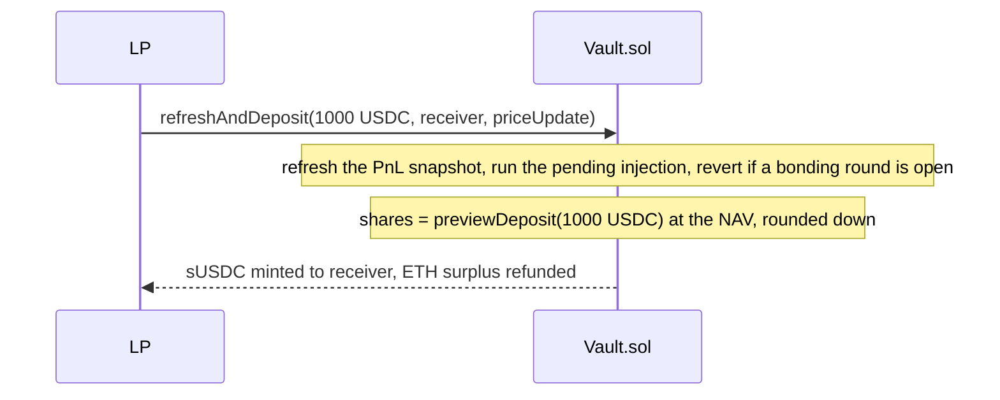
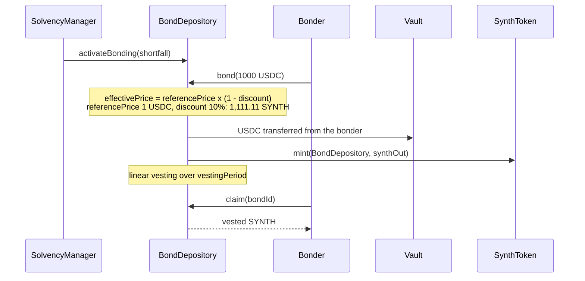
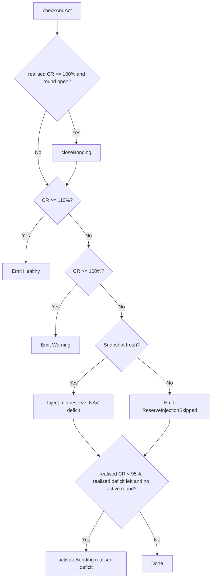

# Guide 7: Vault and Solvency Architecture

**Prerequisites:** [Guide 1: Fundamentals](./01-fundamentals.md)
**Next:** [Guide 8: Security](./08-security.md)

**Status:** Proof of concept. Not audited and not deployed.

---

## Table of Contents

1. [The ERC-4626 Vault](#1-the-erc-4626-vault)
2. [PnL, NAV and the PnL Snapshot](#2-pnl-nav-and-the-pnl-snapshot)
3. [Solvency Layers](#3-solvency-layers)
4. [SolvencyManager Logic](#4-solvencymanager-logic)
5. [Dynamic Spread](#5-dynamic-spread)
6. [Component Summary](#6-component-summary)

---

## 1. The ERC-4626 Vault

`Vault.sol` is the single counterparty for all trades.

| Parameter | Value |
|:---|:---|
| Standard | ERC-4626 (Solady) |
| Asset | USDC (6 decimals) |
| Share token | sUSDC, "Synthetic Liquidity Token", 18 decimals |
| Decimals offset | 12 (virtual shares, so the first deposit mints 1e12 share units per USDC unit) |

### Deposit

`deposit(assets, receiver)` and `mint(shares, receiver)` follow ERC-4626 and price shares at the
conservative NAV (section 2). They revert:

- while the vault is paused (`EnforcedPause`);
- with a stale PnL snapshot (`StalePnlSnapshot`), section 2;
- while a bonding round is open or due (`BondingRoundOpen`).

Before minting, every deposit path calls `SolvencyManager.checkAndActBeforeDeposit`: the pending AssistantFund
injection lands first, so the depositor buys at the post-injection NAV and does not take part of it, and a
round that is open, or that the check had to open because bonding is due, makes the deposit revert (the
revert also unwinds that activation). Bond proceeds are not instantaneous, which is why a due round blocks
deposits instead of being settled in the same call. Below 100% coverage a deposit is otherwise allowed at the
conservative NAV, so deposits do not freeze once no rescue is left. Plain `deposit` and `mint` run the same
step as the refresh-and-act variants: they already need a fresh snapshot, so the pending injection is
defined, and reverting instead would keep deposits closed until someone called `checkAndAct`. With no
SolvencyManager set on the vault the step is skipped.

`refreshAndDeposit(assets, receiver, priceUpdate)` and `refreshAndMint(shares, receiver, priceUpdate)` are
payable: they refresh the snapshot with the caller's Pyth update and then deposit or mint in the same
transaction, and refund the ETH the call added beyond the oracle fee. Deposits have no lock.

**Note for ERC-4626 integrators.** While trades are open, `deposit`, `mint` and `executeWithdrawal` need a PnL
snapshot at most `maxPnlSnapshotAge` old with no open or close since, and any trade invalidates it, so a
plain call usually reverts with `StalePnlSnapshot`. Use the refresh-and-act entry points
(`refreshAndDeposit`, `refreshAndMint`, `refreshAndExecuteWithdrawal`), which refresh and act in one
transaction; a trade between a separate refresh and a separate action makes that action revert
(`test_TradeBetweenRefreshAndDeposit` in `test/unit/EdgeCases.t.sol`). `maxDeposit` and `maxMint` return 0
whenever the plain call would revert.


```mermaid
sequenceDiagram
    participant LP
    participant Vault as Vault.sol
    LP->>Vault: refreshAndDeposit(1000 USDC, receiver, priceUpdate)
    Note over Vault: refresh the PnL snapshot, run the pending injection, revert if a bonding round is open
    Note over Vault: shares = previewDeposit(1000 USDC) at the NAV, rounded down
    Vault-->>LP: sUSDC minted to receiver, ETH surplus refunded
```

### Withdrawal

`withdraw` and `redeem` always revert with `UseRequestWithdrawalFlow`. LPs use a two-step flow with
escrow (`src/Vault.sol`):

```solidity
function requestWithdrawal(uint256 shares) external nonReentrant whenNotPaused {
    uint256 escrowed = withdrawalRequests[msg.sender].shares;
    uint256 balance = balanceOf(msg.sender) + escrowed;
    if (balance < shares) revert InsufficientShares(shares, balance);
    uint256 epoch = currentEpoch();
    uint256 unlockEpoch = epoch + WITHDRAWAL_DELAY_EPOCHS;
    withdrawalRequests[msg.sender] = WithdrawalRequest({shares: shares, requestEpoch: epoch});
    if (escrowed != 0) _transfer(address(this), msg.sender, escrowed);
    _transfer(msg.sender, address(this), shares);
    emit WithdrawalRequested(msg.sender, shares, epoch, unlockEpoch);
}

function executeWithdrawal() external nonReentrant {
    _requireFreshPnlSnapshot();
    _executeWithdrawal();
}

function refreshAndExecuteWithdrawal(bytes[] calldata priceUpdate) external payable nonReentrant refundsEthSurplus {
    _refreshPnlSnapshot(priceUpdate);
    _executeWithdrawal();
}

function _executeWithdrawal() internal {
    WithdrawalRequest storage req = withdrawalRequests[msg.sender];
    if (req.shares == 0) revert NoWithdrawalRequest();
    uint256 unlockEpoch = req.requestEpoch + WITHDRAWAL_DELAY_EPOCHS;
    uint256 epoch = currentEpoch();
    if (epoch < unlockEpoch) revert WithdrawalLocked(unlockEpoch);
    if (epoch >= unlockEpoch + WITHDRAWAL_WINDOW_EPOCHS) revert WithdrawalExpired(unlockEpoch + WITHDRAWAL_WINDOW_EPOCHS);
    uint256 sharesToBurn = req.shares;
    uint256 assets = previewRedeem(sharesToBurn);
    delete withdrawalRequests[msg.sender];
    _burn(address(this), sharesToBurn);
    emit WithdrawalExecuted(msg.sender, sharesToBurn, assets);
    ASSET.safeTransfer(msg.sender, assets);
}
```

- `EPOCH_LENGTH = 1 days`, `WITHDRAWAL_DELAY_EPOCHS = 3`, `WITHDRAWAL_WINDOW_EPOCHS = 1`. Epoch 0 starts at
  deployment.
- The requested shares move into the vault (escrow). They keep their share of the vault's PnL but cannot
  be transferred. A new request returns the previous escrow before escrowing the new amount;
  `cancelWithdrawal` returns it at any time, including after expiry; `executeWithdrawal` burns it.
- A request can be executed only during the epoch after it unlocks (from `unlockEpoch` to
  `unlockEpoch + 1`). Later it reverts with `WithdrawalExpired`; its shares stay in escrow until the owner
  cancels or makes a new request. Nothing moves on its own at expiry.
- The payout uses the share price at execution, not at request, at the conservative NAV. It needs a fresh
  PnL snapshot; `refreshAndExecuteWithdrawal` takes one in the same transaction.
- Withdrawals are allowed below 100% coverage: the NAV already carries the loss, so the leaving LP takes it
  with them.
- `executeWithdrawal` and `cancelWithdrawal` are not blocked by the pause.

### ERC-4626 max functions

| Function | Returns | Why |
|:---|:---|:---|
| `maxDeposit`, `maxMint` | 0 while paused, with a stale snapshot, or while a bonding round is open or due (`SolvencyManager.bondingRoundOpenAfterCheck`); otherwise Solady's default (`type(uint256).max`) | `deposit` and `mint` revert in those states (`test/unit/VaultDepositRule.t.sol` checks each against its action over those states) |
| `maxWithdraw`, `maxRedeem` | 0 | `withdraw` and `redeem` always revert |

`test/unit/Vault.t.sol` checks each of them against its action (`test_MaxDeposit_MatchesDeposit`,
`test_MaxMint_MatchesMint`, `testFuzz_MaxWithdraw_MatchesWithdraw`, `testFuzz_MaxRedeem_MatchesRedeem`);
the stale and below-par cases are `test_Regression_Nav_MaxDepositAndMaxMintZeroWhenStale` and
`test_Regression_MaxDepositAndMaxMintZeroBelowFullCoverage`.

### What the lock does and does not do

The lock is meant to stop LPs from exiting just before a known trader payout. As implemented:

- Every exit needs a request made at least 3 epochs earlier, and the request lapses one epoch after it
  unlocks. An LP who splits shares across addresses and staggers requests can keep at most
  `WINDOW / (DELAY + WINDOW) = 1 / 4` of them executable at any moment.
- Requested shares are escrowed and cannot be moved to another address while the request is pending.
- Withdrawals and deposits are priced at the conservative NAV, which subtracts unrealised trader profit, so
  an LP cannot exit ahead of a known trader profit at a price that ignores it.
- A deposit runs the pending reserve injection before it mints and is refused while bonding is open or due,
  so a new LP cannot take part of a rescue that is pending when it deposits.
- Current limitation: deposits have no lock and the NAV does not add net trader losses, so a new LP can still
  enter while traders are net losing and share in those losses when they are realised (section 2).

---

## 2. PnL, NAV and the PnL Snapshot

LP results are the opposite of trader results, plus fees.

$$SharePrice = \frac{totalAssets()}{totalSupply()} \times 10^{12}, \qquad totalAssets = \max\left(balance - \max(0,\ netPnl_{snapshot}),\ 0\right)$$

`totalAssets()` is a conservative NAV: the vault's USDC balance minus the net unrealised trader profit of
the latest PnL snapshot. A net trader loss is not added. The formulas, rounding and biases are in
[Guide 2, sections 1 and 8](./02-mathematics.md#1-vault-share-price).

**Aggregates.** `TradingStorage` keeps, per pair and side, the total size (the open interest), the total
collateral and the total quantity (size / open price, WAD). They change only in `storeTrade` and
`deleteTrade`, so every open and every settlement (close, TP/SL, liquidation) updates them; removal
subtracts exactly what the position added. The engine's only change is the cast of its Vault address
(`Vault(payable(_vault))`, the Vault now has `receive`). The aggregates live in
`TradingStorage` because it already writes the open interest in the same calls and holds the size in its
OI mappings: the extra storage is one slot per pair and side (collateral and quantity packed), plus the open
trade count and the positions nonce packed into the slot of `tradingEngine` and the trade counter.

**Snapshot.** `refreshPnlSnapshot(priceUpdate)` is payable and permissionless. It loops over the pairs
(`TradingStorage.MAX_PAIRS` = 20 at most), skips pairs without open interest, and prices each through
`IOracle.getPrice` with the same checks as a trade (age, confidence, Chainlink deviation and heartbeat,
sequencer). The update data and `msg.value` go to the first priced pair; one Pyth update can carry every
feed, and the later pairs read the prices it stored. Only `msg.value` minus the fee paid is refunded. Gas
at the bound, 20 pairs each with a long and a short: 640,759 (`refreshPnlSnapshot_20pairs` in
`snapshots/Vault.json`, `FOUNDRY_PROFILE=gas forge test`, commit `2dd5562`); one pair: 126,647 (`refreshPnlSnapshot_1pair`).

**Freshness.** `deposit`, `mint` and `executeWithdrawal` revert with `StalePnlSnapshot` unless no trade is
open, or the snapshot is at most `maxPnlSnapshotAge` old and no position was opened or closed since it was
taken. `maxPnlSnapshotAge` is 60 s by default (`DEFAULT_MAX_PNL_SNAPSHOT_AGE`), owner-set within 1 s and
the immutable ceiling of 3,600 s (`MAX_PNL_SNAPSHOT_AGE_CEILING`). The default is meant to leave room for a
refresh followed by a separate deposit or withdrawal a few blocks later, while keeping the price drift
between refresh and use small; the oracle's own price age limit (`maxPriceAge`) applies at refresh time.
The refresh-and-act entry points (`refreshAndDeposit`, `refreshAndMint`, `refreshAndExecuteWithdrawal`,
`SolvencyManager.refreshAndCheckAndAct`) take a snapshot in the same transaction, so a stale snapshot
never blocks a caller who brings price data. `totalAssets`, the previews and `convertTo*` never revert:
they use the latest snapshot even when it is stale.

**Payouts.** `sendPayout` compares the amount with the USDC balance, not with `totalAssets`, because
`totalAssets` already subtracts the unrealised profit that the close is paying
(`test_Regression_Nav_WinningCloseNotBlockedBySnapshotLiability`).

The balance moves when PnL is realised:

```
┌─────────────────────────────────────────────────────────────────────┐
│ TRADER CLOSES WITH PROFIT                                           │
│   TradingStorage returns the collateral (minus close fee)           │
│   TradingEngine calls Vault.sendPayout(trader, profit)              │
│   totalAssets decreases, share price falls: LPs lose                │
│   Reverts if the vault holds less USDC than the profit              │
└─────────────────────────────────────────────────────────────────────┘

┌─────────────────────────────────────────────────────────────────────┐
│ TRADER CLOSES WITH LOSS, OR IS LIQUIDATED                           │
│   TradingStorage sends the lost collateral to the vault             │
│   80% of the close fee to the vault, 20% to the treasury            │
│   totalAssets increases, share price rises: LPs gain                │
└─────────────────────────────────────────────────────────────────────┘
```

Unrealised trader profit lowers `totalAssets` when a snapshot records it; the later close moves the same
amount from the snapshot to the balance.

### Example

With no trade open, `totalAssets` is the balance:

| State | totalAssets | totalSupply (sUSDC) | Share price | Event |
|:---|:---|:---|:---|:---|
| Initial | 1,000,000 USDC | 1,000,000 | 1.0000 | |
| Trade 1 | 1,000,500 USDC | 1,000,000 | 1.0005 | A trader loses 500 |
| Trade 2 | 999,500 USDC | 1,000,000 | 0.9995 | A trader wins 1,000 |
| Trade 3 | 1,010,000 USDC | 1,000,000 | 1.0100 | A trader loses 10,500 |

With a trade open, from `test_Regression_Nav_WithdrawalPaidAtConservativeNav` in
`test/regression/OpenPnlNavRegression.t.sol`: a 5,000 USDC 100x long against a 1,000,000 USDC vault, then a
5% price rise. After a refresh, an LP executing a withdrawal of half the shares receives 488,780.689655 USDC
at the conservative NAV. Run against the `src/` of commit `c359a1b` (before the NAV), the same test fails
with `500159999999 != 488780689655`: the withdrawal paid 500,159.999999 USDC, a share of the profit the
remaining LPs were about to pay.

### Known biases and the deposit freeze

The NAV ignores the 9x payout cap (conservative), lets positions past 100% loss offset winners on their side
until they are liquidated (optimistic, bounded by the excess loss `E`), and does not add net trader losses
(new LPs share in them). Formulas and a worked example are in
[Guide 2, section 8.2](./02-mathematics.md#82-known-biases-of-the-nav).

Deposits are refused only while a bonding round is open or due: a round is open, or the realised ratio is
below 95% and the AssistantFund cannot cover the realised deficit. Below 100% coverage with no rescue left
(reserve empty, no bonding due) deposits go through at the NAV, which is what ended the round 2b freeze
(`test_Regression_DepositRule_BelowParWithoutRescueAllowed`). The refusal can still last as long as a round
stays open: it ends when

- the round fills, or the realised ratio returns to 100% through fees or trader losses and `checkAndAct`
  closes the round;
- a round that finds no bonders (for example with an unattractive `referencePrice`) raises nothing, so the
  refusal lasts until one of the above happens.

The NAV coverage ratio itself can stay below 100% with profitable positions open at a static price; closing
those positions only adds back what the NAV overstated (the close fee, profit above the 9x cap, the confidence
edge and the close spread), and fee income lifts it by about `D x 10,000 / 8` of traded notional for a
deficit `D` at the 0.08% open and close fees (`OPEN_FEE_BPS`, `CLOSE_FEE_BPS`). That no longer blocks deposits.

Withdrawals keep working while deposits are refused and pay the NAV. There is no owner override for the deposit
rule.

---

## 3. Solvency Layers

### Layer 1: preventive

Preventive: payout cap, static OI cap and dynamic spread; volatility-adaptive OI caps are designed only.

- **Payout cap.** `TradingEngine._calculatePayout` caps collateral plus price PnL at 9x the collateral
  (`src/TradingEngine.sol`):

  ```solidity
  uint256 public constant MAX_PROFIT_MULTIPLIER = 9;

  function _calculatePayout(uint64 _collateral, int256 _pnlUsdc, int256 _fundingOwedUsdc) internal pure returns (uint256 payoutUsdc) {
      int256 maxProfit = int256(uint256(_collateral) * (MAX_PROFIT_MULTIPLIER - 1));
      int256 cappedPnl = _pnlUsdc > maxProfit ? maxProfit : _pnlUsdc;
      int256 net = int256(uint256(_collateral)) + cappedPnl - _fundingOwedUsdc;
      payoutUsdc = net > 0 ? uint256(net) : 0;
  }
  ```

  The largest price profit is 8x collateral (800%). Funding is settled after the cap, in both directions
  ([Guide 2](./02-mathematics.md#2-pnl-and-payout)).
- **Leverage ceiling.** `MAX_LEVERAGE = 100`, enforced when a pair is configured and when a trade opens.
- **Static open interest cap.** `TradingStorage.increaseOpenInterest` reverts when long + short OI on a
  pair exceeds `maxOI`, a value the owner sets per pair.
- **Dynamic spread.** Section 5.

Designed but not implemented: open interest caps that shrink when volatility rises (for example
`MaxOI = BaseOI x (TargetVol / CurrentVol)`), a global OI cap, and a separate `OIManager` contract.

### Layer 2: AssistantFund


```mermaid
graph LR
    subgraph Fees
        Fee[Open and close fees in TradingStorage] -->|80%| Vault[Vault]
        Fee -->|20% to treasury| AF[AssistantFund]
    end
    subgraph Injection
        SM[SolvencyManager] -->|injectFunds| AF
        AF -->|USDC| Vault
    end
    Anyone([Anyone]) -->|skim above targetCap| AF
```

- The fee split is in `TradingEngine._distributeFees`; the 20% share goes to `treasury`, which
  `script/Deploy.s.sol` sets to the `AssistantFund`.
- `injectFunds(amount)` is restricted to the `SolvencyManager` and sends reserve USDC to the vault. The
  `SolvencyManager` injects on the NAV ratio and only with a fresh PnL snapshot.
- `skim()` is permissionless and sends the balance above `targetCap` to the vault.

```solidity
function injectFunds(uint256 _amount) external onlySolvencyManager {
    uint256 available = balance();
    if (_amount > available) revert InsufficientFunds(_amount, available);
    ASSET.safeTransfer(VAULT, _amount);
    emit FundsInjected(_amount);
}
```

An injection raises the share price for everyone holding shares at that moment. A deposit runs the pending
injection before it mints, so no LP can buy just before one and take part of it
(`test_Regression_DepositBelowPar_InjectionSettledFirst`, `test_Regression_DepositRule_InjectionSettledBeforeDeposit`).

### Layer 3: BondDepository and $SYNTH


```mermaid
sequenceDiagram
    participant SM as SolvencyManager
    participant BD as BondDepository
    participant User as Bonder
    participant Vault
    participant Synth as SynthToken

    SM->>BD: activateBonding(shortfall)
    User->>BD: bond(1000 USDC)
    Note over BD: effectivePrice = referencePrice x (1 - discount)<br/>referencePrice 1 USDC, discount 10%: 1,111.11 SYNTH
    BD->>Vault: USDC transferred from the bonder
    BD->>Synth: mint(BondDepository, synthOut)
    Note over BD: linear vesting over vestingPeriod
    User->>BD: claim(bondId)
    BD-->>User: vested SYNTH
```

| Parameter | Value |
|:---|:---|
| `discountBps` | owner-set, at most 1000 (10%); 500 in `script/Deploy.s.sol` |
| `vestingPeriod` | owner-set, at most 7 days; 48 h by default |
| Round cap | the realised shortfall passed by `SolvencyManager`; each bond also stops at the vault's current realised deficit |
| `referencePrice` | owner-set USDC per SYNTH, 2 USDC by default; no market price feed |

Bonding works on the realised ratio (USDC balance per share relative to 1.0), not on the NAV ratio, so
$SYNTH is not sold at a discount because of an unrealised trader profit that can reverse. A round closes
when the realised ratio is back at 100%: the bond that takes the whole remaining realised deficit closes
it, and `checkAndAct` closes it (`closeBonding`) when the realised ratio has recovered through other
inflows. While it is open, `bond` takes at most `min(remainingCap, realisedCollateralizationDeficit)` and
reverts when that is 0. `SynthToken` supply comes only from the minter, which the owner sets and can
change.

---

## 4. SolvencyManager Logic

Implemented order: reserve first, then bonding. CR is the NAV ratio (LP principal coverage ratio),
realised CR the balance-only ratio, both read before any action.


```mermaid
flowchart TD
    A[checkAndAct] --> Z{realised CR >= 100% and round open?}
    Z -->|Yes| Y[closeBonding]
    Z -->|No| B
    Y --> B{CR >= 110%?}
    B -->|Yes| H[Emit Healthy]
    B -->|No| C{CR >= 100%?}
    C -->|Yes| W[Emit Warning]
    C -->|No| S{Snapshot fresh?}
    S -->|Yes| D[Inject min reserve, NAV deficit]
    S -->|No| K[Emit ReserveInjectionSkipped]
    D --> E{realised CR < 95%, realised deficit left and no active round?}
    K --> E
    E -->|Yes| F[activateBonding realised deficit]
    E -->|No| G[Done]
```

```solidity
uint256 public constant SAFE_CR = 110e16; // 110%
uint256 public constant DEFICIT_CR = 100e16; // 100% (recapitalization target)
uint256 public constant CRITICAL_CR = 95e16; // 95%
```

- CR is `Vault.collateralizationRatio()`, the share price at the conservative NAV relative to 1.0 (the LP
  principal coverage ratio). After a period of LP gains (share price above 1.1) large losses can occur
  without triggering any action.
- The injection deficit is `Vault.collateralizationDeficit()`, the USDC needed to bring the NAV share price
  back to 1.0; the bonding shortfall is `Vault.realisedCollateralizationDeficit()`, measured after the
  injection.
- The realised ratio is never below the NAV ratio, so returning early at a NAV ratio of 100% or more never
  skips a bonding round the realised ratio would need.
- With a stale snapshot the injection is skipped and bonding still runs; `refreshAndCheckAndAct(priceUpdate)`
  refreshes first and forwards the ETH surplus refund to the caller.
- At a realised ratio of 100% or more an open bonding round is closed before the healthy and warning checks.
- Deposits call `checkAndActBeforeDeposit`, which runs the same logic and reports whether a round is open
  afterwards; `bondingRoundOpenAfterCheck` predicts that result without acting and backs `maxDeposit` and
  `maxMint`. The call runs inside the vault's `nonReentrant` deposit functions and reaches only vault views,
  `AssistantFund.injectFunds` and the BondDepository round functions. Every deposit therefore emits
  `Healthy`, `Warning` or the rescue events of that check.
- There is no buyback above 110% and no "growth phase" ordering that prefers bonding over the reserve;
  both were described in earlier designs.

---

## 5. Dynamic Spread

`SpreadManager.getSpreadBps`:

```solidity
function getSpreadBps(uint256 _pairIndex, uint256 _currentOI) external view returns (uint256 spreadBps) {
    uint256 oiImpact = (_currentOI * impactFactor) / OI_PRECISION; // OI_PRECISION = 1e30
    uint256 volImpact = (_pairVolatility[_pairIndex] * volFactor) / VOL_PRECISION; // VOL_PRECISION = 1e18
    spreadBps = baseSpreadBps + oiImpact + volImpact;
    if (spreadBps > maxSpreadBps) spreadBps = maxSpreadBps;
}
```

| Parameter | `script/Deploy.s.sol` value | Effect |
|:---|:---|:---|
| `baseSpreadBps` | 5 | floor |
| `impactFactor` | 3e5 | 3 BPS at 10M USD OI (`1e25 x 3e5 / 1e30`) |
| `volFactor` | 100 | 3 BPS at 3% volatility (`3e16 x 100 / 1e18`) |
| `maxSpreadBps` | 100 | ceiling |
| `maxVolatilityChangeBps` | 5000 | each keeper update may move volatility by at most 50% of its current value |

- The OI term uses total OI (long + short), not the imbalance.
- The volatility value is supplied by the keeper; how it is computed is off-chain and not specified in the
  code.
- The spread applies on open and on close, so a wider spread also makes closing more expensive.
- Example: a keeper that needs to move volatility from 3% to 12% with a 50% bound needs several updates
  (3% to 4.5% to 6.75% to 10.1% to 12%). At 12%, with 10M USD OI: 5 + 3 + 12 = 20 BPS.

---

## 6. Component Summary

| Contract | Role |
|:---|:---|
| `Vault.sol` | LP funds, sUSDC shares at the conservative NAV, PnL snapshot, trader profit payouts, NAV and realised ratio views |
| `TradingEngine.sol` | Trading logic, spread, fees, funding, liquidation, TP/SL |
| `TradingStorage.sol` | Trades, pairs, OI, per-side funding indexes, open PnL aggregates, trader collateral |
| `PythChainlinkOracle.sol` | Pyth price with age limit, Chainlink deviation check and L2 sequencer check (`IOracle`) |
| `SpreadManager.sol` | Spread from OI and keeper-set volatility |
| `FundingLib.sol` | Funding index math |
| `OpenPnlLib.sol` | Open PnL of a pair from the per-side aggregates |
| `AssistantFund.sol` | Layer 2 USDC reserve |
| `SolvencyManager.sol` | Reserve and bonding orchestration |
| `BondDepository.sol` | Layer 3 discounted $SYNTH sale with vesting |
| `SynthToken.sol` | $SYNTH ERC-20 with a single minter |

---

**See also:**
- [Guide 2: Mathematics](./02-mathematics.md)
- [Guide 8: Security](./08-security.md)
- [Guide 3: Technical Architecture](./03-architecture.md)
