# 📘 Guide 7: Single-Sided Liquidity (SSL) Technical Architecture

**Version:** 1.0
**Prerequisites:** [Guide 1: Fundamental Concepts](./01-fundamentals.md)
**Next:** [Guide 8: Security](./08-security.md)

---

## 📋 Table of Contents

1. [Core Component: The ERC-4626 Vault](#1-core-component-the-erc-4626-vault)
2. [PnL and Accounting Mechanics](#2-pnl-and-accounting-mechanics)
3. [Risk Management and Solvency System](#3-risk-management-and-solvency-system)
4. [Dynamic Defense Logic](#4-dynamic-defense-logic)
5. [Initial Risk Mitigation](#5-initial-risk-mitigation)
6. [Component Summary](#6-component-summary)

---

## 1. Core Component: The ERC-4626 Vault

The architecture is based on a standardized Vault that acts as the **single counterparty** for all trades.

### Configuration

| Parameter | Value | Description |
|:---|:---|:---|
| **Standard** | ERC-4626 | Tokenized Vault Standard |
| **Asset** | USDC | Base stablecoin |
| **Share Token** | sToken | Synthetic Vault Token |
| **Decimals** | 18 | For sToken |

### Deposit Mechanics

```mermaid
sequenceDiagram
    participant LP as Liquidity Provider
    participant Vault as Vault.sol
    participant sToken as sToken

    LP->>Vault: deposit(1000 USDC, receiver)
    Vault->>Vault: shares = (assets × totalSupply) / totalAssets
    Note over Vault: If totalAssets=10000, totalSupply=10000<br/>shares = 1000 × 10000 / 10000 = 1000
    Vault->>sToken: mint(1000 sToken, receiver)
    sToken-->>LP: Receives 1000 sToken
```



### Withdrawal Mechanics

```mermaid
sequenceDiagram
    participant LP as Liquidity Provider
    participant Vault as Vault.sol
    participant sToken as sToken

    LP->>Vault: redeem(1000 sToken, receiver, owner)
    Vault->>Vault: Check withdrawal lock (3 epochs)
    Vault->>Vault: assets = (shares × totalAssets) / totalSupply
    Note over Vault: If totalAssets=11000, totalSupply=10000<br/>assets = 1000 × 11000 / 10000 = 1100 USDC
    Vault->>sToken: burn(1000 sToken)
    Vault->>LP: transfer(1100 USDC)
```



### Withdrawal Lock (Anti Front-Running)

To prevent LPs from withdrawing liquidity just before a large payout to traders:

```solidity
struct WithdrawalRequest {
    uint256 shares;
    uint256 requestEpoch;
    address receiver;
}

uint256 constant WITHDRAWAL_DELAY_EPOCHS = 3;

function requestWithdrawal(uint256 shares) external {
    withdrawalRequests[msg.sender] = WithdrawalRequest({
        shares: shares,
        requestEpoch: currentEpoch(),
        receiver: msg.sender
    });
    emit WithdrawalRequested(msg.sender, shares, currentEpoch());
}

function executeWithdrawal() external {
    WithdrawalRequest storage req = withdrawalRequests[msg.sender];
    if (currentEpoch() < req.requestEpoch + WITHDRAWAL_DELAY_EPOCHS) {
        revert WithdrawalLocked(req.requestEpoch + WITHDRAWAL_DELAY_EPOCHS);
    }
    
    uint256 assets = previewRedeem(req.shares);
    _burn(msg.sender, req.shares);
    IERC20(usdc).safeTransfer(req.receiver, assets);
    
    delete withdrawalRequests[msg.sender];
}
```

---

## 2. PnL and Accounting Mechanics

The Vault acts as "The House". LP performance depends **inversely** on Trader performance.

### Share Price Formula

$$SharePrice = \\frac{totalAssets()}{totalSupply()}$$

### PnL Flow

```
┌─────────────────────────────────────────────────────────────────────┐
│ WINNING TRADE (User wins)                                           │
│                                                                      │
│   User wins 100 USDC                                                │
│        │                                                             │
│        ▼                                                             │
│   Vault.sendPayout(user, 100 USDC)                                  │
│        │                                                             │
│        ▼                                                             │
│   totalAssets() -= 100                                              │
│   totalSupply() = (unchanged)                                       │
│        │                                                             │
│        ▼                                                             │
│   SharePrice ↓ DECREASES                                            │
│   LPs suffer impermanent loss                                       │
└─────────────────────────────────────────────────────────────────────┘

┌─────────────────────────────────────────────────────────────────────┐
│ LOSING TRADE (User loses)                                           │
│                                                                      │
│   User loses 100 USDC (+ 8 USDC fees)                               │
│        │                                                             │
│        ▼                                                             │
│   Collateral stays in Vault                                         │
│   Fees distributed (80% vault, 20% treasury)                        │
│        │                                                             │
│        ▼                                                             │
│   totalAssets() += 100 + 6.4 (80% of fees)                          │
│   totalSupply() = (unchanged)                                       │
│        │                                                             │
│        ▼                                                             │
│   SharePrice ↑ INCREASES                                            │
│   LPs earn yield                                                    │
└─────────────────────────────────────────────────────────────────────┘
```

### Numerical Example

| State | totalAssets | totalSupply | SharePrice | Event |
|:---|:---|:---|:---|:---|
| Initial | 1,000,000 USDC | 1,000,000 sToken | 1.00 | - |
| Trade 1 | 1,000,500 USDC | 1,000,000 sToken | 1.0005 | Trader loses 500 |
| Trade 2 | 999,500 USDC | 1,000,000 sToken | 0.9995 | Trader wins 1,000 |
| Trade 3 | 1,010,000 USDC | 1,000,000 sToken | 1.01 | Trader loses 10,500 |

---

## 3. Risk Management and Solvency System

To protect the Vault's `totalAssets` from catastrophic drops, **three security layers** are implemented.

### Layer 1: Preventive (Profit Caps and Spreads)

#### Profit Caps (Hard Limit)

```solidity
uint256 constant MAX_PROFIT_MULTIPLIER = 9e18; // 9x = 900%

function _calculatePayout(
    uint256 collateral,
    int256 pnl
) internal pure returns (uint256 payout) {
    if (pnl <= 0) {
        // Loss: return remaining collateral (if any)
        payout = pnl < -int256(collateral) ? 0 : collateral - uint256(-pnl);
    } else {
        // Profit: cap at MAX_PROFIT_MULTIPLIER
        uint256 maxPayout = collateral.mulWad(MAX_PROFIT_MULTIPLIER);
        uint256 theoreticalPayout = collateral + uint256(pnl);
        payout = theoreticalPayout > maxPayout ? maxPayout : theoreticalPayout;
    }
}
```

#### Dynamic Spreads

The `PricingLib` contract applies additional spread based on **Vault utilization**:

```solidity
function calculateSpread(
    uint256 baseSpreadBps,
    uint256 totalOI,
    uint256 totalAssets,
    uint256 impactFactor
) internal pure returns (uint256 spreadBps) {
    // Utilization = OI / Assets (e.g., 50% = 0.5e18)
    uint256 utilization = totalOI.divWad(totalAssets);
    
    // Spread = Base + (Utilization × ImpactFactor)
    // Example: 0.05% + (0.5 × 0.1%) = 0.10%
    uint256 dynamicComponent = utilization.mulWad(impactFactor);
    
    spreadBps = baseSpreadBps + dynamicComponent;
    
    // Maximum cap
    if (spreadBps > MAX_SPREAD_BPS) {
        spreadBps = MAX_SPREAD_BPS;
    }
}
```

### Layer 2: Reactive (Assistant Fund)

A separate contract (`AssistantFund.sol`) that accumulates reserve capital.


#### Funding (Filling)

```solidity
function distributeFees(uint256 totalFees) internal {
    uint256 assistantShare = totalFees.mulWad(ASSISTANT_FEE_SPLIT); // 20%
    uint256 vaultShare = totalFees - assistantShare;
    
    IERC20(usdc).safeTransfer(address(assistantFund), assistantShare);
    // vaultShare stays in Vault (increases totalAssets)
}
```

#### Usage (Injection)

```solidity
// Only callable by SolvencyManager
function injectFunds(uint256 amount) external onlySolvencyManager {
    if (amount > balance()) revert InsufficientFunds();
    
    IERC20(usdc).safeTransfer(address(vault), amount);
    emit FundsInjected(amount);
}
```

### Layer 3: Last Resort (Token Minting & Bonding)

If the Assistant Fund is insufficient, the **BondDepository** is activated.

#### Bonding Mechanism


#### Bonding Parameters

| Parameter | Value | Description |
|:---|:---|:---|
| `DISCOUNT_BPS` | 500-1000 | 5-10% discount vs TWAP |
| `VESTING_PERIOD` | 0-7 days | Vesting period (based on urgency) |
| `MAX_BOND_CAP` | Variable | Maximum USDC to raise in one round |

---

## 4. Dynamic Defense Logic

The system prioritizes which capital source to use based on **protocol maturity**.

### Scenario A: Growth Phase

**Objective:** Preserve USDC in Assistant Fund to build reserve.


### Scenario B: Mature Phase

**Objective:** Protect $SYNTH holders from unnecessary dilution.


### Activation Thresholds

```solidity
uint256 constant SAFE_CR = 110e16;      // 110%
uint256 constant DEFICIT_CR = 100e16;   // 100%
uint256 constant CRITICAL_CR = 95e16;   // 95%

function checkAndAct() external {
    uint256 cr = vault.collateralizationRatio();
    
    if (cr >= SAFE_CR) {
        // Healthy - consider buyback
        _executeBuyback();
    } else if (cr >= DEFICIT_CR) {
        // Warning - no action, just monitor
        emit Warning(cr);
    } else if (cr >= CRITICAL_CR) {
        // Deficit - inject from Assistant Fund
        _injectFromAssistant();
    } else {
        // Critical - activate bonding
        _activateBonding();
    }
}
```

---

## 5. Initial Risk Mitigation: Adaptive OI Based on Volatility

The protocol dynamically adjusts Open Interest limits based on **asset volatility**. Higher volatility = lower OI allowed and higher spread.

### Why volatility?

- **High volatility = Greater risk of extreme movements**
- **Automatic protection:** Protocol "closes" during periods of uncertainty
- **No manual intervention:** Parameters adjust algorithmically

### Maximum OI Formula by Volatility

```solidity
/// @notice Calculate max OI based on current volatility
/// @param pairIndex The trading pair
/// @return maxOI Maximum open interest allowed for this pair
function calculateMaxOI(uint256 pairIndex) public view returns (uint256 maxOI) {
    Pair storage pair = pairs[pairIndex];
    
    // Get current volatility (σ 24h), updated by keeper
    uint256 currentVolatility = pairVolatility[pairIndex];
    
    // Volatility multiplier: at target volatility = 1.0
    // Lower volatility = higher multiplier (more OI allowed)
    // Higher volatility = lower multiplier (less OI allowed)
    uint256 volatilityMultiplier;
    
    if (currentVolatility <= pair.minVolatility) {
        // Floor: don't allow infinite OI in extremely low vol
        volatilityMultiplier = MAX_VOLATILITY_MULTIPLIER; // e.g., 2.0x
    } else {
        // Formula: targetVol / currentVol (capped at max)
        volatilityMultiplier = pair.targetVolatility.divWad(currentVolatility);
        if (volatilityMultiplier > MAX_VOLATILITY_MULTIPLIER) {
            volatilityMultiplier = MAX_VOLATILITY_MULTIPLIER;
        }
    }
    
    // Apply multiplier to base OI
    maxOI = pair.baseMaxOI.mulWad(volatilityMultiplier);
    
    // Also cap by vault utilization
    uint256 maxFromVault = vault.totalAssets().mulWad(MAX_UTILIZATION);
    
    return min(maxOI, maxFromVault);
}
```

### Example: BTC/USD

| Scenario | σ 24h | Multiplier | Effective MaxOI |
|:---|:---|:---|:---|
| **Low volatility** | 1.5% | 3% / 1.5% = 2.0 | $10M × 2.0 = **$20M** |
| **Normal volatility** | 3% | 3% / 3% = 1.0 | $10M × 1.0 = **$10M** |
| **High volatility** | 6% | 3% / 6% = 0.5 | $10M × 0.5 = **$5M** |
| **Extreme volatility** | 10% | 3% / 10% = 0.3 | $10M × 0.3 = **$3M** |

### Dynamic Spread with Volatility

Spread also increases with volatility:

```solidity
function calculateSpread(uint256 pairIndex) public view returns (uint256 spreadBps) {
    Pair storage pair = pairs[pairIndex];
    
    uint256 oiUtilization = openInterest[pairIndex].divWad(calculateMaxOI(pairIndex));
    uint256 currentVolatility = pairVolatility[pairIndex];
    
    // Spread = Base + OI impact + Volatility impact
    spreadBps = pair.baseSpreadBps 
        + oiUtilization.mulWad(pair.oiImpactFactor)
        + currentVolatility.mulWad(pair.volatilityImpactFactor);
    
    // Cap at maximum spread
    if (spreadBps > MAX_SPREAD_BPS) {
        spreadBps = MAX_SPREAD_BPS;
    }
}
```

### Volatility Update

```solidity
/// @notice Update volatility for a pair (called by authorized keeper)
/// @param pairIndex The pair to update
/// @param newVolatility The new 24h realized volatility
function updateVolatility(uint256 pairIndex, uint256 newVolatility) external onlyKeeper {
    uint256 currentVolatility = pairVolatility[pairIndex];
    
    // Limit maximum change per update to prevent manipulation
    uint256 maxChange = currentVolatility.mulWad(MAX_VOLATILITY_CHANGE_PCT);
    
    if (newVolatility > currentVolatility + maxChange) {
        newVolatility = currentVolatility + maxChange;
    } else if (newVolatility < currentVolatility - maxChange) {
        newVolatility = currentVolatility - maxChange;
    }
    
    pairVolatility[pairIndex] = newVolatility;
    lastVolatilityUpdate[pairIndex] = block.timestamp;
    
    emit VolatilityUpdated(pairIndex, newVolatility);
}
```

### Validation on Trade Opening

```solidity
function openTrade(...) external {
    // ... other validations ...
    
    uint256 pairMaxOI = calculateMaxOI(pairIndex);
    uint256 newPairOI = openInterest[pairIndex] + positionSize;
    
    if (newPairOI > pairMaxOI) {
        revert MaxOIExceeded(newPairOI, pairMaxOI);
    }
    
    // Get execution price with volatility-adjusted spread
    uint256 spreadBps = calculateSpread(pairIndex);
    uint256 executionPrice = applySpread(oraclePrice, spreadBps, isLong, true);
    
    // ... continue with opening ...
}
```

### Behavior During High Volatility Events

```
┌─────────────────────────────────────────────────────────────────────┐
│ EVENT: BTC Flash Crash (-15% in 1 hour)                             │
├─────────────────────────────────────────────────────────────────────┤
│                                                                      │
│  1. Keeper detects σ 24h = 12% (normally 3%)                        │
│  2. Keeper calls updateVolatility(BTC_INDEX, 12%)                   │
│  3. System recalculates:                                             │
│     • MaxOI: $10M × (3%/12%) = $2.5M                                │
│     • Spread: 0.05% + 0.03% + 0.36% = 0.44%                         │
│                                                                      │
│  4. If current OI ($8M) > new MaxOI ($2.5M):                        │
│     • Existing positions NOT closed                                 │
│     • New positions: BLOCKED until OI drops                         │
│     • Closes: Allowed (help reduce OI)                              │
│                                                                      │
│  5. When volatility returns to normal:                              │
│     • MaxOI increases gradually                                     │
│     • Spread decreases gradually                                    │
│     • New positions: Allowed again                                  │
│                                                                      │
└─────────────────────────────────────────────────────────────────────┘
```

**Guarantee:** The protocol automatically protects itself during periods of high uncertainty without requiring manual intervention.

---

## 6. Component Summary

| Contract | Function | Standard/Logic |
|:---|:---|:---|
| **LiquidityVault.sol** | Custodies LP funds, central counterparty | ERC-4626 |
| **TradingEngine.sol** | Executes trades, calculates PnL | Business Logic |
| **TradingStorage.sol** | Stores trades and OI | State Layer |
| **OracleAggregator.sol** | Aggregates DON prices | DON + Chainlink |
| **OIManager.sol** | Calculates max OI based on volatility | Adaptive OI |
| **AssistantFund.sol** | Emergency reserve in USDC | Treasury |
| **BondDepository.sol** | Sells $SYNTH at discount | Bonding Mechanism |
| **SolvencyManager.sol** | Orchestrates rescues (Fund vs Bond) | State Machine |
| **PricingLib.sol** | Calculates dynamic spreads (OI + Vol) | Library |
| **FundingLib.sol** | Calculates funding rates | Library |

---

**See also:**
- [Guide 2: Mathematics](./02-mathematics.md) - Adaptive OI and Spread formulas
- [Guide 8: Security](./08-security.md) - Threat model and access control
- [Guide 3: Technical Architecture](./03-architecture.md) - Detailed flows
